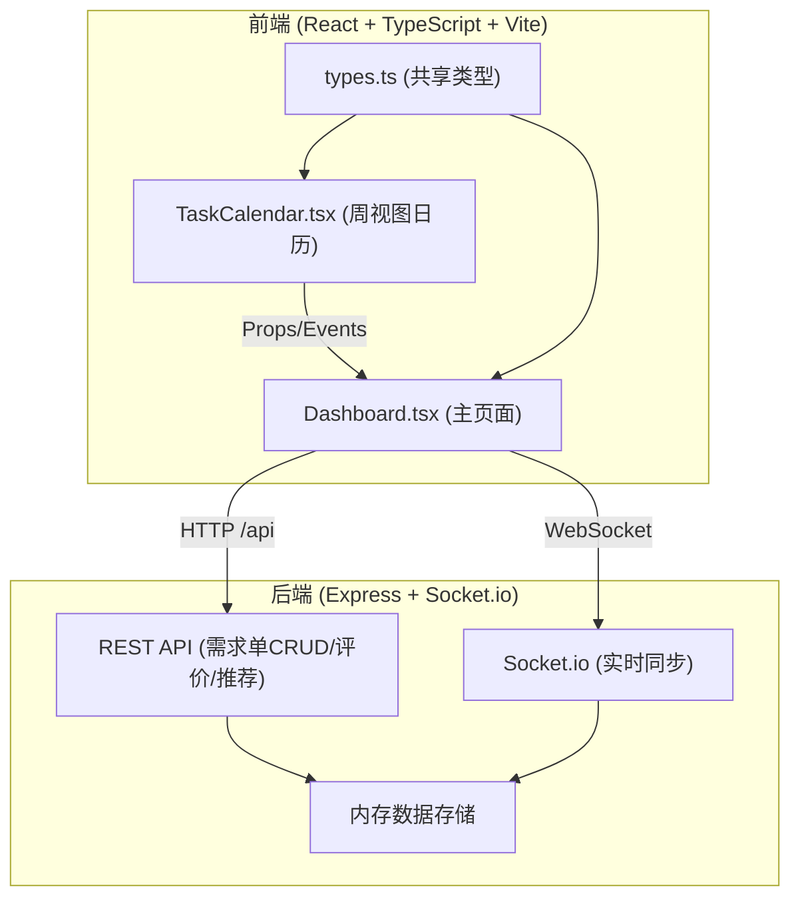
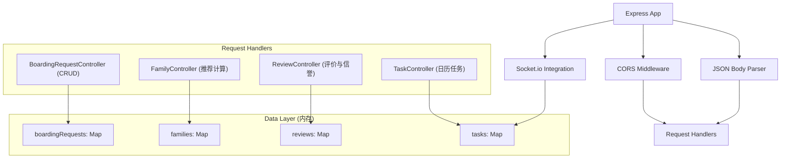
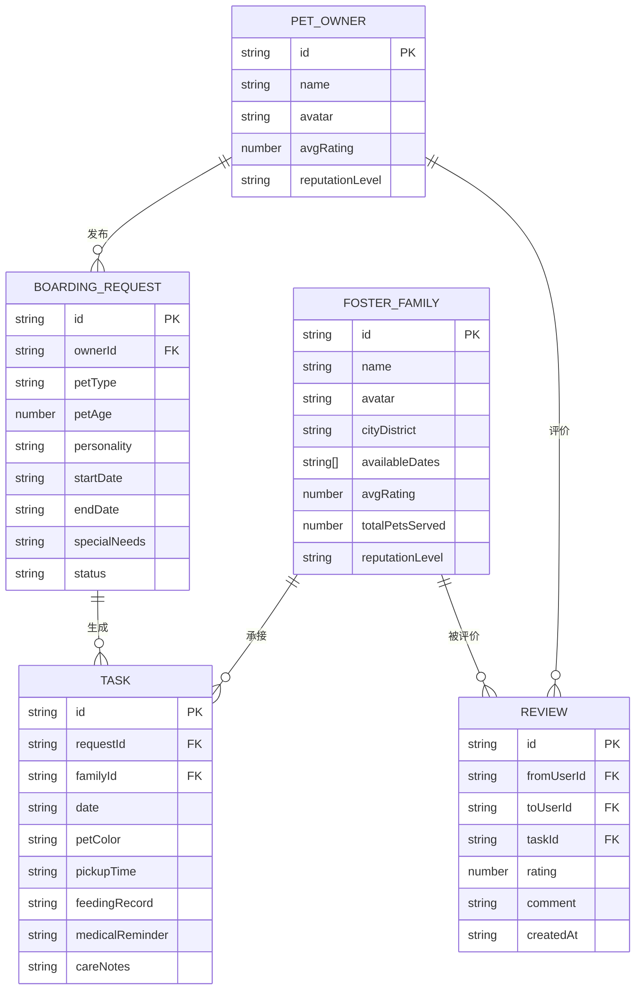

## 1. 架构设计



## 2. 技术说明

- **前端框架**：React 18 + TypeScript
- **构建工具**：Vite 5
- **后端框架**：Express 4
- **实时通信**：Socket.io（客户端 + 服务端）
- **数据存储**：内存存储（使用 Map/Array 模拟，无需数据库）
- **样式方案**：CSS Modules + 内联样式（温暖自然风格）
- **辅助工具**：uuid（唯一ID生成）、cors（跨域处理）

## 3. 路由定义

| 路由路径 | 用途 | 方法 |
|----------|------|------|
| / | Dashboard 主页面 | GET |
| /api/boarding-requests | 获取所有寄养需求单 | GET |
| /api/boarding-requests | 创建寄养需求单 | POST |
| /api/boarding-requests/:id | 获取单个需求单详情 | GET |
| /api/boarding-requests/:id | 更新需求单 | PUT |
| /api/boarding-requests/:id | 删除需求单 | DELETE |
| /api/families/recommend | 根据需求推荐寄养家庭 | POST |
| /api/reviews | 提交评价 | POST |
| /api/reviews/:userId | 获取用户评价列表 | GET |
| /api/tasks | 获取日历任务列表 | GET |
| /api/tasks | 创建/更新日历任务 | PUT |

## 4. API 定义

### 4.1 推荐寄养家庭请求

```typescript
interface RecommendRequest {
  cityDistrict: string;
  startDate: string;
  endDate: string;
  petType: string;
}

interface RecommendResponse {
  families: Array<{
    id: string;
    name: string;
    avatar: string;
    rating: number;
    totalPetsServed: number;
    cityDistrict: string;
    availableDates: string[];
    matchScore: number;
    reputationLevel: 'bronze' | 'silver' | 'gold';
  }>;
}
```

### 4.2 评价提交

```typescript
interface ReviewSubmitRequest {
  fromUserId: string;
  toUserId: string;
  taskId: string;
  rating: 1 | 2 | 3 | 4 | 5;
  comment: string;
}

interface ReviewSubmitResponse {
  success: boolean;
  newAverageRating: number;
  newReputationLevel: 'bronze' | 'silver' | 'gold';
}
```

## 5. 服务端架构图



## 6. 数据模型

### 6.1 数据模型定义



### 6.2 信誉等级规则

| 等级 | 条件 | 显示徽章颜色 |
|------|------|-------------|
| 铜牌 (Bronze) | 平均评分 < 4.0 或 评价数 < 5 | #CD7F32 |
| 银牌 (Silver) | 平均评分 ≥ 4.0 且 评价数 ≥ 5 | #C0C0C0 |
| 金牌 (Gold) | 平均评分 ≥ 4.5 且 评价数 ≥ 10 | #FFD700 |

## 7. 项目文件结构

```
auto28/
├── package.json              # 项目依赖与启动脚本
├── vite.config.js            # Vite 构建配置（代理设置）
├── tsconfig.json             # TypeScript 严格模式配置
├── index.html                # 前端入口 HTML
├── src/
│   ├── types.ts              # 共享类型定义
│   ├── main.tsx              # React 入口
│   ├── App.tsx               # 根组件
│   ├── pages/
│   │   └── Dashboard.tsx     # 主页面（整合所有组件）
│   ├── components/
│   │   └── TaskCalendar.tsx  # 周视图日历组件
│   ├── styles/
│   │   └── global.css        # 全局样式
│   └── server/
│       └── main.ts           # Express + Socket.io 后端
```

## 8. 性能优化策略

- **前端**：使用 React.memo 避免不必要的重渲染，日历组件虚拟化渲染
- **推荐算法**：O(n) 单次遍历计算匹配度，前端排序使用稳定快速排序
- **WebSocket**：仅发送变更的增量数据，而非全量任务列表
- **样式**：CSS transform/opacity 实现动画，触发 GPU 加速
