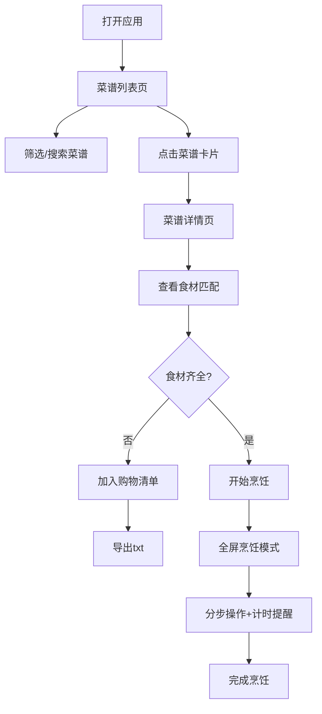

## 1. 产品概述

为家庭用户设计的手工菜谱电子化与智能烹饪助手平台，解决纸质菜谱难以保存、调阅和智能匹配食材的痛点，帮助用户高效管理菜谱、利用现有食材、享受智能烹饪体验。

- **核心目标**：数字化家庭菜谱管理，智能匹配食材库存，提供沉浸式烹饪引导
- **目标用户**：家庭主妇/煮夫、烹饪爱好者、需要管理家庭食材的用户
- **市场价值**：连接食材库存与菜谱推荐，减少食材浪费，提升烹饪效率与乐趣

## 2. 核心功能

### 2.1 用户角色

| 角色 | 注册方式 | 核心权限 |
|------|----------|----------|
| 家庭用户 | 本地使用（无需注册） | 管理菜谱库、维护食材库存、使用智能推荐、烹饪模式引导 |

### 2.2 功能模块

1. **菜谱列表页**：网格卡片展示、分类筛选、时长筛选、搜索功能
2. **菜谱详情页**：完整信息展示、食材清单、步骤说明、开始烹饪入口
3. **智能食材库存看板**：食材管理、单位换算、菜谱智能推荐、购物清单导出
4. **全屏烹饪模式**：分步引导、定时器管理、语音播报、边界闪烁提醒

### 2.3 页面详情

| 页面名称 | 模块名称 | 功能描述 |
|----------|----------|----------|
| 菜谱列表页 | 筛选栏 | 按菜品类型（家常菜/烘焙/甜点等）和烹饪时长筛选 |
| 菜谱列表页 | 网格卡片 | 展示封面、名称、预估时间、难度等级，悬停放大动效 |
| 菜谱详情页 | 食材清单 | 展示用量、单位，可查看与库存匹配情况 |
| 菜谱详情页 | 步骤列表 | 每步包含说明、图片、定时器，可跳转烹饪模式 |
| 食材库存看板 | 库存列表 | 展示食材种类、剩余量、单位换算功能 |
| 食材库存看板 | 智能推荐 | 基于库存匹配菜谱，进度条显示匹配度，高亮缺少食材 |
| 食材库存看板 | 购物清单 | 导出缺少食材为txt文件 |
| 烹饪模式 | 步骤展示 | 全屏展示当前步骤，左右滑入过渡动画 |
| 烹饪模式 | 计时控制 | 全局计时、步骤定时器、开始/暂停/跳转控制 |
| 烹饪模式 | 提醒系统 | 定时器到期边界闪烁、提示音、语音播报 |

## 3. 核心流程

用户打开应用 → 浏览菜谱列表（可筛选）→ 选择菜谱查看详情 → 查看食材清单与库存匹配 → 如有缺料可加入购物清单 → 点击开始烹饪进入全屏模式 → 按步骤操作，系统提供计时和语音提醒 → 完成烹饪

## 4. 界面设计

### 4.1 设计风格

**暖色调家庭厨房风格**
- **主色调**：奶油色 `#FFF8F0`（背景）、浅木色 `#D4A574`（强调）、暖橙色 `#FF8C42`（点缀）
- **辅助色**：深棕色 `#5D4037`（文字）、米色 `#F5E6D3`（卡片）
- **按钮风格**：大圆角（16px）、暖橙渐变、轻微阴影、悬停放大效果
- **字体**：标题使用「Noto Serif SC」衬线体，正文使用「Noto Sans SC」无衬线体
- **布局风格**：卡片式布局，大圆角柔和边缘，大量留白，温馨舒适
- **动效**：卡片悬停放大（1.03倍）、步骤切换左右滑入、定时器到期边界闪烁
- **图标风格**：线性简约图标，暖橙色填充，烹饪相关emoji点缀

### 4.2 页面设计概述

| 页面名称 | 模块名称 | UI元素 |
|----------|----------|--------|
| 菜谱列表页 | 顶部导航 | 品牌logo、搜索框、库存看板入口 |
| 菜谱列表页 | 筛选栏 | 分类标签（可横向滚动）、时长筛选下拉 |
| 菜谱列表页 | 卡片网格 | 响应式网格（桌面4列、平板2列、手机1列）、封面图、时间/难度标签 |
| 菜谱详情页 | 头部 | 大图封面、菜名、分类标签、时间/难度信息 |
| 菜谱详情页 | 食材区 | 清单列表、用量显示、库存匹配状态 |
| 菜谱详情页 | 步骤区 | 编号步骤卡片、图片、定时器图标 |
| 食材库存看板 | 库存列表 | 食材卡片、剩余量进度条、单位换算按钮 |
| 食材库存看板 | 推荐区 | 匹配度进度条、菜谱卡片、缺少食材高亮 |
| 烹饪模式 | 顶部栏 | 步骤编号/总数、退出按钮 |
| 烹饪模式 | 内容区 | 步骤说明文字、大图展示、渐变深色背景 |
| 烹饪模式 | 控制栏 | 全局计时显示、上一步/下一步按钮、开始/暂停按钮 |

### 4.3 响应式设计

- **桌面优先**，自适应降级到平板和手机
- **断点**：桌面 ≥ 1200px、平板 768-1199px、手机 < 768px
- **触屏优化**：按钮最小尺寸44×44px，卡片间距适配手指点击区域
- **烹饪模式**：手机端自动隐藏非关键元素，确保操作区域足够大

### 4.4 性能要求

- 菜谱详情页首屏渲染 ≤ 1.5秒
- 库存看板首屏渲染 ≤ 1.5秒
- 步骤切换动画帧率稳定 60fps
- 图片懒加载，支持WebP格式
