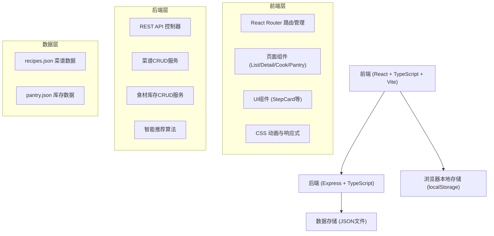
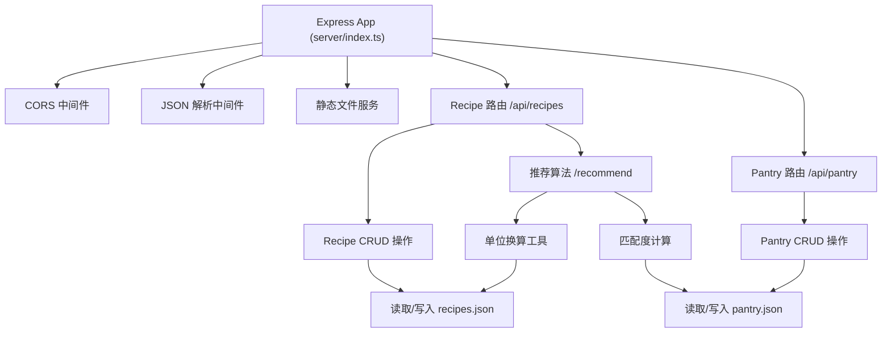
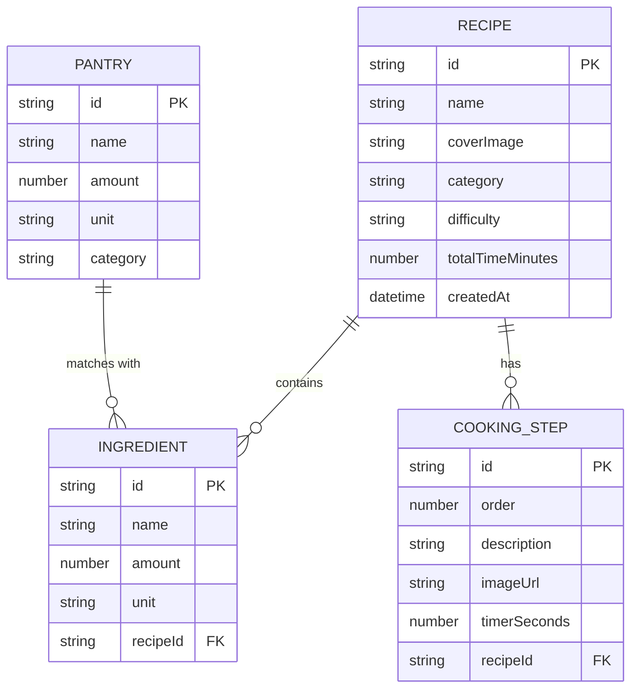

## 1. 架构设计



## 2. 技术描述

- **前端**：React 18 + TypeScript + Vite 5
- **样式方案**：CSS Modules + CSS Variables（不使用Tailwind，保持自定义设计风格）
- **路由**：React Router 6
- **后端**：Express 4 + TypeScript + ts-node
- **数据存储**：JSON文件（server/data/目录），本地持久化
- **HTTP客户端**：原生 fetch API
- **并发控制**：使用 concurrently 同时启动前后端

## 3. 项目结构

```
auto50/
├── package.json              # 项目依赖和脚本
├── vite.config.js            # Vite配置，API代理
├── tsconfig.json             # TypeScript严格模式配置
├── index.html                # 入口HTML
├── server/
│   ├── index.ts              # 后端入口，Express服务器
│   └── data/
│       ├── recipes.json      # 菜谱数据存储
│       └── pantry.json       # 食材库存数据存储
└── src/
    ├── main.tsx              # React入口
    ├── App.tsx               # 根组件，路由配置
    ├── types.ts              # 全局TypeScript类型定义
    ├── api/
    │   └── client.ts         # API客户端封装
    ├── pages/
    │   ├── RecipeList.tsx    # 菜谱列表页
    │   ├── RecipeDetail.tsx  # 菜谱详情页
    │   ├── CookMode.tsx      # 全屏烹饪模式
    │   └── PantryView.tsx    # 食材库存看板
    ├── components/
    │   └── StepCard.tsx      # 步骤卡片组件
    └── styles/
        ├── variables.css     # CSS变量（颜色、字体等）
        ├── animations.css    # 动画关键帧
        └── reset.css         # 基础重置样式
```

## 4. 路由定义

| 路由路径 | 页面组件 | 用途 |
|----------|----------|------|
| `/` | RecipeList | 首页，菜谱列表网格展示 |
| `/recipe/:id` | RecipeDetail | 菜谱详情页 |
| `/cook/:id` | CookMode | 全屏烹饪模式 |
| `/pantry` | PantryView | 食材库存看板 |

## 5. API 定义

### 5.1 TypeScript 类型定义

```typescript
// 食材项
interface Ingredient {
  id: string;
  name: string;
  amount: number;
  unit: string; // g, ml, 个, 勺, etc.
}

// 烹饪步骤
interface CookingStep {
  id: string;
  order: number;
  description: string;
  imageUrl?: string;
  timerSeconds?: number; // 定时提醒（秒）
}

// 菜谱
interface Recipe {
  id: string;
  name: string;
  coverImage: string;
  category: string; // 家常菜, 烘焙, 甜点, etc.
  difficulty: 'easy' | 'medium' | 'hard';
  totalTimeMinutes: number;
  ingredients: Ingredient[];
  steps: CookingStep[];
  createdAt: string;
}

// 库存食材
interface PantryItem {
  id: string;
  name: string;
  amount: number;
  unit: string;
  category?: string;
}

// 推荐结果
interface RecommendationResult {
  recipe: Recipe;
  matchPercentage: number;
  matchedIngredients: string[];
  missingIngredients: Ingredient[];
}
```

### 5.2 REST API 接口

| 方法 | 路径 | 描述 | 请求体 | 响应 |
|------|------|------|--------|------|
| GET | `/api/recipes` | 获取所有菜谱，支持筛选 | query: category, maxTime | `Recipe[]` |
| GET | `/api/recipes/:id` | 获取单个菜谱详情 | - | `Recipe` |
| POST | `/api/recipes` | 创建新菜谱 | `Omit<Recipe, 'id' \| 'createdAt'>` | `Recipe` |
| PUT | `/api/recipes/:id` | 更新菜谱 | `Partial<Recipe>` | `Recipe` |
| DELETE | `/api/recipes/:id` | 删除菜谱 | - | `{ success: boolean }` |
| GET | `/api/pantry` | 获取所有库存食材 | - | `PantryItem[]` |
| POST | `/api/pantry` | 添加库存食材 | `Omit<PantryItem, 'id'>` | `PantryItem` |
| PUT | `/api/pantry/:id` | 更新库存食材 | `Partial<PantryItem>` | `PantryItem` |
| DELETE | `/api/pantry/:id` | 删除库存食材 | - | `{ success: boolean }` |
| GET | `/api/recipes/recommend` | 基于库存推荐菜谱 | - | `RecommendationResult[]` |

## 6. 服务端架构



## 7. 数据模型

### 7.1 ER 图



### 7.2 单位换算规则

```typescript
// 质量单位换算（基准：克）
const massUnits: Record<string, number> = {
  'g': 1,
  'kg': 1000,
  '斤': 500,
  '两': 50,
  '盎司': 28.35,
  '磅': 453.6,
};

// 体积单位换算（基准：毫升）
const volumeUnits: Record<string, number> = {
  'ml': 1,
  'l': 1000,
  '茶匙': 5,
  '汤匙': 15,
  '杯': 240,
};

// 特殊食材密度表（体积→质量换算）
const ingredientDensity: Record<string, number> = {
  '水': 1,
  '牛奶': 1.03,
  '面粉': 0.55,
  '白糖': 0.85,
  '食用油': 0.92,
  // ... 更多常见食材
};
```

## 8. 性能优化方案

### 8.1 前端性能

- **代码分割**：按路由分割，动态导入页面组件
- **图片优化**：使用 `loading="lazy"` 懒加载，`srcset` 响应式图片
- **Memo优化**：`React.memo` 包裹列表项组件，避免不必要重渲染
- **防抖节流**：搜索框输入防抖（300ms），滚动事件节流
- **骨架屏**：数据加载期间显示骨架屏，提升感知性能

### 8.2 动画性能

- 使用 `transform` 和 `opacity` 属性做动画（触发合成层）
- 避免在动画中修改 `width`/`height`/`top`/`left`（触发重排）
- 步骤切换使用 `translateX` 实现左右滑入
- 悬停放大使用 `scale(1.03)` 配合 `will-change: transform`

## 9. 前端依赖清单

```json
{
  "dependencies": {
    "react": "^18.2.0",
    "react-dom": "^18.2.0",
    "react-router-dom": "^6.22.0",
    "uuid": "^9.0.1"
  },
  "devDependencies": {
    "@types/react": "^18.2.0",
    "@types/react-dom": "^18.2.0",
    "@types/uuid": "^9.0.8",
    "@vitejs/plugin-react": "^4.2.1",
    "typescript": "^5.4.0",
    "vite": "^5.1.0",
    "concurrently": "^8.2.2",
    "cors": "^2.8.5",
    "express": "^4.18.3",
    "ts-node": "^10.9.2",
    "@types/cors": "^2.8.17",
    "@types/express": "^4.17.21",
    "@types/node": "^20.11.0"
  }
}
```
