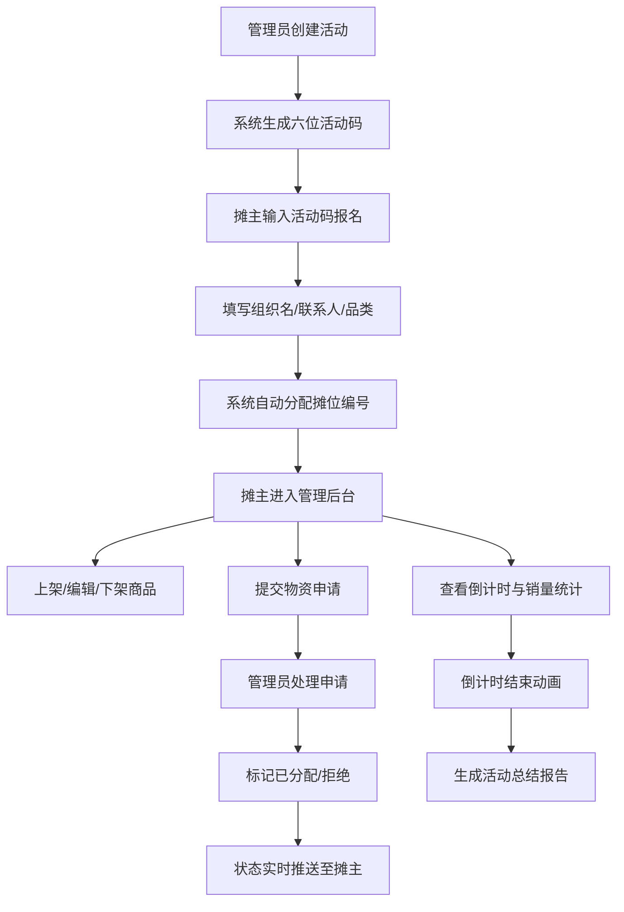

## 1. 产品概述

义卖活动管理平台——面向小型非营利组织的线下义卖活动全流程管理工具，解决活动报名混乱、摊位分配不透明、现场物资调度低效三大痛点，帮助组织者高效管理从报名到总结的完整活动生命周期。

## 2. 核心功能

### 2.1 用户角色

| 角色 | 进入方式 | 核心权限 |
|------|----------|----------|
| 活动组织者（管理员） | 直接访问管理员面板 | 创建活动、查看摊主列表、处理物资申请、查看报告 |
| 摊主 | 通过活动码报名后登录 | 管理个人摊位商品、查看销量统计、提交物资申请 |

### 2.2 功能模块

1. **报名页**: 活动码输入、报名表单、摊位自动分配
2. **摊主管理页**: 商品管理（上架/编辑/下架）、倒计时仪表盘、销量统计
3. **管理员面板**: 摊主列表、物资申请管理、申请状态处理
4. **报告页**: 销售额柱状图、品类饼图、整体数据汇总、文本导出

### 2.3 页面详情

| 页面名称 | 模块名称 | 功能描述 |
|----------|----------|----------|
| 报名页 | 活动码输入区 | 输入六位活动码，验证后显示活动信息和剩余摊位数 |
| 报名页 | 报名表单 | 填写组织名、联系人、售卖品类，提交后自动分配摊位编号并弹窗确认 |
| 摊主管理页 | 活动信息 | 显示当前活动名称、时间、地点、摊位编号 |
| 摊主管理页 | 商品管理 | 卡片网格展示商品，支持上架/编辑/下架操作 |
| 摊主管理页 | 销量统计 | 倒计时仪表盘，实时显示成交笔数、销售额、Top3畅销商品 |
| 摊主管理页 | 物资申请 | 提交物资需求表单（类型下拉+备注） |
| 管理员面板 | 摊主列表 | 展示所有摊主及其摊位编号，含物资申请按钮 |
| 管理员面板 | 申请调度 | 按紧急程度排序展示未处理申请，支持标记已分配/拒绝 |
| 报告页 | 销售额柱状图 | 各摊位销售额对比 |
| 报告页 | 品类饼图 | 各品类销售占比 |
| 报告页 | 整体数据 | 总销售额、总成交笔数、参与摊主数、物资申请处理率 |
| 报告页 | 导出功能 | 一键导出文本摘要 |

## 3. 核心流程

**活动创建与报名流程**：管理员创建活动→系统生成六位活动码→摊主输入活动码→填写报名信息→系统自动分配摊位编号→确认弹窗

**摊主管理流程**：摊主登录→上架商品（名称/描述/价格/库存/图片）→编辑/下架商品→活动前1小时启动倒计时→实时查看销量→倒计时结束播放动画

**物资调度流程**：摊主提交物资需求→管理员查看未处理申请→按紧急程度排序→标记已分配（绿色）/拒绝（红色）→状态实时推送

**报告生成流程**：活动结束→自动生成柱状图+饼图→展示整体数据→支持文本导出

## 4. 用户界面设计

### 4.1 设计风格

- **主色调**: 温暖活泼的橙黄+白色（橙色 #FF8C42、黄色 #FFD166、白色 #FFFFFF）
- **辅助色**: 浅灰 #F5F5F5（背景）、深灰 #333333（文字）、绿色 #4CAF50（已分配）、红色 #EF5350（拒绝）
- **按钮风格**: 大号圆角按钮，橙到黄渐变，呼吸动画
- **字体**: 标题使用 Noto Sans SC Bold，正文使用 Noto Sans SC Regular
- **布局**: 圆角卡片 + 柔和阴影，摊主管理页两栏布局
- **图标**: lucide-react 图标库

### 4.2 页面设计概览

| 页面名称 | 模块名称 | UI元素 |
|----------|----------|--------|
| 报名页 | 活动码输入 | 居中大号输入框，渐变确认按钮带呼吸动画，已报名人数/剩余摊位数标签 |
| 报名页 | 报名表单 | 圆角卡片表单，品类下拉选择，提交后弹窗确认含摊位编号 |
| 摊主管理页 | 左侧导航 | 窄栏导航（活动信息/商品管理/销量统计/物资申请），图标+文字 |
| 摊主管理页 | 商品管理 | 卡片网格，悬停上浮+编辑/删除图标浮现，上架按钮 |
| 摊主管理页 | 倒计时仪表盘 | 大号数字时钟，冒号分隔，渐变色进度条（绿→红） |
| 摊主管理页 | 销量统计 | 数字卡片（总笔数/销售额），Top3列表 |
| 管理员面板 | 摊主列表 | 列表行，每行含摊位编号+组织名+物资申请按钮 |
| 管理员面板 | 申请卡片 | 卡片展示，紧急程度标签，状态变化平滑背景色过渡（绿色/红色） |
| 报告页 | 柱状图 | Recharts柱状图，各摊位销售额 |
| 报告页 | 饼图 | Recharts饼图，各品类销售占比 |
| 报告页 | 数据卡片 | 四宫格数据卡片，导出按钮 |

### 4.3 响应式设计

- 桌面优先设计，平板和手机自适应
- 窄屏下导航栏折叠为汉堡菜单
- 商品卡片网格从3列→2列→1列
- 管理员面板列表在窄屏下简化显示

### 4.4 动画设计

- 报名按钮：橙到黄渐变 + 微弱呼吸动画（scale 1.0→1.03循环）
- 商品卡片：hover上浮4px + 显示操作图标
- 倒计时进度条：渐变色随时间从绿变红
- 物资申请卡片：状态变化时背景色平滑过渡（0.3s ease）
- 倒计时结束：播放结束动画（缩放+淡出）
