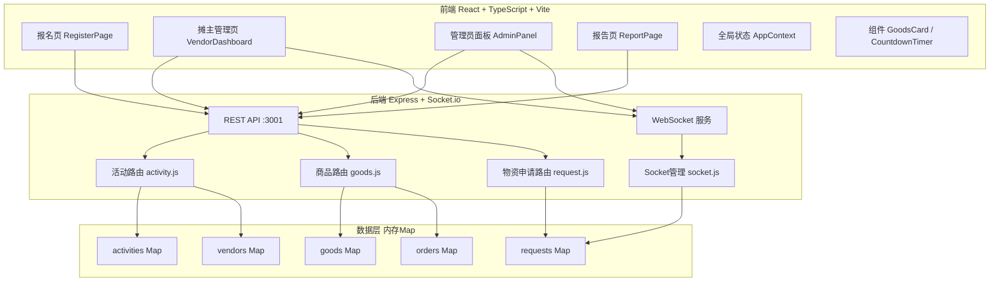
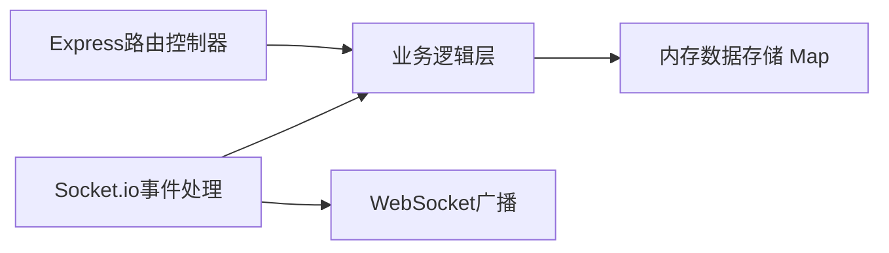
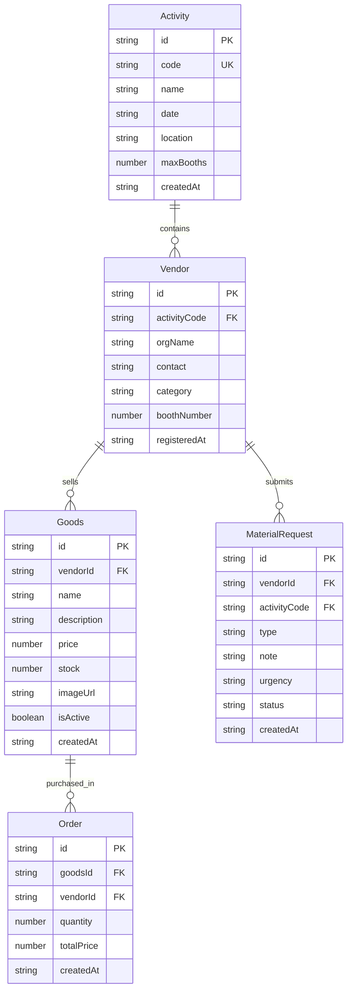

## 1. 架构设计



## 2. 技术说明

- **前端**: React 18 + TypeScript + Vite + TailwindCSS
- **初始化工具**: vite-init (react-express-ts 模板)
- **后端**: Express 4 + Socket.io
- **数据库**: 内存存储（Map对象），无需外部数据库
- **图表**: Recharts
- **图标**: lucide-react
- **实时通信**: Socket.io（倒计时广播、物资申请状态推送）
- **构建工具**: Vite（前端）+ tsc（类型检查）
- **并发运行**: concurrently

## 3. 路由定义

| 路由 | 用途 |
|------|------|
| `/` | 报名首页，输入活动码报名 |
| `/vendor/:vendorId` | 摊主个人管理后台 |
| `/admin/:activityCode` | 管理员物资调度面板 |
| `/report/:activityCode` | 活动总结报告页面 |

## 4. API 定义

### 4.1 活动相关

```
POST   /api/activities                    创建活动
GET    /api/activities/:code              获取活动信息
POST   /api/activities/:code/register     摊主报名
GET    /api/activities/:code/vendors      获取摊主列表
```

**创建活动请求体**:
```typescript
interface CreateActivityBody {
  name: string;
  date: string;
  location: string;
  maxBooths: number;
}
```

**创建活动响应**:
```typescript
interface Activity {
  id: string;
  code: string;
  name: string;
  date: string;
  location: string;
  maxBooths: number;
  createdAt: string;
}
```

**报名请求体**:
```typescript
interface RegisterBody {
  orgName: string;
  contact: string;
  category: "手工艺品" | "二手书籍" | "自制食品" | "服装配饰" | "其他";
}
```

**报名响应**:
```typescript
interface Vendor {
  id: string;
  activityCode: string;
  orgName: string;
  contact: string;
  category: string;
  boothNumber: number;
  registeredAt: string;
}
```

### 4.2 商品相关

```
POST   /api/goods                         上架商品
GET    /api/goods?vendorId=xxx            获取摊主商品列表
PUT    /api/goods/:id                     编辑商品
DELETE /api/goods/:id                     下架商品
POST   /api/goods/:id/purchase            购买商品（模拟成交）
```

**商品数据结构**:
```typescript
interface Goods {
  id: string;
  vendorId: string;
  name: string;
  description: string;
  price: number;
  stock: number;
  imageUrl: string;
  isActive: boolean;
  createdAt: string;
}
```

### 4.3 物资申请相关

```
POST   /api/requests                      提交物资申请
GET    /api/requests?activityCode=xxx     获取活动物资申请列表
PUT    /api/requests/:id                  处理物资申请
```

**物资申请数据结构**:
```typescript
interface MaterialRequest {
  id: string;
  vendorId: string;
  activityCode: string;
  type: "额外桌子" | "电源延长线" | "宣传海报" | "椅子" | "其他";
  note: string;
  urgency: "高" | "中" | "低";
  status: "pending" | "allocated" | "rejected";
  createdAt: string;
}
```

## 5. 服务端架构图



## 6. 数据模型

### 6.1 数据模型定义



### 6.2 内存数据初始化

所有数据存储在 server/index.js 的 Map 对象中：
- `activities`: Map<string, Activity> — 活动码为键
- `vendors`: Map<string, Vendor> — 摊主ID为键
- `goods`: Map<string, Goods> — 商品ID为键
- `requests`: Map<string, MaterialRequest> — 申请ID为键
- `orders`: Map<string, Order> — 订单ID为键
