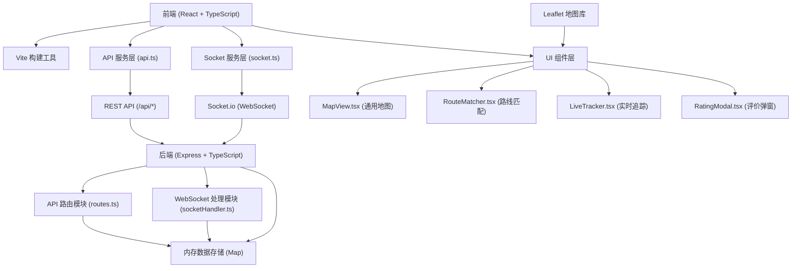
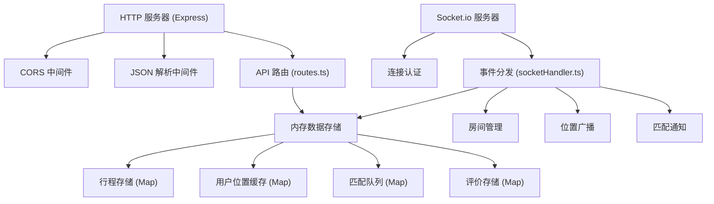
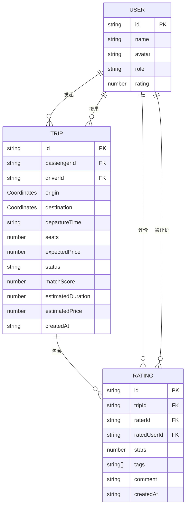

## 1. 架构设计



## 2. 技术描述

- **前端**：React@18 + TypeScript + Vite@5
- **后端**：Express@4 + TypeScript + Socket.io@4
- **地图服务**：Leaflet@1.9 + react-leaflet@4
- **状态管理**：React hooks (useState, useEffect, useContext)
- **HTTP客户端**：Fetch API
- **实时通信**：Socket.io-client@4
- **数据存储**：内存 Map（无持久化）
- **样式方案**：CSS Modules + Tailwind CSS@3
- **图标库**：lucide-react
- **代码规范**：TypeScript 严格模式 + ESLint

## 3. 项目文件结构

```
├── package.json                 # 项目依赖和脚本
├── vite.config.js              # Vite 配置（代理设置）
├── tsconfig.json               # TypeScript 配置
├── index.html                  # 入口 HTML
├── client/
│   └── src/
│       ├── main.tsx            # 应用入口
│       ├── App.tsx             # 主应用组件
│       ├── services/
│       │   ├── api.ts          # REST API 封装
│       │   └── socket.ts       # Socket.io 封装
│       ├── components/
│       │   ├── MapView.tsx     # 通用地图组件
│       │   ├── RouteMatcher.tsx # 路线匹配组件
│       │   ├── LiveTracker.tsx  # 实时追踪组件
│       │   └── RatingModal.tsx  # 评价弹窗组件
│       ├── types/
│       │   └── index.ts        # 类型定义
│       └── styles/
│           └── globals.css     # 全局样式
└── server/
    ├── index.ts                # 服务器入口
    ├── routes.ts               # API 路由
    └── socketHandler.ts        # WebSocket 处理
```

## 4. 前端路由定义

| 路由 | 页面 | 功能 |
|------|------|------|
| / | 首页 | 发布行程、路线匹配 |
| /match | 匹配结果页 | 显示推荐司机列表 |
| /track | 行程追踪页 | 实时位置共享 |
| /history | 历史行程页 | 查看历史行程记录 |

## 5. API 定义

### 5.1 数据类型定义

```typescript
// 地理位置坐标
interface Coordinates {
  lat: number;
  lng: number;
  address?: string;
}

// 用户信息
interface User {
  id: string;
  name: string;
  avatar: string;
  role: 'passenger' | 'driver';
  rating: number;
}

// 司机信息
interface Driver extends User {
  carModel: string;
  carPlate: string;
}

// 行程信息
interface Trip {
  id: string;
  passengerId: string;
  driverId?: string;
  origin: Coordinates;
  destination: Coordinates;
  departureTime: string;
  seats: number;
  expectedPrice: number;
  status: 'pending' | 'matched' | 'accepted' | 'in_progress' | 'completed' | 'cancelled';
  matchScore?: number;
  estimatedDuration?: number;
  estimatedPrice?: number;
  createdAt: string;
}

// 匹配结果
interface MatchResult {
  driver: Driver;
  matchScore: number;
  estimatedDuration: number;
  estimatedPrice: number;
  routeOverlap: number;
  timeConsistency: number;
}

// 位置更新
interface LocationUpdate {
  tripId: string;
  userId: string;
  coordinates: Coordinates;
  timestamp: string;
  estimatedArrival?: number;
}

// 评价数据
interface RatingData {
  tripId: string;
  raterId: string;
  ratedUserId: string;
  stars: number;
  tags: string[];
  comment?: string;
  createdAt: string;
}
```

### 5.2 REST API 接口

| 方法 | 路径 | 描述 | 请求体 | 响应体 |
|------|------|------|--------|--------|
| POST | /api/trips | 发布行程 | `{ origin, destination, departureTime, seats, expectedPrice, passengerId }` | `{ tripId, status }` |
| GET | /api/trips | 匹配查询 | Query: `origin, dest, seats` | `{ matches: MatchResult[] }` |
| POST | /api/trips/:id/rate | 提交评价 | `{ raterId, ratedUserId, stars, tags, comment }` | `{ success, ratingId }` |
| GET | /api/trips/:id | 获取行程详情 | - | `Trip` |
| GET | /api/trips | 获取用户行程列表 | Query: `userId` | `{ trips: Trip[] }` |

### 5.3 WebSocket 事件

| 事件名 | 方向 | 描述 | 数据 |
|--------|------|------|------|
| `acceptRide` | Client → Server | 司机接单 | `{ tripId, driverId }` |
| `updateLocation` | Client → Server | 更新位置 | `LocationUpdate` |
| `notifyMatch` | Server → Client | 匹配通知 | `{ tripId, matchResult }` |
| `locationUpdated` | Server → Client | 位置更新广播 | `LocationUpdate` |
| `finishTrip` | Client → Server | 结束行程 | `{ tripId }` |
| `tripFinished` | Server → Client | 行程结束通知 | `{ tripId, finalPrice }` |
| `joinTrip` | Client → Server | 加入行程房间 | `{ tripId, userId }` |

## 6. 服务器架构



## 7. 数据模型

### 7.1 实体关系图



## 8. 性能优化策略

1. **位置更新优化**：
   - 位置更新采用防抖/节流，确保 200ms 内完成渲染
   - 使用 requestAnimationFrame 进行地图图标位置更新
   - 轨迹点做采样压缩，避免过多 DOM 节点

2. **匹配算法优化**：
   - 使用空间索引加速距离计算
   - 预计算司机路线缓存
   - 匹配查询响应时间控制在 500ms 内

3. **前端渲染优化**：
   - React.memo 包裹地图组件避免不必要重渲染
   - 使用 useCallback/useMemo 优化函数和计算值
   - Canvas 实现烟花动画避免重排重绘

4. **WebSocket 优化**：
   - 按行程建立独立房间，减少广播范围
   - 消息体压缩，减少数据传输量
   - 心跳检测确保连接稳定
