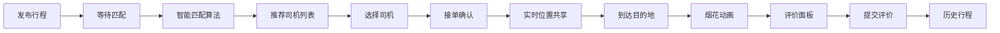

## 1. 产品概述

拼车路线匹配与实时位置共享应用，为用户提供智能拼车服务，解决城市出行成本高、资源浪费问题。通过智能路线匹配算法，将同方向出行的乘客与司机进行配对，实现资源共享、降低出行成本。

- 目标用户：城市通勤人群、出租车/网约车司机
- 核心价值：智能路线匹配、实时位置追踪、安全评价体系
- 市场定位：便捷、经济、安全的拼车出行平台

## 2. 核心功能

### 2.1 用户角色

| 角色 | 注册方式 | 核心权限 |
|------|---------|---------|
| 乘客 | 默认登录 | 发布行程、匹配查询、评价司机 |
| 司机 | 默认登录 | 接单、实时位置上报、评价乘客 |

### 2.2 功能模块

1. **路线匹配模块**：发布行程需求、智能匹配推荐、司机接单
2. **实时共享模块**：实时位置追踪、路径显示、预计到达时间
3. **评价系统**：星级评分、标签评价、文字评价
4. **历史行程**：行程记录查看

### 2.3 页面详情

| 页面名称 | 模块名称 | 功能描述 |
|---------|---------|----------|
| 首页 | 路线匹配 | 起点终点输入、时间偏好设置、座位数选择、价格期望、匹配按钮 |
| 匹配结果页 | 匹配列表 | 推荐司机列表、匹配度显示、预计时间价格、选择接单 |
| 行程追踪页 | 实时共享 | 地图显示双发位置、轨迹路线、预计到达时间、到达动画 |
| 评价弹窗 | 评价系统 | 5星评分、标签选择、文字评价提交 |
| 历史行程页 | 历史记录 | 行程列表、评价查看 |

## 3. 核心流程

用户打开应用 → 输入起点终点和出行偏好 → 发布行程 → 系统智能匹配 → 显示推荐司机列表 → 选择司机确认接单 → 实时位置共享追踪 → 到达目的地 → 烟花动画 → 弹出评价面板 → 提交评价 → 跳转历史行程

## 4. 用户界面设计

### 4.1 设计风格

- 主色调：暖色系橙红色 #FF6B35
- 辅助色：蓝色高亮 #2196F3
- 背景色：白色 #FFFFFF、浅灰色 #F5F5F5
- 按钮风格：圆角矩形 border-radius: 12px，悬停上浮效果，点击缩放反馈
- 字体：标题使用粗体无衬线字体，正文使用清晰易读的无衬线字体
- 图标：使用 lucide-react 图标库
- 卡片样式：圆角矩形（border-radius: 12px）+ 轻微阴影
- 动画效果：淡入动画 fadeIn 0.3秒，悬停上浮 translateY(-2px)，点击缩放 scale(0.98)

### 4.2 页面设计概述

| 页面名称 | 模块名称 | UI元素 |
|---------|---------|--------|
| 首页 | 导航栏 | 品牌Logo、发布行程按钮（蓝色高亮）、搜索框 |
| 首页 | 地图区域 | 占60%以上高度，Leaflet地图，起点终点标记 |
| 首页 | 底部面板 | 起点输入、终点输入、时间选择、座位数、价格期望、匹配按钮 |
| 匹配结果页 | 匹配列表 | 司机卡片列表（头像、昵称、车型、匹配度进度条、预计时间、价格），分隔线，淡入动画 |
| 行程追踪页 | 实时地图 | 双方位置图标、移动轨迹残影、路径折线、预计到达时间倒计时 |
| 评价弹窗 | 评价面板 | 5星评分组件、标签选择（最多3个）、文字输入（200字限制）、提交按钮 |

### 4.3 响应式设计

- **桌面端**：地图和面板左右布局，地图占左侧60%，面板占右侧40%
- **平板端**：上下布局，地图占上半部分，面板占下半部分
- **手机端**：地图全屏显示，底部面板可滑动展开/收起，支持手势操作

### 4.4 特殊动效

1. **等待匹配动画**：脉冲圆圈动画，提示用户正在匹配中
2. **匹配度进度条**：渐变色进度条，从绿色（高匹配）到红色（低匹配）过渡
3. **移动轨迹残影**：位置图标后跟随微弱的轨迹残影效果
4. **到达烟花动画**：Canvas实现的烟花粒子动画，持续3秒
5. **卡片悬停效果**：轻微上浮 + 阴影加深
6. **列表淡入动画**：fadeIn 0.3秒，逐项延迟显示
