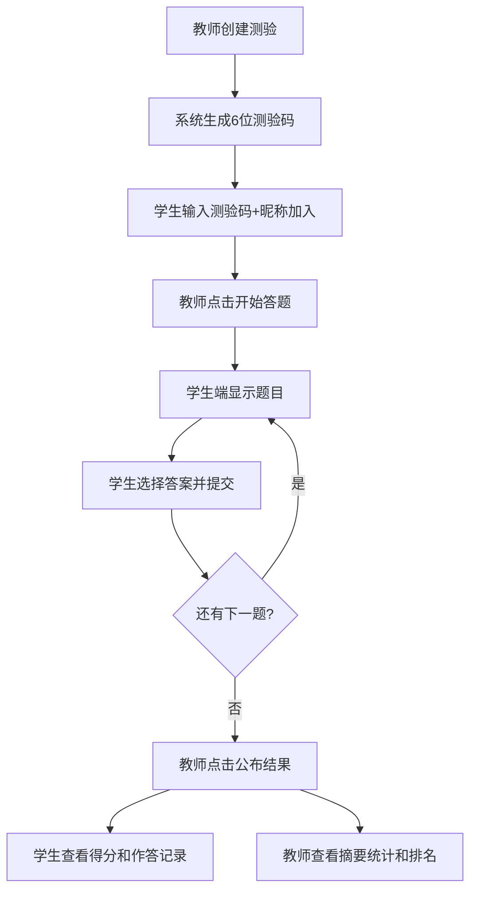

## 1. 产品概述

随堂测验与实时学情分析平台，面向网课教师和学生，解决现有问卷工具结果统计不直观、无法实时展示答题进度的问题。教师创建选择题/判断题测验，学生通过测验码参与答题，教师端实时查看答题人数、正确率分布和选项统计柱状图。

- 目标用户：在线教育教师、课堂学生
- 核心价值：实时学情反馈、零延迟课堂互动、一键导出统计分析

## 2. 核心功能

### 2.1 用户角色

| 角色 | 进入方式 | 核心权限 |
|------|----------|----------|
| 教师 | 选择"教师"身份 | 创建测验、控制答题流程、查看实时统计、导出数据 |
| 学生 | 选择"学生"身份，输入测验码+昵称 | 参与答题、查看个人成绩 |

### 2.2 功能模块

1. **教师控制面板**：测验创建、流程控制、实时看板、统计摘要
2. **学生答题端**：加入测验、答题界面、结果反馈

### 2.3 页面详情

| 页面名称 | 模块名称 | 功能描述 |
|----------|----------|----------|
| 首页（角色选择） | 身份选择 | 选择教师或学生身份进入对应页面 |
| 教师控制面板 | 测验创建 | 填写标题、选择题目类型、动态添加题目和选项、设置正确答案 |
| 教师控制面板 | 流程控制 | 开始答题、结束答题、公布结果按钮，按状态启用/禁用 |
| 教师控制面板 | 实时看板 | 答题人数、正确率卡片、选项统计柱状图、已答/未答学生列表 |
| 教师控制面板 | 统计摘要 | 正确率分布饼图、单题正确率条形图、学生排名、导出JSON |
| 学生答题端 | 加入测验 | 输入6位测验码和昵称，等待教师开始 |
| 学生答题端 | 答题界面 | 显示题目和选项，选中后提交，倒计时提示 |
| 学生答题端 | 结果反馈 | 显示得分、每题作答记录（标注对错）、整体正确率 |

## 3. 核心流程

教师创建测验 → 生成6位测验码 → 学生输入测验码加入 → 教师点击"开始答题" → 学生端显示题目并答题 → 教师端实时更新统计 → 倒计时结束自动提交 → 教师点击"公布结果" → 学生查看得分和作答记录 → 教师查看摘要统计和排名

## 4. 用户界面设计

### 4.1 设计风格

- 主色：#2563eb（蓝色），辅助色：#10b981（绿色/正确）、#ef4444（红色/错误），背景：#f8fafc
- 按钮风格：圆角12px，主色填充，禁用态灰色
- 字体：标题加粗，统计数字32px粗体，正文常规
- 布局：卡片式布局，教师端左右分栏，学生端居中单列
- 图标风格：简洁线性图标

### 4.2 页面设计概览

| 页面名称 | 模块名称 | UI元素 |
|----------|----------|--------|
| 首页 | 身份选择卡片 | 居中两张卡片（教师/学生），蓝色渐变背景，悬停上浮 |
| 教师控制面板 | 控制区（左侧） | 测验创建表单、流程控制按钮、测验码展示 |
| 教师控制面板 | 看板区（右侧） | 答题人数卡片、正确率卡片、柱状图（选项颜色：A红B蓝C绿D橙）、学生列表 |
| 教师控制面板 | 摘要面板 | 饼图（正确率分布）、条形图（单题正确率）、排名列表、导出按钮 |
| 学生答题端 | 加入页 | 测验码输入框、昵称输入框、加入按钮 |
| 学生答题端 | 等待页 | 等待教师开始提示，动画效果 |
| 学生答题端 | 答题页 | 题目卡片（白底圆角阴影）、选项按钮（悬停放大1.05倍）、提交按钮、倒计时 |
| 学生答题端 | 结果页 | 得分展示、逐题作答记录（对错标注） |

### 4.3 响应式适配

- 教师端：宽度 < 1024px 时，左右布局改为上下布局
- 学生端：宽度 < 768px 时，选项按钮从行排列改为2列网格布局
- 桌面优先设计，移动端自适应

### 4.4 动画效果

- 图表数据更新：0.3秒缓动过渡
- 卡片悬停：上浮效果（translateY + shadow）
- 选项悬停：放大1.05倍 + 背景色变浅
- 选项选中：主色填充 + 白色文字
