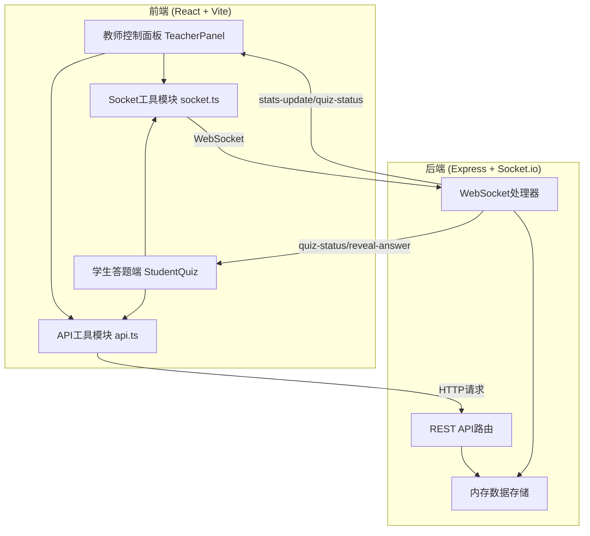
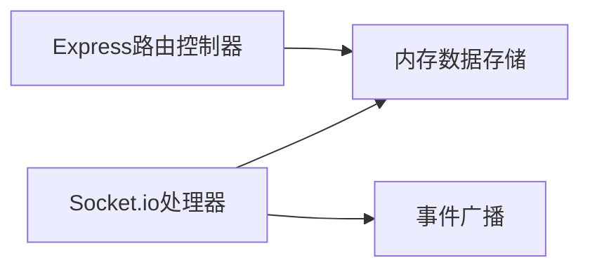
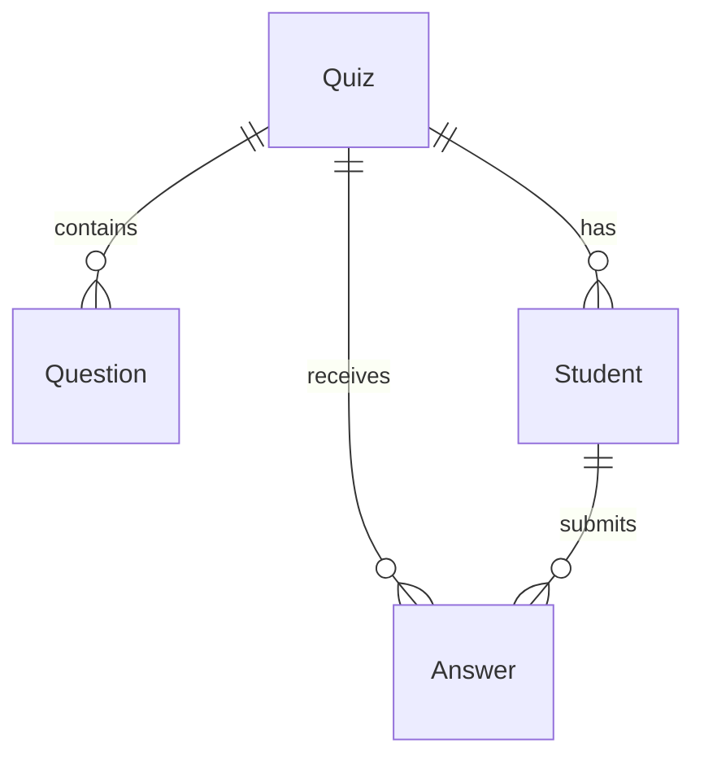

## 1. 架构设计



## 2. 技术说明

- 前端：React 18 + TypeScript + Vite + Recharts + Socket.io-client + TailwindCSS
- 初始化工具：vite-init（react-express-ts模板）
- 后端：Express 4 + Socket.io + uuid + cors
- 数据库：内存数据存储（Map/对象），无持久化
- 通信：REST API（创建测验、提交答案、获取统计）+ Socket.io（实时推送）

## 3. 路由定义

| 路由 | 用途 |
|------|------|
| / | 首页，角色选择 |
| /teacher | 教师控制面板 |
| /student | 学生答题端 |

## 4. API定义

### REST API

| 方法 | 路径 | 请求体 | 响应 | 用途 |
|------|------|--------|------|------|
| POST | /api/quiz | `{ title, questions: [{ type, text, options, correctAnswers }] }` | `{ quizId, code }` | 创建测验 |
| POST | /api/answer | `{ quizId, studentId, questionIndex, answers }` | `{ success, message }` | 提交答案 |
| GET | /api/quiz/:id/stats | - | `{ quiz, students, answers, stats }` | 获取统计 |

### TypeScript类型定义

```typescript
interface Quiz {
  id: string;
  code: string;
  title: string;
  questions: Question[];
  status: 'waiting' | 'active' | 'finished' | 'revealed';
  currentQuestionIndex: number;
  timerDuration: number;
  createdAt: number;
}

interface Question {
  type: 'single' | 'multiple' | 'boolean';
  text: string;
  options: string[];
  correctAnswers: number[];
}

interface Student {
  id: string;
  nickname: string;
  quizId: string;
  joinedAt: number;
}

interface Answer {
  studentId: string;
  questionIndex: number;
  answers: number[];
  submittedAt: number;
}
```

### WebSocket事件

| 事件名 | 方向 | 数据 | 用途 |
|--------|------|------|------|
| join-quiz | 学生→服务器 | `{ quizId, studentId, nickname }` | 学生加入测验房间 |
| start-quiz | 教师→服务器 | `{ quizId, timerDuration }` | 开始答题 |
| end-quiz | 教师→服务器 | `{ quizId }` | 结束当前题目答题 |
| next-question | 教师→服务器 | `{ quizId }` | 进入下一题 |
| reveal-answer | 教师→服务器 | `{ quizId }` | 公布正确答案 |
| stats-update | 服务器→教师 | 统计数据对象 | 推送实时统计更新 |
| quiz-status | 服务器→全体 | `{ status, currentQuestionIndex, timerDuration }` | 推送状态变化 |
| question-start | 服务器→学生 | `{ questionIndex, question, timerDuration }` | 开始新题目 |
| question-end | 服务器→学生 | `{ autoSubmit }` | 题目结束 |
| result-reveal | 服务器→学生 | `{ quiz, answers, score }` | 公布结果 |
| timer-tick | 服务器→学生 | `{ remaining }` | 倒计时更新 |

## 5. 服务器架构



- Express路由处理REST请求，直接操作内存存储
- Socket.io处理器监听教师/学生事件，更新存储后广播
- 内存存储使用Map结构管理测验、学生、答案数据

## 6. 数据模型

### 6.1 数据模型定义



### 6.2 内存数据结构

```typescript
const quizzes: Map<string, Quiz> = new Map();
const students: Map<string, Student> = new Map();
const answers: Map<string, Answer[]> = new Map();
const quizRooms: Map<string, Set<string>> = new Map();
```

- quizzes：测验ID → 测验对象
- students：学生ID → 学生对象
- answers：测验ID → 答案数组
- quizRooms：测验ID → 学生Socket ID集合
