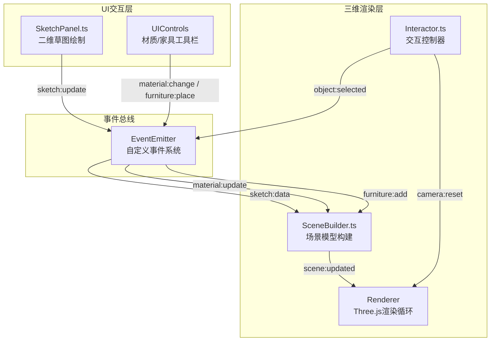

## 1. 架构设计



## 2. 技术说明

- 前端框架：纯TypeScript + Three.js，无上层UI框架（按需求使用原生DOM操作）
- 构建工具：Vite 5.x + TypeScript（ES Module，严格模式）
- 3D引擎：Three.js latest
- 辅助库：uuid（唯一标识）、lil-gui（调试UI，可选）
- 无后端：纯前端单页应用，数据全部驻留内存

## 3. 目录结构

```
e:\solo\SoloAutoDemo\tasks\auto57\
├── .trae/documents/
│   ├── PRD.md
│   └── ARCHITECTURE.md
├── index.html
├── package.json
├── vite.config.js
├── tsconfig.json
└── src/
    ├── main.ts              # 入口，协调UI和渲染模块
    ├── types.ts             # 共享类型定义
    ├── events/
    │   └── EventBus.ts      # 事件总线
    ├── ui/
    │   ├── SketchPanel.ts   # 二维草图面板
    │   ├── MaterialPanel.ts # 材质色板
    │   └── FurniturePanel.ts# 家具工具栏
    └── renderer/
        ├── SceneBuilder.ts  # 3D场景构建
        ├── Interactor.ts    # 交互控制
        └── types.ts         # 渲染层类型
```

## 4. 数据模型

### 4.1 草图几何数据
```typescript
interface WallRect {
  id: string;
  x: number;      // 画布像素坐标
  y: number;
  width: number;
  height: number;
  type: 'wall' | 'door' | 'window';
}

interface SketchData {
  walls: WallRect[];
  gridSize: number;  // 单元格像素大小（默认15）
  canvasWidth: number;
  canvasHeight: number;
}
```

### 4.2 家具数据
```typescript
type FurnitureType = 'table' | 'chair' | 'cabinet' | 'bed';

interface FurnitureItem {
  id: string;
  type: FurnitureType;
  position: { x: number; y: number; z: number };
  color: number;
  scale: { x: number; y: number; z: number };
}
```

### 4.3 材质配置
```typescript
interface MaterialConfig {
  wallColor: number;
  floorColor: number;
  ceilingColor: number;
}
```

## 5. 核心模块职责

### SceneBuilder.ts
- 接收SketchData，将2D矩形坐标映射为3D世界坐标
- 创建墙壁Mesh（BoxGeometry + MeshStandardMaterial，半透明）
- 门窗洞口：在墙壁Mesh上做差集（或直接分段构建），边缘添加LineSegments
- 创建地板Plane和天花板
- 管理家具Mesh的增删改
- 暴露`updateMaterials(config: MaterialConfig)`方法做颜色tween

### Interactor.ts
- 封装OrbitControls（旋转/缩放/平移）
- 封装Raycaster用于物体拾取
- 点击地面/墙面时触发家具放置UI
- 选中家具时显示浅黄色发光轮廓（OutlineEffect或备用方案）
- 支持家具拖拽（限制在房间范围内）和右键删除
- 提供`resetCamera()`和`exportPNG(width, height)`方法

### SketchPanel.ts
- HTML5 Canvas 2D绘制
- 15px网格吸附：`Math.round(pos / gridSize) * gridSize`
- 鼠标事件：mousedown记录起点→mousemove绘制预览矩形→mouseup确认
- 双击：命中测试切换wall↔door/window
- 历史记录栈支持撤销，清空按钮重置
- 每次变更emit`sketch:update`事件

## 6. 性能优化策略

- 草图绘制：requestAnimationFrame节流，脏矩形重绘
- 3D场景：共享Geometry实例，合并非动态Mesh
- 材质动画：使用Three.js Color.lerp + Clock，避免每帧对象创建
- 选中高亮：复用同一个OutlineEffect或emissive材质，避免重复创建
- 导出PNG：renderer.setSize临时切换，渲染后恢复，避免重排
