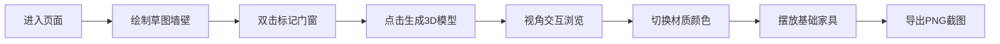

## 1. 产品概述

室内设计草图一键转3D可视化工具，解决建筑设计师与客户在方案讨论中因二维图纸理解差异导致的沟通效率低下问题。用户通过简单的二维草图绘制即可自动生成可交互的3D空间模型，支持材质切换、家具摆放和视角自由操控。

- 核心价值：将二维草图即时转化为直观3D预览，降低沟通成本，提升设计效率
- 目标用户：建筑设计师、室内设计师、装修客户

## 2. 核心功能

### 2.1 用户角色

| 角色 | 注册方式 | 核心权限 |
|------|---------|---------|
| 普通用户 | 无需注册，直接使用 | 绘制草图、生成3D模型、调整材质、摆放家具、导出截图 |

### 2.2 功能模块

1. **草图绘制面板**：方格画布、墙壁绘制、门窗标记、撤销清空
2. **3D场景视图**：自动建模、视角控制、模型高亮、属性面板
3. **材质工具栏**：颜色预设、实时切换、过渡动画
4. **家具摆放系统**：家具选择、位置调整、拖拽删除
5. **视图导出**：PNG截图导出、重置视角

### 2.3 页面详情

| 页面名称 | 模块名称 | 功能描述 |
|---------|---------|---------|
| 主工作台 | 草图绘制面板 | 左侧35%宽度方格画布，鼠标拖拽绘制墙壁矩形，15px单元格吸附，双击切换门窗，撤销/清空操作 |
| 主工作台 | 3D场景视图 | 右侧全屏3D渲染区，OrbitControls视角控制，Raycaster物体拾取 |
| 主工作台 | 顶部操作栏 | 生成按钮、撤销、清空操作入口 |
| 主工作台 | 底部工具栏 | 6种颜色预设色板、家具选择工具栏、重置视角、导出按钮 |

## 3. 核心流程

用户进入页面后，在左侧方格画布上通过鼠标拖拽绘制墙壁矩形，双击墙壁可标记为门窗洞口。点击生成按钮后，系统解析草图几何数据，自动计算三维空间结构并渲染3D模型。用户可通过鼠标旋转/缩放视角，从底部色板切换墙壁地板材质颜色，点击地面或墙面放置家具，最后可导出1920x1080分辨率的PNG截图。

## 4. 用户界面设计

### 4.1 设计风格
- 主色调：深色主题，背景#1a1a2e，卡片#16213e
- 辅助色：亮蓝色#00d4ff（门窗线框）、浅黄色#ffe066（选中高亮）
- 材质预设：白色#ffffff、米黄#f5e6c8、浅灰#d9d9d9、浅蓝#c8e0f5、薄荷绿#c8f5e0、浅粉#f5c8d9
- 按钮风格：圆角8px，悬停0.2秒颜色过渡+阴影上浮
- 字体：现代无衬线字体，清晰可读
- 布局：桌面端左右分栏（草图35% / 3D视图65%），移动端抽屉式侧边栏

### 4.2 页面设计概览

| 页面名称 | 模块名称 | UI元素 |
|---------|---------|--------|
| 主工作台 | 草图绘制面板 | 深色方格背景、红色墙壁矩形、蓝色门窗虚线框、网格辅助线 |
| 主工作台 | 3D场景视图 | 半透明白色墙壁、亮蓝色门窗边缘线框、浅灰色地板、发光选中轮廓 |
| 主工作台 | 顶部操作栏 | 生成按钮（主色高亮）、撤销按钮、清空按钮，横向排列 |
| 主工作台 | 底部工具栏 | 6个圆形色板、4个家具图标按钮、重置视角、导出按钮 |

### 4.3 响应式设计
- 桌面端（≥768px）：左右固定分栏布局
- 移动端（<768px）：草图面板变为可折叠抽屉式侧边栏，3D视图全屏
- 触控优化：支持触屏绘制和手势缩放

### 4.4 3D场景设计指南
- 环境光照：AmbientLight(0xffffff, 0.6) + DirectionalLight(0xffffff, 0.8)，柔和自然
- 相机设置：初始俯视45°角，PerspectiveCamera(60, aspect, 0.1, 1000)
- 材质效果：墙壁使用MeshStandardMaterial半透明，门窗边缘用LineSegments亮蓝色线框
- 选中效果：通过OutlineEffect或Emissive材质实现浅黄色发光轮廓
- 动画过渡：材质颜色使用0.3秒线性tween动画
- 性能预算：基础房间+10个家具时≥45FPS
