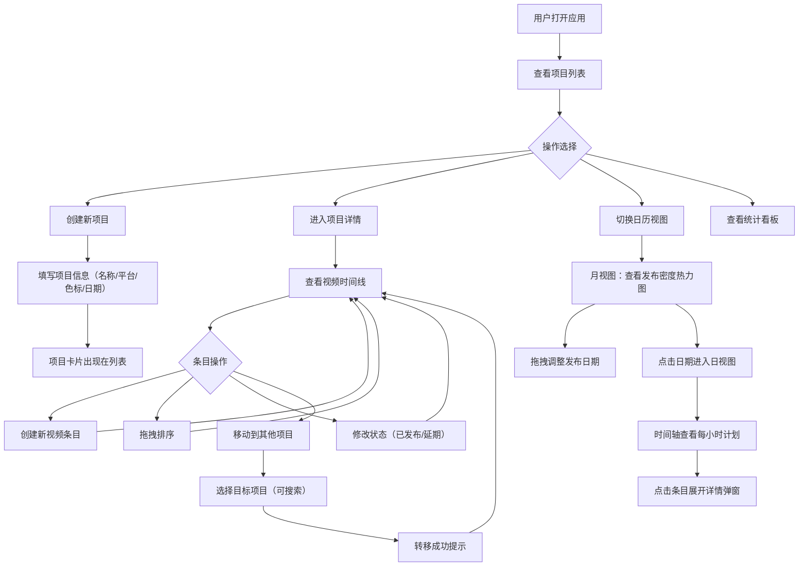

## 1. 产品概述

短视频发布排期管理工具，帮助内容创作者高效规划和管理多平台短视频的发布计划。解决手动记录发布时间容易遗漏、多平台同步困难以及素材关联混乱的核心痛点。

- 目标用户：短视频内容创作者、自媒体运营人员
- 核心价值：通过可视化日历和项目管理，消除发布遗漏，统一管理多平台排期，建立素材与视频的清晰关联

## 2. 核心功能

### 2.1 用户角色
| 角色 | 注册方式 | 核心权限 |
|------|----------|----------|
| 内容创作者 | 无需注册，本地使用 | 创建/管理项目和视频条目，查看日历和统计 |

### 2.2 功能模块
1. **项目列表页**：项目卡片展示、创建/管理项目、进度可视化
2. **项目详情页**：视频条目时间线、拖拽排序、状态管理、条目移动
3. **日历视图页**：月视图密度热力图、日视图时间轴、拖拽排期
4. **统计看板页**：发布进度概览、平台分布、延期统计

### 2.3 页面详情
| 页面名称 | 模块名称 | 功能描述 |
|----------|----------|----------|
| 项目列表页 | 项目卡片网格 | 展示所有项目卡片，每张卡片显示项目名称、平台标签、封面色标签、进度条；进度低于50%时显示警示条 |
| 项目列表页 | 创建项目弹窗 | 输入项目名称、选择目标平台（多选）、选择封面颜色标签、设定起止日期 |
| 项目详情页 | 视频时间线 | 按发布时间从上到下排列的视频条目列表，过期条目置灰+已过期标签，支持拖拽排序 |
| 项目详情页 | 视频条目管理 | 创建/编辑视频（标题、发布时间、时长、素材链接、状态），一键延期过期条目 |
| 项目详情页 | 条目批量移动 | 勾选多个条目后移动到其他项目，项目选择弹窗支持搜索 |
| 日历视图页 | 月视图 | 日期单元格显示发布数量徽标和缩略标题，单元格背景色按密度渐变，支持拖拽调整日期 |
| 日历视图页 | 日视图 | 点击日期进入，时间轴精确展示每小时发布计划，条目可展开详情弹窗 |
| 统计看板页 | 数据概览 | 总项目数、总视频数、已发布/待发布/已延期比例、各平台分布 |

## 3. 核心流程

## 4. 用户界面设计

### 4.1 设计风格
- 主色调：#6366f1（靛蓝），成功/已发布色：#22c55e（翠绿）
- 按钮风格：圆角矩形（20px圆角），主要按钮填充靛蓝色，成功按钮填充翠绿色
- 字体：系统默认字体（-apple-system），正文14px，标题18px
- 布局风格：左深色导航栏 + 右浅灰主内容区两栏布局
- 卡片风格：8px圆角，悬停上浮4px + 阴影加深（0.3s ease过渡）

### 4.2 页面设计概览
| 页面名称 | 模块名称 | UI元素 |
|----------|----------|--------|
| 全局 | 左侧导航栏 | 240px宽，深色半透明毛玻璃背景；Logo文本图标；项目列表（带色标签+进度小圆点）；日历快捷入口；设置按钮；选中项左侧3px彩色指示条+背景微变 |
| 项目列表页 | 项目卡片网格 | 卡片8px圆角；右上角进度条（颜色随封面色）；进度<50%时底部淡红色渐变警示条；悬停上浮4px+阴影加深 |
| 项目详情页 | 视频时间线 | 垂直时间线布局，左侧时间标记；条目卡片可拖拽，拖拽时半透明占位+弹性动画；过期条目置灰+"已过期"标签+"延期到明天"按钮 |
| 日历视图页 | 月视图网格 | 7列日历网格；单元格背景按密度渐变（白→淡黄→浅橙→深红）；数字徽标+最多3条缩略标题；拖拽时日期高亮预览 |
| 日历视图页 | 日视图时间轴 | 垂直时间轴，每小时一行；条目可点击展开详情弹窗；弹窗底部滑入动画+毛玻璃遮罩 |
| 全局弹窗 | 详情/选择弹窗 | 底部滑入过渡动画；毛玻璃背景遮罩；20px圆角按钮 |
| 移动端 | 底部Tab栏 | 60px高；图标+文字标签；弹窗改为全屏右侧抽屉面板 |

### 4.3 响应式设计
- 桌面优先设计（≥768px）：左侧240px导航栏 + 右侧主内容区
- 移动端（<768px）：导航栏收缩为底部Tab栏（60px高）；日历切换紧凑模式（仅数字徽标）；弹窗改为全屏右侧抽屉面板

### 4.4 12种预设柔和色板
#f87171（珊瑚红）、#fb923c（琥珀橙）、#fbbf24（向日葵黄）、#a3e635（青柠绿）、#34d399（薄荷绿）、#22d3ee（天际蓝）、#60a5fa（矢车菊蓝）、#818cf8（薰衣草紫）、#a78bfa（紫罗兰）、#e879f9（兰花粉）、#f472b6（玫瑰粉）、#94a3b8（石板灰）

## 5. 性能要求
- 日历月视图切换渲染时间 ≤ 80ms（30个项目200条视频）
- 拖拽排序帧率 ≥ 55fps
- 列表滚动帧率 ≥ 50fps
