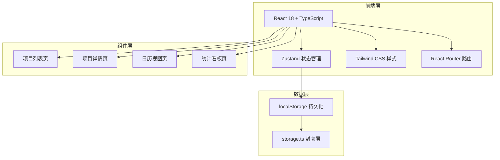
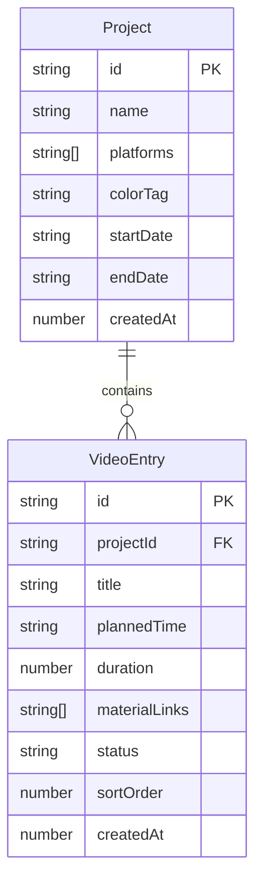

## 1. 架构设计



## 2. 技术说明
- 前端：React@18 + TypeScript + Tailwind CSS@3 + Vite
- 初始化工具：vite-init（react-ts 模板）
- 后端：无
- 数据库：无（使用 localStorage 持久化）
- 状态管理：Zustand（替代用户要求的自定义 Context，提供更简洁的API和自动持久化能力）
- 路由：React Router DOM（客户端路由）
- 唯一ID：uuid

## 3. 路由定义
| 路由 | 用途 |
|------|------|
| / | 项目列表首页，展示所有项目卡片 |
| /project/:id | 项目详情页，展示视频条目时间线 |
| /calendar | 日历视图页（月视图/日视图切换） |
| /calendar/:date | 日视图，精确展示指定日期的发布计划 |
| /stats | 统计看板页 |

## 4. 数据模型

### 4.1 数据模型定义



### 4.2 类型定义

```typescript
type Platform = 'douyin' | 'bilibili' | 'xiaohongshu' | 'weixin';

type VideoStatus = 'pending' | 'published' | 'delayed';

type ViewMode = 'projects' | 'calendar' | 'stats';

interface Project {
  id: string;
  name: string;
  platforms: Platform[];
  colorTag: string;
  startDate: string;
  endDate: string;
  createdAt: number;
}

interface VideoEntry {
  id: string;
  projectId: string;
  title: string;
  plannedTime: string;
  duration: number;
  materialLinks: string[];
  status: VideoStatus;
  sortOrder: number;
  createdAt: number;
}
```

## 5. 文件组织结构

```
├── index.html
├── package.json
├── vite.config.ts
├── tsconfig.json
├── tailwind.config.js
├── postcss.config.js
├── src/
│   ├── main.tsx
│   ├── App.tsx
│   ├── types.ts
│   ├── store.ts              (Zustand 全局状态管理)
│   ├── utils/
│   │   └── storage.ts        (localStorage 读写封装)
│   ├── components/
│   │   ├── Sidebar.tsx        (左侧导航栏)
│   │   ├── ProjectCard.tsx    (项目卡片)
│   │   ├── ProjectForm.tsx    (创建/编辑项目表单)
│   │   ├── VideoTimeline.tsx  (视频时间线列表)
│   │   ├── VideoItem.tsx      (单个视频条目)
│   │   ├── VideoForm.tsx      (创建/编辑视频表单)
│   │   ├── MoveVideoModal.tsx (移动条目到其他项目弹窗)
│   │   ├── CalendarView.tsx   (日历月视图)
│   │   ├── CalendarDayView.tsx(日历日视图)
│   │   ├── DetailModal.tsx    (视频详情弹窗)
│   │   └── StatsDashboard.tsx (统计看板)
│   └── styles.css             (全局样式补充)
```

## 6. 状态管理设计（Zustand）

```typescript
interface AppState {
  projects: Project[];
  videos: VideoEntry[];
  selectedProjectId: string | null;
  viewMode: ViewMode;
  calendarDate: string;
  
  // 项目操作
  addProject: (project: Omit<Project, 'id' | 'createdAt'>) => void;
  updateProject: (id: string, data: Partial<Project>) => void;
  deleteProject: (id: string) => void;
  
  // 视频操作
  addVideo: (video: Omit<VideoEntry, 'id' | 'createdAt' | 'sortOrder'>) => void;
  updateVideo: (id: string, data: Partial<VideoEntry>) => void;
  deleteVideo: (id: string) => void;
  moveVideoToProject: (videoIds: string[], targetProjectId: string) => void;
  updateVideoStatus: (id: string, status: VideoStatus) => void;
  reorderVideos: (projectId: string, videoIds: string[]) => void;
  
  // UI状态
  setViewMode: (mode: ViewMode) => void;
  setSelectedProjectId: (id: string | null) => void;
  setCalendarDate: (date: string) => void;
}
```

## 7. 性能优化策略
- 日历月视图：使用 `useMemo` 缓存日期计算和视频分组，避免每次渲染重新计算
- 拖拽排序：使用 `requestAnimationFrame` 控制动画帧率，确保流畅拖拽体验
- 列表滚动：虚拟化长列表（当条目超过50条时启用），确保滚动帧率 ≥ 50fps
- localStorage 写入：使用防抖（debounce 300ms）避免频繁写入
- 组件拆分：每个组件 < 200 行，避免大型重渲染
