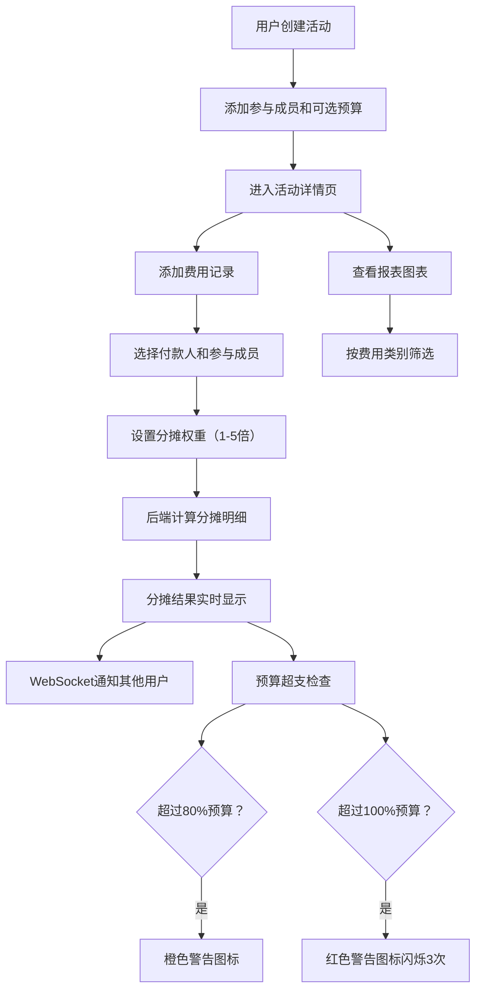

## 1. 产品概述

面向小型社区或兴趣小组的活动经费分摊与预算追踪应用，实现从活动创建、费用记录、成员分摊到预算超支预警的完整闭环。帮助用户轻松管理集体活动的财务透明度，避免费用分摊纠纷。

- 目标用户：兴趣小组、社团、户外团队、合租室友等需要共同分摊费用的小型群体
- 核心价值：让多人活动的费用分摊变得透明、简单、实时

## 2. 核心功能

### 2.1 用户角色

| 角色 | 说明 |
|------|------|
| 活动创建者 | 创建活动、设置预算、管理成员 |
| 参与成员 | 查看费用、查看分摊明细、添加费用 |

### 2.2 功能模块

1. **活动列表页**：活动卡片网格展示、搜索筛选、创建活动入口
2. **活动详情页**：活动信息、费用列表、成员分摊表、添加费用、报表图表

### 2.3 页面详情

| 页面名称 | 模块名称 | 功能描述 |
|----------|----------|----------|
| 活动列表页 | 活动卡片网格 | 展示所有活动卡片，卡片显示名称、成员人数、总预算，背景色循环8种柔和色，悬停上浮5px+阴影 |
| 活动列表页 | 搜索筛选 | 按活动名称搜索 |
| 活动列表页 | 创建活动 | 弹出模态框填写活动名称、描述、参与成员（自定义姓名+头像初始）、可选预算 |
| 活动详情页 | 活动信息栏 | 显示活动名称、描述、成员头像列表（圆形，姓名首字母） |
| 活动详情页 | 费用列表 | 左侧区域，每条费用显示名称、金额、付款人、日期，高于平均金额的红色左边框 |
| 活动详情页 | 分摊表 | 右侧区域，表格列出每位成员应付款/已付款，交替行背景色，当前用户行淡蓝高亮 |
| 活动详情页 | 添加费用 | 模态表单，选择付款人、参与成员（默认全选）、分摊权重1-5倍 |
| 活动详情页 | 报表图表 | 柱状图展示各成员累计应付/已付对比，按费用类别筛选，动画500ms |
| 活动详情页 | 预算预警 | 超80%橙色警告图标，超100%红色警告图标闪烁3次 |

## 3. 核心流程

用户创建活动 → 添加参与成员 → 记录费用支出 → 系统按权重计算分摊 → 实时更新分摊表 → WebSocket通知在线成员 → 预算超支预警提示

## 4. 用户界面设计

### 4.1 设计风格

- 主色调：蓝灰色系（#1a202c 深蓝导航、#e2e8f0 浅灰内容区）
- 强调色：橙红色（#e53e3e 用于警告和高亮）
- 卡片圆角12px，阴影rgba(0,0,0,0.08)
- 字体：系统字体栈，中文优先思源黑体
- 布局：左右分栏，左侧240px深蓝导航栏，右侧白色内容区最大1200px居中
- 模态框：半透明遮罩，缩放淡入动画300ms
- 按钮：悬停渐变，点击水波纹效果

### 4.2 页面设计概览

| 页面名称 | 模块名称 | UI元素 |
|----------|----------|--------|
| 活动列表页 | 活动卡片 | 网格布局，8种柔和色循环背景，圆角12px，悬停上浮+阴影动画 |
| 活动列表页 | 创建按钮 | 固定右下角浮动按钮，橙红色，悬停放大 |
| 活动列表页 | 搜索栏 | 顶部圆角输入框，带搜索图标 |
| 活动详情页 | 成员头像 | 圆形头像，姓名首字母，彩色边框 |
| 活动详情页 | 费用列表 | 左侧卡片式列表，高金额红色左边框 |
| 活动详情页 | 分摊表 | 右侧表格，交替行背景，当前用户淡蓝高亮 |
| 活动详情页 | 饼图 | recharts饼图，成员应付金额占比，动画过渡 |
| 活动详情页 | 柱状图 | recharts柱状图，应付/已付对比，类别筛选 |

### 4.3 响应式适配

- 桌面优先设计，最小宽度768px
- 屏幕<768px：侧边导航折叠为汉堡菜单，详情页左右分栏变为上下排列
- 触摸优化：按钮最小44px点击区域

### 4.4 动画与交互

- 模态框打开：scale(0.95)→1, opacity 0→1, 300ms
- 卡片悬停：translateY(-5px), 阴影增强
- 预算警告闪烁：红色图标闪烁3次后停止
- 图表更新：500ms动画过渡
- 按钮水波纹：点击时径向扩散效果
