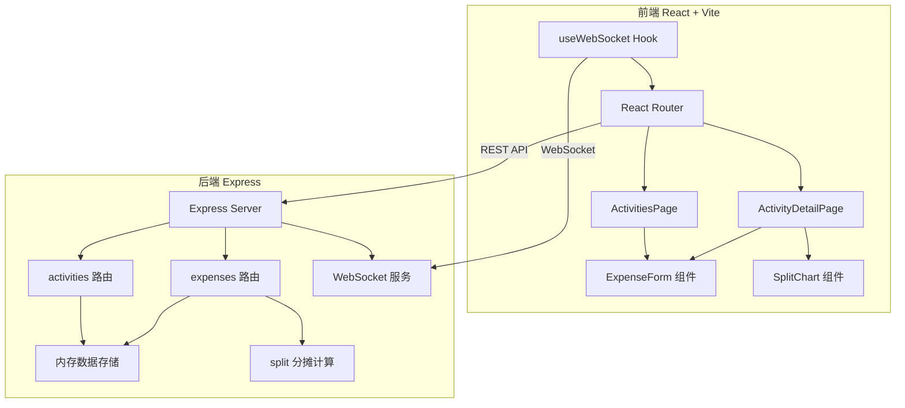
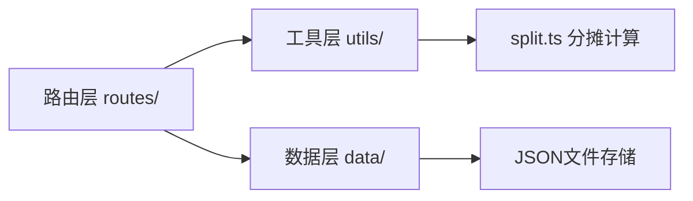
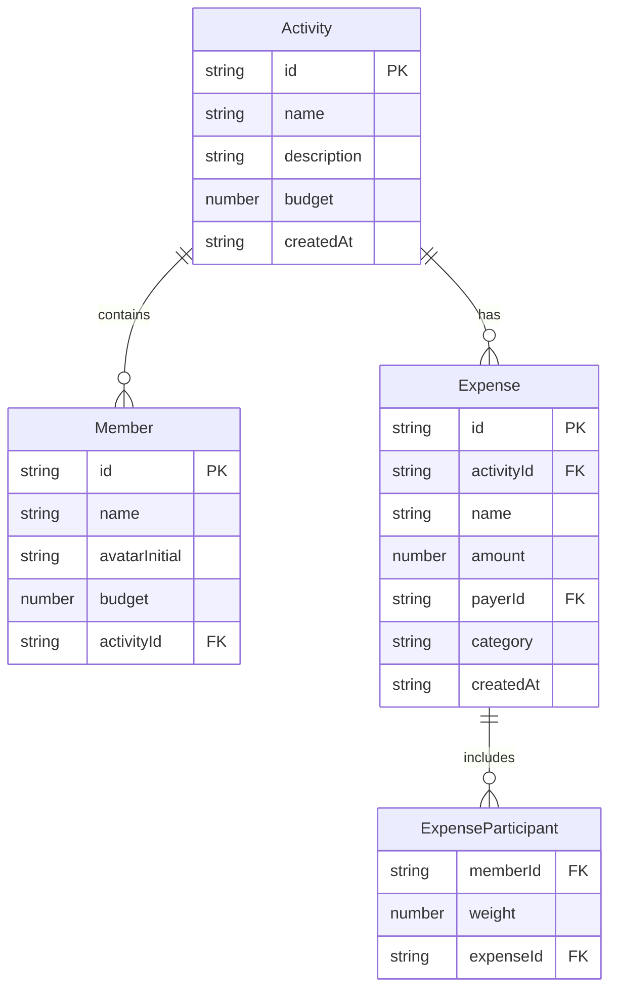

## 1. 架构设计



## 2. 技术说明

- 前端：React@18 + TypeScript + Vite + TailwindCSS + Zustand
- 初始化工具：vite-init (react-express-ts 模板)
- 后端：Express@4 + TypeScript (ESM格式)
- 数据库：JSON文件存储（server/data/目录）
- 图表：recharts
- 实时通信：WebSocket (ws)
- 包管理：npm

## 3. 路由定义

| 路由 | 用途 |
|------|------|
| / | 活动列表页，展示所有活动卡片 |
| /activity/:id | 活动详情页，费用列表、分摊表、报表 |

## 4. API 定义

### 4.1 活动 API

```typescript
interface Activity {
  id: string;
  name: string;
  description: string;
  members: Member[];
  budget?: number;
  createdAt: string;
}

interface Member {
  id: string;
  name: string;
  avatarInitial: string;
  budget?: number;
}

// POST /api/activities - 创建活动
// Request: { name: string; description: string; members: Omit<Member, 'id'>[]; budget?: number }
// Response: Activity

// GET /api/activities - 获取活动列表
// Response: Activity[]

// GET /api/activities/:id - 获取活动详情
// Response: Activity

// DELETE /api/activities/:id - 删除活动
// Response: { success: boolean }
```

### 4.2 费用 API

```typescript
interface Expense {
  id: string;
  activityId: string;
  name: string;
  amount: number;
  payerId: string;
  participants: ExpenseParticipant[];
  category: 'dining' | 'transport' | 'ticket' | 'other';
  createdAt: string;
}

interface ExpenseParticipant {
  memberId: string;
  weight: number;
}

interface SplitResult {
  memberId: string;
  memberName: string;
  shareAmount: number;
  totalOwed: number;
  totalPaid: number;
  budget?: number;
}

// POST /api/activities/:id/expenses - 添加费用
// Request: { name: string; amount: number; payerId: string; participants: ExpenseParticipant[]; category: string }
// Response: { expense: Expense; splits: SplitResult[] }

// GET /api/activities/:id/expenses - 获取费用列表
// Response: Expense[]

// PUT /api/activities/:id/expenses/:expenseId - 更新费用
// Request: Partial<Expense>
// Response: Expense

// DELETE /api/activities/:id/expenses/:expenseId - 删除费用
// Response: { success: boolean }

// GET /api/activities/:id/splits - 获取分摊结果
// Response: SplitResult[]
```

## 5. 服务端架构图



## 6. 数据模型

### 6.1 数据模型定义



### 6.2 数据存储

数据以JSON文件形式存储在 `server/data/` 目录下：
- `activities.json` - 存储所有活动及其成员信息
- `expenses.json` - 存储所有费用记录

服务启动时加载到内存，修改时同步写入文件。
