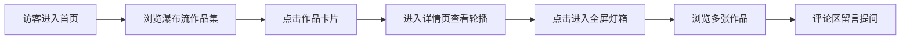
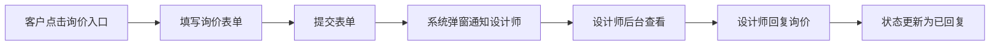

## 1. 产品概述

为自由插画师和平面设计师打造的在线作品集构建与客户询价管理工具，解决个人作品展示散乱、客户询价流程不透明、合作记录无法追溯的问题。

- 核心目标：提供专业的作品展示平台，简化客户沟通流程，建立完整的合作记录体系
- 目标用户：自由插画师、平面设计师及其他创意工作者
- 市场价值：帮助创意工作者建立专业形象，提升客户转化率，规范化业务流程

## 2. 核心功能

### 2.1 用户角色

| 角色 | 访问方式 | 核心权限 |
|------|----------|----------|
| 访客 | 公开访问 | 浏览作品集、查看作品详情、提交询价、发表评论 |
| 设计师 | 管理后台 | 创建/编辑作品集、回复评论、查看/回复询价、管理合作状态 |

### 2.2 功能模块

1. **首页作品集展示**：瀑布流网格展示、卡片悬停效果、标签自动着色
2. **作品详情页**：横向轮播画廊、全屏灯箱模式、评论区互动
3. **询价表单**：预算选择、项目描述、期望日期、提交动画
4. **管理后台**：询价卡片列表、状态着色、对话历史、回复功能

### 2.3 页面详情

| 页面名称 | 模块名称 | 功能描述 |
|----------|----------|----------|
| 首页 | 作品集瀑布流 | 网格布局展示作品卡片，支持响应式，悬停放大效果，标签按类别着色 |
| 首页 | 导航栏 | 品牌Logo、首页链接、询价入口、管理后台入口 |
| 作品详情页 | 横向轮播 | 多张作品图片轮播展示，支持触摸滑动，左右箭头导航 |
| 作品详情页 | 全屏灯箱 | 点击图片进入全屏模式，平滑缩放动画，渐变模糊过渡切换 |
| 作品详情页 | 评论区 | 访客留言、设计师回复、回复高亮动画 |
| 询价页面 | 询价表单 | 预算范围下拉、项目描述文本域、期望日期选择器、表单验证 |
| 管理后台 | 询价列表 | 按状态分组的卡片列表，状态着色（待回复/已回复/已成交） |
| 管理后台 | 询价详情 | 展开对话历史、回复输入框、状态更新 |

## 3. 核心流程

### 3.1 访客浏览作品流程

访客进入首页 → 浏览瀑布流作品集 → 点击感兴趣的作品卡片 → 进入详情页查看轮播图 → 点击进入全屏灯箱 → 浏览多张作品 → 可在评论区留言提问

### 3.2 客户询价流程

客户点击询价入口 → 填写询价表单（预算/描述/日期）→ 提交表单 → 系统发送弹窗通知设计师 → 设计师在后台查看并回复 → 客户可查看回复

## 4. 用户界面设计

### 4.1 设计风格

- **主色调**：冷白（#FAFAFA）和深灰（#2D2D2D），辅以蓝紫渐变（#6366F1 → #A855F7）作为品牌色
- **按钮风格**：圆角8px，带微弱阴影（box-shadow: 0 2px 8px rgba(0,0,0,0.06)），蓝紫渐变背景
- **字体**：使用优雅的无衬线字体，标题加粗，正文保持舒适行高
- **布局风格**：卡片式布局，最大宽度1200px居中，内容区域留白充足
- **图标风格**：简约线性图标，统一线条粗细

### 4.2 色彩系统

| 用途 | 颜色值 | 说明 |
|------|--------|------|
| 背景色 | #FAFAFA | 冷白色背景 |
| 主文字 | #2D2D2D | 深灰色文字 |
| 次要文字 | #6B7280 | 中灰色辅助文字 |
| 品牌渐变 | #6366F1 → #A855F7 | 蓝紫渐变，用于标题和按钮 |
| 数字绘画标签 | #818CF8 → #A78BFA | 蓝紫色系 |
| 传统手绘标签 | #FB923C → #FBBF24 | 暖橙色系 |
| 混合媒介标签 | #34D399 → #10B981 | 翠绿色系 |
| 待回复状态 | #F3F4F6 背景 + #EAB308 标签 | 浅灰配黄色 |
| 已回复状态 | #DBEAFE 背景 + #22C55E 标签 | 淡蓝配绿色 |
| 已成交状态 | #D1FAE5 背景 + #F59E0B 标签 | 淡绿配金色 |
| 回复高亮 | #D1FAE5 | 淡绿色，评论回复时短暂高亮 |

### 4.3 页面设计概述

| 页面名称 | 模块名称 | UI元素 |
|----------|----------|--------|
| 首页 | 导航栏 | 左侧品牌名（渐变文字），右侧导航链接 |
| 首页 | 作品集瀑布流 | 三列网格（桌面）、两列（平板）、单列（移动端），卡片悬停放大+遮罩层 |
| 首页 | 作品卡片 | 封面图、半透明遮罩、项目名称、创作日期、底部工具标签 |
| 作品详情页 | 轮播图 | 横向排列图片，底部圆点指示器，左右切换箭头 |
| 作品详情页 | 灯箱模式 | 全屏黑色背景，居中图片，渐变模糊切换效果 |
| 作品详情页 | 评论区 | 评论列表（头像+名称+内容+时间），回复输入框 |
| 询价页面 | 表单 | 标签+输入控件组合，下拉选择器，日期选择器，提交按钮 |
| 询价页面 | 成功动画 | 气泡上升动画，2秒后自动消失 |
| 管理后台 | 询价卡片 | 状态着色背景，顶部状态标签，客户信息摘要 |
| 管理后台 | 对话历史 | 时间线布局，客户消息与设计师回复区分显示 |

### 4.4 动画与交互

- **卡片悬停**：图片缩放1.05倍，叠加rgba(0,0,0,0.5)遮罩层，文字淡入
- **标签着色**：根据工具类型自动应用对应渐变背景色
- **轮播切换**：图片滑动+渐变模糊过渡效果
- **灯箱打开**：平滑缩放到全屏，背景渐显
- **评论回复**：评论背景变为淡绿色，2秒后缓慢淡出恢复
- **询价提交成功**：气泡从底部上升，透明度从1变为0，持续2秒
- **页面加载**：图片懒加载，低像素模糊占位符过渡到高清图

### 4.5 响应式设计

- **桌面端**（≥1200px）：三列瀑布流，最大宽度1200px居中
- **平板端**（768px-1199px）：两列瀑布流，间距适当缩小
- **移动端**（<768px）：单列瀑布流，字体缩小1-2号，内边距减少
- **触摸优化**：轮播图支持左右滑动，按钮点击区域≥44x44px

### 4.6 性能要求

- 图片懒加载，滚动到视口时加载
- 低像素模糊占位符先显示，高清图加载完成后平滑替换
- 页面首次加载时间≤2秒（模拟慢速网络）
- 动画使用CSS transform和opacity，确保GPU加速
