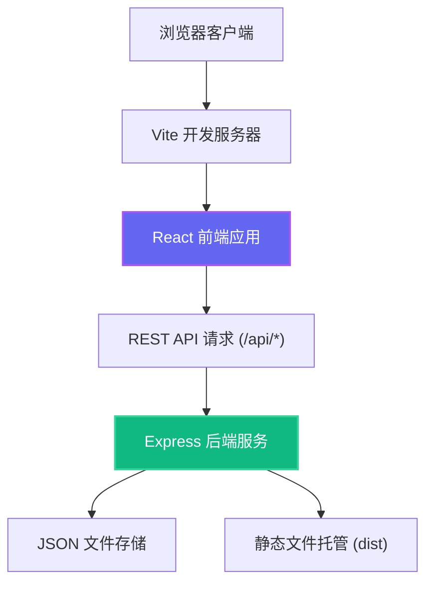
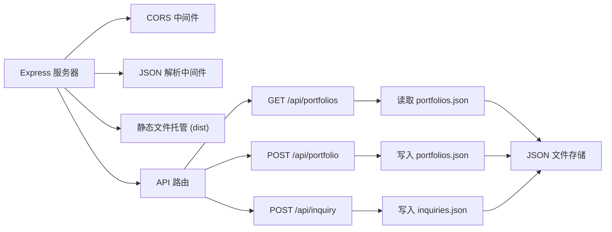
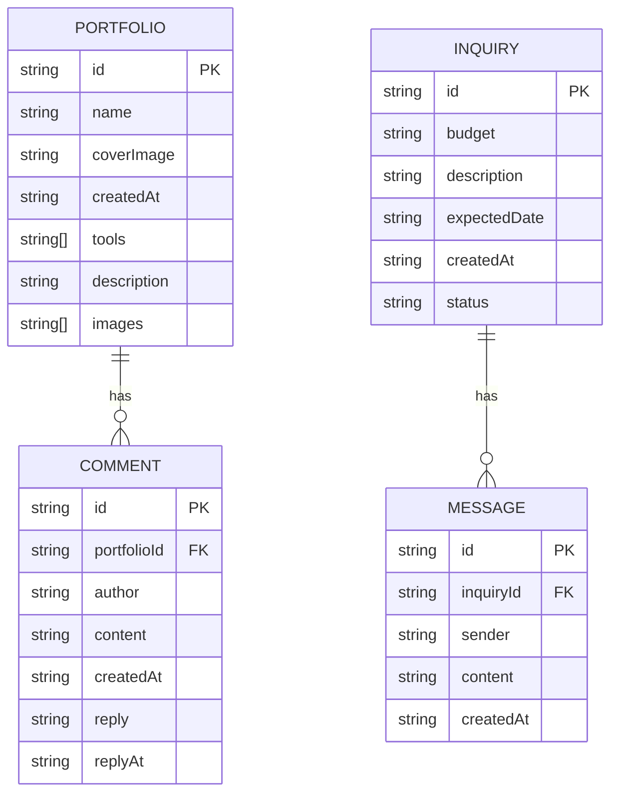

## 1. 架构设计



## 2. 技术描述

- **前端**：React 18 + TypeScript + Vite 5
  - 状态管理：React useState/useEffect（轻量级，无需额外状态管理库）
  - 路由：React Router DOM 6
  - 样式：CSS Modules + 内联样式（无Tailwind CSS，按用户要求自定义样式）
  - 图标：Lucide React
- **后端**：Express 4 + TypeScript
  - CORS 支持
  - UUID 生成唯一ID
  - JSON 文件作为数据存储（无需数据库）
- **构建工具**：Vite 5，代理 /api 到后端服务
- **包管理器**：npm
- **启动脚本**：concurrently 同时启动前端和后端

## 3. 项目文件结构

```
├── package.json
├── vite.config.js
├── tsconfig.json
├── index.html
├── server/
│   └── index.ts
├── src/
│   ├── App.tsx
│   ├── main.tsx
│   └── components/
│       ├── PortfolioGrid.tsx
│       ├── PortfolioDetail.tsx
│       ├── InquiryForm.tsx
│       └── AdminPanel.tsx
└── data/
    ├── portfolios.json
    └── inquiries.json
```

## 4. 路由定义

| 路由 | 页面/组件 | 说明 |
|------|-----------|------|
| / | PortfolioGrid | 首页，展示作品集瀑布流 |
| /portfolio/:id | PortfolioDetail | 作品详情页，轮播+灯箱+评论 |
| /inquiry | InquiryForm | 客户询价表单页面 |
| /admin | AdminPanel | 设计师管理后台 |

## 5. API 定义

### 5.1 类型定义

```typescript
// 作品集类型
interface Portfolio {
  id: string;
  name: string;
  coverImage: string;
  createdAt: string;
  tools: string[];
  description: string;
  images: string[];
  comments: Comment[];
}

// 评论类型
interface Comment {
  id: string;
  author: string;
  content: string;
  createdAt: string;
  reply?: string;
  replyAt?: string;
}

// 询价类型
interface Inquiry {
  id: string;
  budget: string;
  description: string;
  expectedDate: string;
  createdAt: string;
  status: 'pending' | 'replied' | 'completed';
  messages: Message[];
}

// 消息类型
interface Message {
  id: string;
  sender: 'client' | 'designer';
  content: string;
  createdAt: string;
}
```

### 5.2 API 接口

| 方法 | 路径 | 请求体 | 响应 | 说明 |
|------|------|--------|------|------|
| GET | /api/portfolios | - | Portfolio[] | 获取所有作品集列表 |
| POST | /api/portfolio | { name, coverImage, createdAt, tools, description, images } | Portfolio | 创建新作品集 |
| GET | /api/portfolio/:id | - | Portfolio | 获取单个作品集详情 |
| POST | /api/portfolio/:id/comment | { author, content } | Comment | 添加评论 |
| POST | /api/portfolio/:id/comment/:commentId/reply | { reply } | Comment | 回复评论 |
| GET | /api/inquiries | - | Inquiry[] | 获取所有询价列表 |
| POST | /api/inquiry | { budget, description, expectedDate } | Inquiry | 提交新询价 |
| POST | /api/inquiry/:id/reply | { content } | Inquiry | 回复询价 |
| PUT | /api/inquiry/:id/status | { status } | Inquiry | 更新询价状态 |

## 6. 服务器架构



## 7. 数据模型

### 7.1 ER 图



### 7.2 JSON 数据文件示例

**portfolios.json:**
```json
[
  {
    "id": "uuid-1",
    "name": "梦幻森林系列",
    "coverImage": "https://images.unsplash.com/photo-1513364776144-60967b0f800f?w=600",
    "createdAt": "2024-01-15",
    "tools": ["Procreate", "Photoshop"],
    "description": "探索神秘森林中的精灵与奇幻生物，使用数字绘画技法营造梦幻氛围。",
    "images": [
      "https://images.unsplash.com/photo-1513364776144-60967b0f800f?w=1200",
      "https://images.unsplash.com/photo-1578301978693-85fa9c0320b9?w=1200"
    ],
    "comments": []
  }
]
```

**inquiries.json:**
```json
[
  {
    "id": "uuid-1",
    "budget": "3000-5000",
    "description": "需要一张商业插画用于产品包装",
    "expectedDate": "2024-03-01",
    "createdAt": "2024-01-20T10:00:00Z",
    "status": "pending",
    "messages": []
  }
]
```

## 8. 开发规范

### 8.1 代码规范
- TypeScript 严格模式（strict: true）
- 组件使用函数式组件 + Hooks
- 组件文件不超过 300 行
- 使用 CSS 变量管理主题色
- 命名规范：PascalCase 组件名，camelCase 变量和函数

### 8.2 性能优化
- 图片懒加载：使用 Intersection Observer API
- 图片渐进式加载：先显示低清模糊版，再替换高清图
- 组件按需渲染，避免不必要的重渲染
- 动画使用 transform 和 opacity，开启 GPU 加速

### 8.3 启动命令
```bash
npm install && npm run dev
```

`npm run dev` 会同时启动：
- Vite 前端开发服务器（端口 5173）
- Express 后端服务（端口 3001）
- Vite 代理 /api 请求到后端
