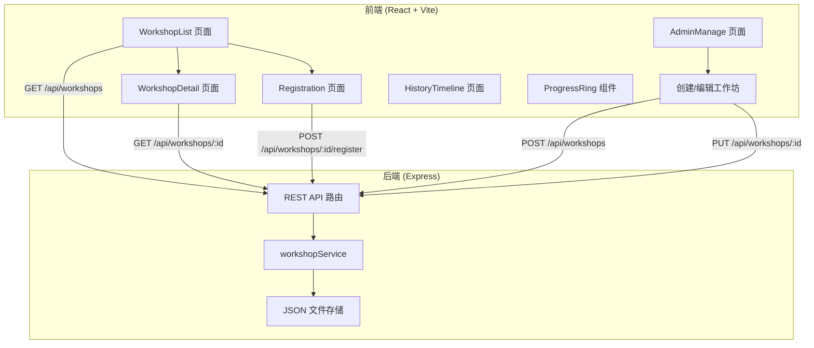
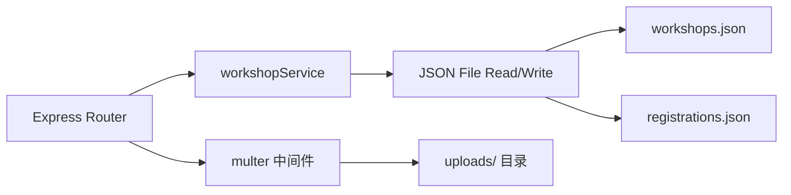
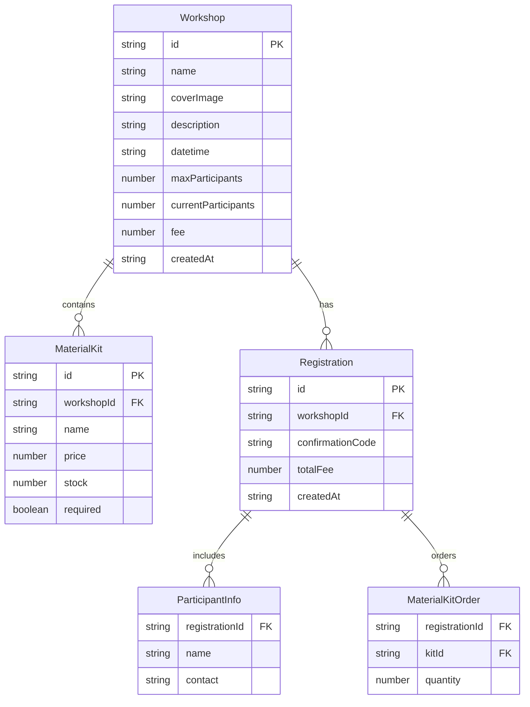

## 1. 架构设计



## 2. 技术说明

- **前端**：React 18 + TypeScript + Vite + Tailwind CSS + Zustand
- **构建工具**：Vite（含 API 代理配置）
- **后端**：Express 4 + TypeScript
- **数据存储**：JSON 文件（server/data/workshops.json、server/data/registrations.json）
- **依赖包**：react、express、uuid、cors、react-router-dom

## 3. 路由定义

| 路由 | 用途 |
|------|------|
| `/` | 首页 - 工作坊卡片网格列表 |
| `/workshop/:id` | 工作坊详情页 |
| `/workshop/:id/register` | 报名流程页（三步表单） |
| `/admin` | 主办方管理页（创建/编辑工作坊） |
| `/history` | 参与者历史时间线页 |
| `/confirmation/:code` | 报名确认页 |

## 4. API 定义

### 4.1 工作坊相关

```typescript
interface Workshop {
  id: string;
  name: string;
  coverImage: string;
  description: string;
  datetime: string;
  maxParticipants: number;
  currentParticipants: number;
  fee: number;
  materialKits: MaterialKit[];
  createdAt: string;
}

interface MaterialKit {
  id: string;
  name: string;
  price: number;
  stock: number;
  required: boolean;
}

// GET /api/workshops - 获取所有工作坊
// Response: Workshop[]

// GET /api/workshops/:id - 获取单个工作坊
// Response: Workshop

// POST /api/workshops - 创建工作坊
// Request: Omit<Workshop, 'id' | 'createdAt' | 'currentParticipants'>
// Response: Workshop

// PUT /api/workshops/:id - 更新工作坊
// Request: Partial<Workshop>
// Response: Workshop
```

### 4.2 报名相关

```typescript
interface Registration {
  id: string;
  workshopId: string;
  participants: ParticipantInfo[];
  materialKitOrders: MaterialKitOrder[];
  confirmationCode: string;
  totalFee: number;
  createdAt: string;
}

interface ParticipantInfo {
  name: string;
  contact: string;
}

interface MaterialKitOrder {
  kitId: string;
  quantity: number;
}

// POST /api/workshops/:id/register - 报名工作坊
// Request: { participantCount: number; materialKitOrders: MaterialKitOrder[]; participants: ParticipantInfo[] }
// Response: { success: boolean; confirmationCode?: string; error?: string }

// GET /api/registrations/:code - 查询报名确认码
// Response: Registration & { workshop: Workshop }
```

### 4.3 反馈相关

```typescript
// POST /api/workshops/:id/feedback - 发送反馈问卷
// Response: { success: boolean; sentCount: number }

// POST /api/feedback - 提交反馈
// Request: { registrationId: string; rating: number; comment: string; photoUrl?: string }
// Response: { success: boolean }

// GET /api/history?contact=xxx - 查询参与者历史
// Response: (Registration & { workshop: Workshop })[]
```

### 4.4 文件上传

```typescript
// POST /api/upload - 上传封面图
// Request: multipart/form-data { file: File }
// Response: { url: string }
```

## 5. 服务器架构图



## 6. 数据模型

### 6.1 数据模型定义



### 6.2 数据存储方式

使用 JSON 文件存储，初始数据包含3个示例工作坊：

- **陶艺手作初体验**：最大8人，含陶土套装（必选）和上釉工具包（可选）
- **实木置物架制作**：最大6人，含木工基础套装（必选）和打磨工具包（可选）
- **法式甜点烘焙**：最大10人，含烘焙材料包（必选）和装饰工具包（可选）
