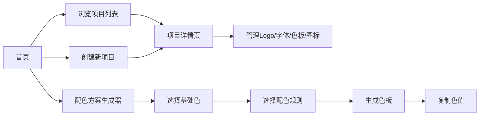

## 1. 产品概述

品牌视觉资产管理与配色方案生成器，为独立开发者和小型设计团队提供统一的品牌资产管理平台，解决Logo、字体、图标、配色方案散落各处难以管理的问题，同时提供基于色轮理论的智能配色生成功能。

- 目标用户：独立开发者、UI/UX设计师、小型设计团队
- 核心价值：统一管理品牌资产，快速生成和谐配色方案，提升设计效率

## 2. 核心功能

### 2.1 功能模块
1. **首页 - 品牌项目列表**：品牌项目卡片网格展示、最近访问快捷入口、新建项目入口
2. **品牌项目详情页**：资产分类管理（Logo、字体、色板、图标）、资产预览、编辑与删除
3. **配色方案生成器**：基础色输入、配色规则选择、色板生成与导出

### 2.2 页面详情

| 页面名称 | 模块名称 | 功能描述 |
|---------|---------|----------|
| 首页 | 最近访问项目 | 展示最近访问的4个项目卡片，支持快速复制品牌色 |
| 首页 | 项目卡片网格 | 展示所有品牌项目，卡片背景取品牌主色渐变，悬停放大1.05倍 |
| 首页 | 新建项目 | 弹出表单，输入项目名称、上传Logo、设定品牌色、选择字体 |
| 项目详情页 | 资产折叠面板 | 左侧分类展示Logo、字体、色板、图标 |
| 项目详情页 | 资产预览区 | 右侧大图/列表展示选中资产详情，支持编辑和删除 |
| 配色生成器 | 颜色选择器 | HEX和HSL双模式输入与显示 |
| 配色生成器 | 配色规则选择 | 互补、类似、三色、分割互补、单色5种模式 |
| 配色生成器 | 色板展示 | 5个色块横向滚动布局，点击复制HEX值 |

## 3. 核心流程

用户打开应用 → 浏览已有品牌项目或创建新项目 → 进入项目详情管理各类资产 → 使用配色生成器获取方案 → 复制色值应用于设计工作

## 4. 用户界面设计

### 4.1 设计风格
- 主色调：柔和蓝灰色系（#5B7B9A 为主色）
- 按钮风格：渐变背景、圆角8px、悬停微上浮
- 字体：无衬线体（Roboto），标题font-weight: 600，正文font-weight: 400
- 布局：卡片式网格布局，充足留白
- 整体风格：干净、专业、现代简约

### 4.2 页面设计概览

| 页面名称 | 模块名称 | UI元素 |
|---------|---------|--------|
| 首页 | 项目卡片 | 渐变背景（主色→浅色）、悬停scale(1.05)、品牌色小圆点、阴影过渡 |
| 首页 | 最近访问 | 顶部快捷区，悬浮复制按钮 |
| 项目详情页 | 资产列表 | 折叠手风琴式面板，弹性动画 |
| 配色生成器 | 色板列表 | 横向可滚动，色块淡入淡出过渡，点击复制反馈 |

### 4.3 响应式设计
- 桌面端（≥768px）：多列网格布局
- 移动端（<768px）：单列布局，字体和色块自适应缩放
- 所有触控元素最小高度44px，优化触摸操作
