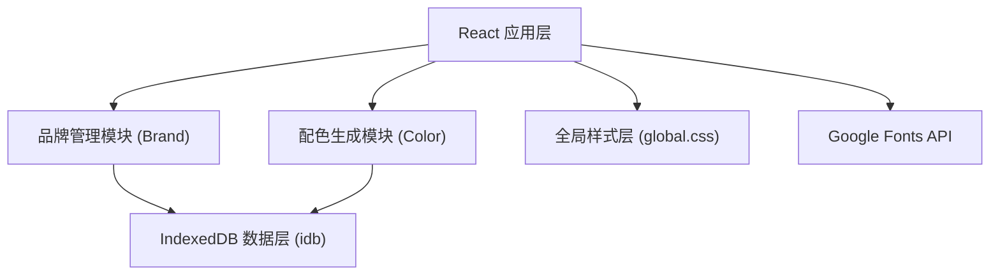
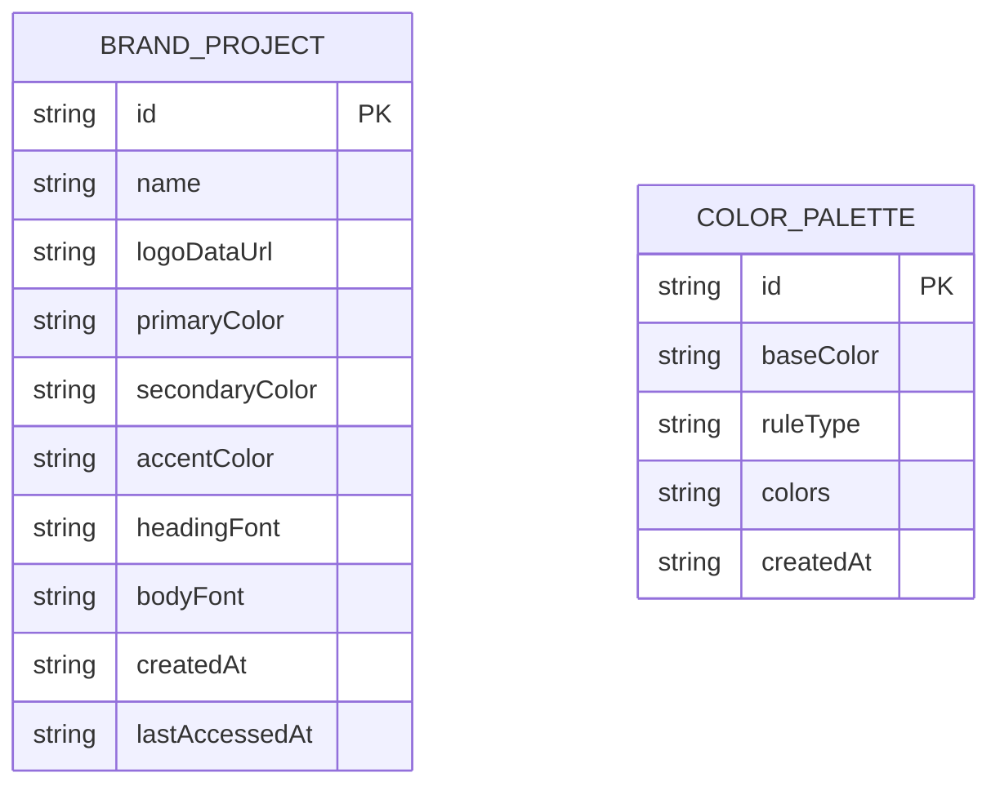

## 1. 架构设计



## 2. 技术描述

- 前端框架：React 18 + TypeScript
- 构建工具：Vite
- 本地数据库：IndexedDB (通过 idb 库封装)
- 唯一标识生成：uuid
- 字体方案：@fontsource/roboto + Google Fonts API 动态加载
- 状态管理：React Hooks (useState, useEffect, useCallback)
- 动画方案：requestAnimationFrame + CSS Transition

## 3. 路由与视图

| 视图 | 描述 |
|------|------|
| 首页视图 | 品牌项目卡片网格 + 最近访问快捷入口 + 配色生成器入口 |
| 项目详情视图 | 左侧资产列表（折叠面板） + 右侧预览区域 |
| 配色生成器 | 颜色选择器 + 规则选择 + 色板展示 |

采用单页应用方式，通过内部状态切换视图，不使用 react-router。

## 4. 数据模型

### 4.1 数据实体定义



### 4.2 IndexedDB Store 定义

- **brand_projects**：存储品牌项目，主键 id，索引 name、lastAccessedAt
- **color_palettes**：存储配色方案，主键 id，索引 createdAt

## 5. 文件结构

```
e:\solo\SoloAutoDemo\tasks\auto69\
├── package.json
├── vite.config.js
├── tsconfig.json
├── index.html
└── src/
    ├── main.tsx
    ├── styles/
    │   └── global.css
    ├── store/
    │   └── db.ts
    ├── modules/
    │   ├── brand/
    │   │   ├── BrandManager.tsx
    │   │   └── BrandDetail.tsx
    │   └── color/
    │       ├── ColorPaletteGenerator.tsx
    │       └── ColorPicker.tsx
    └── types/
        └── index.ts
```

## 6. 性能与动画要求

- 色板计算与渲染：≤ 300ms
- 所有动画：requestAnimationFrame 实现，目标 60FPS
- 卡片悬停：transform: scale(1.05)，CSS transition 200ms ease
- 色板切换：opacity 淡入淡出，300ms transition
- 弹性动画：使用自定义 spring 缓动函数
