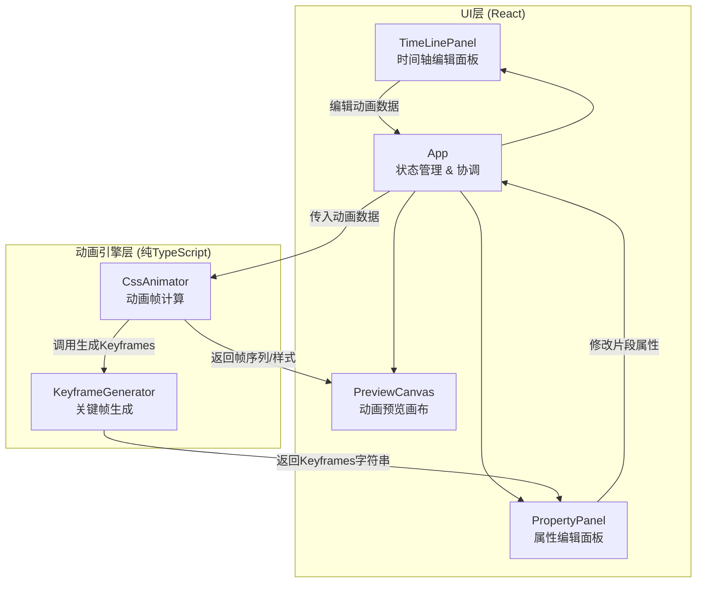

## 1. 架构设计



## 2. 技术说明

- **前端框架**：React 18 + TypeScript + Vite
- **状态管理**：Zustand（轻量级状态管理，管理动画片段数据、选中状态等）
- **样式方案**：Tailwind CSS
- **唯一标识**：uuid（生成动画片段ID）
- **图标库**：lucide-react
- **无后端**：纯前端应用，所有计算在浏览器端完成
- **构建工具**：Vite，严格模式

## 3. 路由定义

| 路由 | 用途 |
|------|------|
| / | 主编辑页面，包含时间轴、属性面板和预览画布 |

## 4. 数据流向

```mermaid
flowchart LR
    "UI编辑操作" -->|"更新动画数据"| "Zustand Store"
    "Zustand Store" -->|"传入CssAnimator"| "帧计算引擎"
    "帧计算引擎" -->|"计算结果"| "PreviewCanvas渲染"
    "Zustand Store" -->|"选中片段数据"| "PropertyPanel展示"
    "PropertyPanel" -->|"参数修改回调"| "Zustand Store"
    "KeyframeGenerator" -->|"CSS代码字符串"| "PropertyPanel代码预览"
    "KeyframeGenerator" -->|"完整类代码"| "导出下载"
```

## 5. 模块职责

### 5.1 CssAnimator.ts（动画引擎核心）

- 输入：AnimationClip[] 动画片段数据
- 输出：计算后的CSS变换值、动画帧序列
- 职责：根据时间轴数据计算每一帧的CSS变换值，管理动画播放状态
- 不依赖React，提供纯函数接口

### 5.2 KeyframeGenerator.ts（关键帧生成器）

- 输入：单个AnimationClip + 缓动函数
- 输出：CSS Keyframes字符串、完整CssAnimation类代码
- 职责：根据缓动函数和参数生成精确的Keyframes，生成导出代码
- 独立于UI，可被CssAnimator和PropertyPanel共同调用

### 5.3 TimeLinePanel.tsx（时间轴面板）

- 接收动画片段数据，渲染时间轴UI
- 支持片段添加、删除、拖拽调整
- 通过回调函数与Store通信

### 5.4 PropertyPanel.tsx（属性面板）

- 接收选中片段数据，展示属性编辑器
- 滑块/输入框实时调整参数
- 顶部CSS代码预览（调用KeyframeGenerator）
- 一键复制和导出功能

### 5.5 PreviewCanvas.tsx（预览画布）

- 接收动画数据和计算结果，实时渲染效果
- 显示FPS和进度条
- 不包含动画计算逻辑，通过props获取已计算结果

## 6. 文件结构

```
├── index.html
├── package.json
├── vite.config.ts
├── tsconfig.json
├── src/
│   ├── main.tsx
│   ├── App.tsx
│   ├── store/
│   │   └── useAnimationStore.ts
│   ├── components/
│   │   ├── TimeLinePanel.tsx
│   │   ├── PropertyPanel.tsx
│   │   └── PreviewCanvas.tsx
│   └── engine/
│       ├── CssAnimator.ts
│       └── KeyframeGenerator.ts
```
