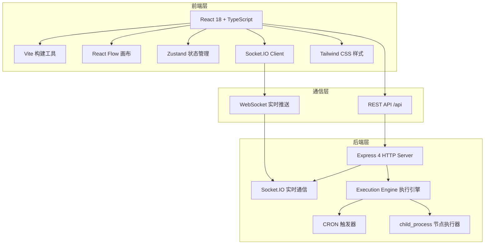
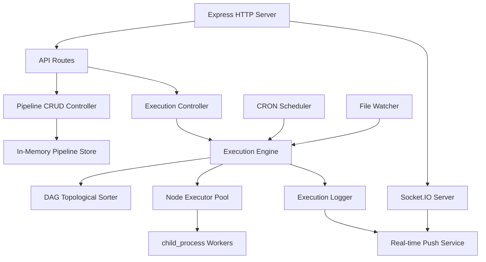

## 1. 架构设计



## 2. 技术描述

- **前端**：React@18 + TypeScript@5 + Vite@5 + React Flow@11 + Zustand@4 + Socket.IO Client@4 + Tailwind CSS@3 + lucide-react
- **后端**：Node.js + Express@4 + Socket.IO@4 + child_process + uuid@9 + cron-parser@4
- **构建工具**：Vite@5 配置代理 `/api` 到后端 `http://localhost:3001`
- **启动方式**：concurrently 同时启动前后端，前端端口 5173，后端端口 3001

## 3. 项目结构

```
e:\solo\SoloAutoDemo\tasks\auto8\
├── package.json
├── vite.config.js
├── tsconfig.json
├── index.html
└── src/
    ├── frontend/
    │   ├── components/
    │   │   ├── PipelineCanvas.tsx      # 画布主组件
    │   │   ├── NodeConfigPanel.tsx     # 节点配置抽屉
    │   │   └── ExecutionLogViewer.tsx  # 执行日志查看器
    │   ├── stores/
    │   │   └── pipelineStore.ts        # Zustand 状态管理
    │   ├── types/
    │   │   └── index.ts                # 类型定义
    │   ├── App.tsx
    │   ├── main.tsx
    │   └── index.css
    └── backend/
        ├── server.ts                   # Express + Socket.IO 服务器
        └── executionEngine.ts          # DAG解析与执行引擎
```

## 4. API 定义

### 4.1 REST API

| Method | Route | Purpose |
|--------|-------|---------|
| GET | /api/pipelines | 获取所有管道列表 |
| GET | /api/pipelines/:id | 获取单个管道详情 |
| POST | /api/pipelines | 创建新管道 |
| PUT | /api/pipelines/:id | 更新管道配置 |
| DELETE | /api/pipelines/:id | 删除管道 |
| POST | /api/pipelines/:id/trigger | 手动触发管道执行 |
| GET | /api/executions | 获取执行记录列表 |
| GET | /api/executions/:id | 获取执行记录详情 |

### 4.2 WebSocket 事件

| Event | Direction | Payload | Purpose |
|-------|-----------|---------|---------|
| `node:start` | Server → Client | `{ executionId, nodeId, timestamp }` | 节点开始执行 |
| `node:complete` | Server → Client | `{ executionId, nodeId, output, duration, timestamp }` | 节点执行完成 |
| `node:error` | Server → Client | `{ executionId, nodeId, error, duration, timestamp }` | 节点执行出错 |
| `pipeline:complete` | Server → Client | `{ executionId, status, totalDuration, timestamp }` | 管道执行完成 |
| `execution:log` | Server → Client | `{ executionId, ...logData }` | 实时执行日志 |

### 4.3 TypeScript 类型定义

```typescript
// 节点类型
type NodeType = 'file-watcher' | 'image-compress' | 'email-send' | 'http-request' | 'file-convert' | 'delay' | 'notification';

// 节点配置
interface NodeConfig {
  [key: string]: string | number | boolean | string[];
}

// 管道节点
interface PipelineNode {
  id: string;
  type: NodeType;
  position: { x: number; y: number };
  config: NodeConfig;
  label: string;
}

// 管道连线
interface PipelineEdge {
  id: string;
  source: string;
  target: string;
}

// 管道定义
interface Pipeline {
  id: string;
  name: string;
  description?: string;
  nodes: PipelineNode[];
  edges: PipelineEdge[];
  trigger: {
    type: 'manual' | 'cron' | 'file';
    cronExpression?: string;
    filePath?: string;
  };
  createdAt: string;
  updatedAt: string;
}

// 执行记录
interface ExecutionRecord {
  id: string;
  pipelineId: string;
  status: 'running' | 'success' | 'failed';
  startTime: string;
  endTime?: string;
  totalDuration?: number;
  nodeLogs: NodeExecutionLog[];
  triggeredBy: 'manual' | 'cron' | 'file';
}

// 节点执行日志
interface NodeExecutionLog {
  nodeId: string;
  nodeType: NodeType;
  status: 'pending' | 'running' | 'success' | 'failed';
  input: any;
  output?: any;
  error?: string;
  startTime: string;
  endTime?: string;
  duration?: number;
}
```

## 5. 服务器架构



## 6. 核心流程设计

### 6.1 管道执行流程

1. **DAG 解析**：将节点和边构建为有向无环图，进行拓扑排序
2. **依赖检查**：验证是否有环，检测孤立节点
3. **顺序执行**：按拓扑顺序依次执行节点，前一个节点的输出作为下一个节点的输入
4. **状态追踪**：每个节点执行前发送 `node:start` 事件，完成后发送 `node:complete` 或 `node:error`
5. **错误处理**：任一节点失败则标记管道为失败，可选择继续或终止

### 6.2 节点类型定义

| 节点类型 | 配置参数 | 输入 | 输出 | 模拟行为 |
|----------|----------|------|------|----------|
| file-watcher | filePath, interval | - | { files: string[] } | 延迟 500ms，返回模拟文件列表 |
| image-compress | quality, maxWidth, format | { files: string[] } | { compressedFiles: string[], savedBytes: number } | 延迟 800-1500ms，随机生成压缩结果 |
| email-send | to, subject, template | { data: any } | { sent: boolean, messageId: string } | 延迟 300ms，90% 成功率 |
| http-request | url, method, headers, body | { data?: any } | { status: number, response: any } | 延迟 200-1000ms，模拟 API 响应 |
| file-convert | fromFormat, toFormat | { files: string[] } | { convertedFiles: string[] } | 延迟 600-1200ms |
| delay | durationMs | { data: any } | { data: any } | 延迟指定时间后透传 |
| notification | title, message, channel | { data: any } | { delivered: boolean } | 延迟 200ms |

## 7. 性能指标

- 画布重绘延迟：≤ 50ms（使用 React Flow 虚拟渲染 + useMemo 优化）
- WebSocket 端到端延迟：≤ 200ms（100 节点以内管道）
- 节点执行吞吐量：≥ 10 节点/秒（并发执行无依赖节点）
- 内存占用：单个管道执行 ≤ 50MB

## 8. 启动脚本

```json
{
  "scripts": {
    "dev:frontend": "vite",
    "dev:backend": "ts-node src/backend/server.ts",
    "dev": "concurrently \"npm run dev:frontend\" \"npm run dev:backend\"",
    "build": "tsc && vite build",
    "preview": "vite preview"
  }
}
```
