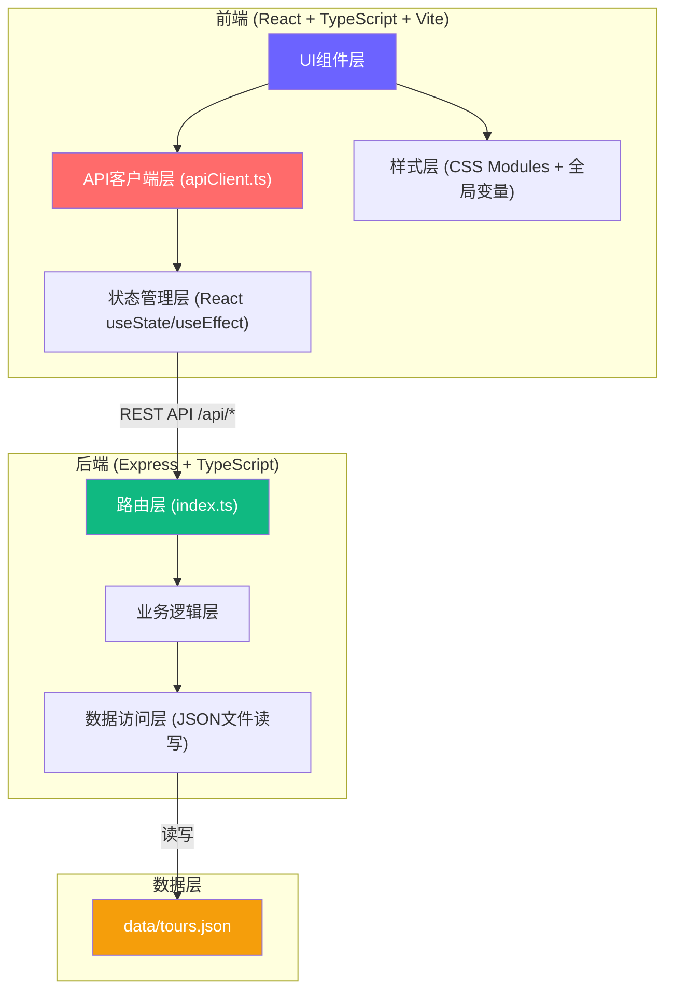
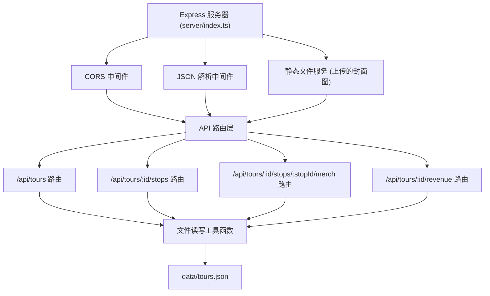
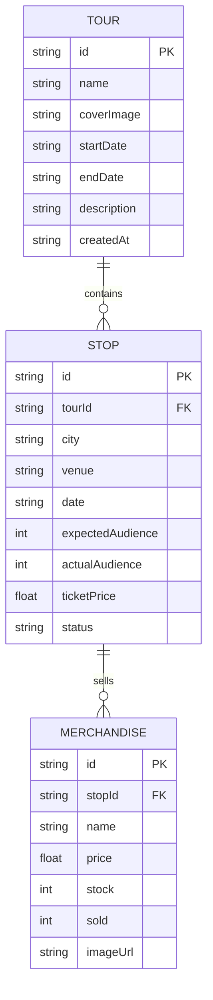

## 1. 架构设计



## 2. 技术描述

- 前端：React 18 + TypeScript 5 + Vite 5
  - UI库：自定义组件（无第三方UI库）
  - 图表：Recharts 2
  - 路由：React Router DOM 6
  - 工具：file-saver 2、uuid 9
- 后端：Express 4 + TypeScript 5
  - CORS：cors 2
  - 数据存储：JSON文件（data/tours.json）
- 构建工具：Vite（前端）、ts-node（后端开发）
- 并发启动：concurrently 8

## 3. 路由定义

| 路由 | 用途 |
|------|------|
| / | 首页 - 巡演卡片网格列表 |
| /tour/:id | 巡演详情页 - 站点时间轴、周边商品、收益统计 |
| /create | 创建新巡演 |

## 4. API 定义

### 4.1 类型定义

```typescript
interface Merchandise {
  id: string;
  name: string;
  price: number;
  stock: number;
  sold: number;
  imageUrl: string;
}

interface Stop {
  id: string;
  city: string;
  venue: string;
  date: string;
  expectedAudience: number;
  actualAudience: number;
  ticketPrice: number;
  merchandise: Merchandise[];
  status: 'upcoming' | 'ongoing' | 'completed';
}

interface Tour {
  id: string;
  name: string;
  coverImage: string;
  startDate: string;
  endDate: string;
  description: string;
  stops: Stop[];
  createdAt: string;
}

interface RevenueData {
  stopId: string;
  city: string;
  venue: string;
  date: string;
  ticketRevenue: number;
  merchRevenue: number;
  totalRevenue: number;
}
```

### 4.2 API 端点

| 方法 | 路径 | 描述 | 请求体 | 响应 |
|------|------|------|--------|------|
| GET | /api/tours | 获取所有巡演列表 | - | Tour[] |
| GET | /api/tours/:id | 获取单场巡演详情 | - | Tour |
| POST | /api/tours | 创建新巡演 | Omit<Tour, 'id' \| 'createdAt'> | Tour |
| PUT | /api/tours/:id | 更新巡演信息 | Partial<Tour> | Tour |
| DELETE | /api/tours/:id | 删除巡演 | - | { success: boolean } |
| POST | /api/tours/:id/stops | 添加站点 | Omit<Stop, 'id'> | Stop |
| PUT | /api/tours/:id/stops/:stopId | 更新站点 | Partial<Stop> | Stop |
| DELETE | /api/tours/:id/stops/:stopId | 删除站点 | - | { success: boolean } |
| POST | /api/tours/:id/stops/:stopId/merch | 添加周边商品 | Omit<Merchandise, 'id' \| 'sold'> | Merchandise |
| PUT | /api/tours/:id/stops/:stopId/merch/:merchId | 更新商品 | Partial<Merchandise> | Merchandise |
| DELETE | /api/tours/:id/stops/:stopId/merch/:merchId | 删除商品 | - | { success: boolean } |
| GET | /api/tours/:id/revenue | 获取收益统计 | - | { average: number; data: RevenueData[] } |

## 5. 服务器架构图



## 6. 数据模型

### 6.1 ER 图



### 6.2 JSON 数据结构示例

```json
{
  "tours": [
    {
      "id": "uuid-1",
      "name": "夏日热浪巡演2024",
      "coverImage": "/uploads/cover1.jpg",
      "startDate": "2024-07-01",
      "endDate": "2024-08-15",
      "description": "跨越10个城市的夏季音乐之旅",
      "createdAt": "2024-06-01T00:00:00Z",
      "stops": [
        {
          "id": "stop-uuid-1",
          "city": "北京",
          "venue": "糖果TANGO",
          "date": "2024-07-05",
          "expectedAudience": 500,
          "actualAudience": 480,
          "ticketPrice": 120,
          "status": "completed",
          "merchandise": [
            {
              "id": "merch-uuid-1",
              "name": "巡演T恤",
              "price": 99,
              "stock": 100,
              "sold": 75,
              "imageUrl": "/uploads/merch1.jpg"
            }
          ]
        }
      ]
    }
  ]
}
```

## 7. 项目文件结构

```
.
├── package.json
├── vite.config.js
├── tsconfig.json
├── index.html
├── data/
│   └── tours.json
├── server/
│   └── index.ts
├── src/
│   ├── main.tsx
│   ├── App.tsx
│   ├── api/
│   │   └── apiClient.ts
│   ├── components/
│   │   ├── TourCardList.tsx
│   │   ├── TourTimeline.tsx
│   │   ├── MerchCardList.tsx
│   │   ├── RevenueChart.tsx
│   │   └── Modal.tsx
│   └── styles/
│       └── global.css
└── .trae/
    └── documents/
        ├── prd.md
        └── architecture.md
```
