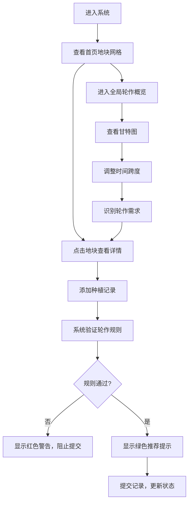

## 1. 产品概述

作物轮作管理系统是一款面向社区花园和城市农场管理者的专业应用，旨在解决地块种植历史混乱、轮作规则难以自动提醒、收成预测不准确等核心问题。通过数字化管理地块信息、智能轮作规则引擎和数据驱动的收成预测，帮助管理者实现科学种植、提升产量、维护土壤健康。

## 2. 核心功能

### 2.1 用户角色
| 角色 | 注册方式 | 核心权限 |
|------|----------|----------|
| 农场管理员 | 系统内置 | 地块管理、种植记录、轮作规划、数据统计 |

### 2.2 功能模块
1. **首页地块列表**：地块卡片网格展示、土壤类型着色、种植状态进度条、轮作提醒铃铛
2. **地块详情页**：种植记录时间轴、轮作规则验证、收成预测面板
3. **全局轮作概览**：甘特图时间轴、季度缩放滑块、科属颜色编码

### 2.3 页面详情
| 页面名称 | 模块名称 | 功能描述 |
|----------|----------|----------|
| 首页地块列表 | 地块卡片网格 | 展示所有地块，按土壤类型自动着色，显示当前作物和生长进度 |
| 首页地块列表 | 轮作提醒 | 未来7天需轮作的地块显示橙色铃铛动画 |
| 地块详情页 | 种植记录时间轴 | 按时间展示种植历史，按科属颜色区分 |
| 地块详情页 | 轮作规则引擎 | 检测前2次种植记录，避免同科连作，推荐伴生作物 |
| 地块详情页 | 收成预测面板 | 折线图展示产量趋势，柱状图对比历史同期数据 |
| 全局轮作概览 | 甘特图组件 | X轴月份、Y轴地块，条块按科属着色，悬停显示详情 |
| 全局轮作概览 | 季度缩放滑块 | 调整甘特图时间跨度 |

## 3. 核心流程

### 3.1 地块管理流程
管理员登录系统 → 查看首页地块卡片网格 → 点击地块查看详情 → 添加新的种植记录 → 系统自动验证轮作规则 → 提交后更新地块状态

### 3.2 轮作规划流程
管理员进入全局轮作概览 → 查看所有地块甘特图 → 使用缩放滑块调整时间跨度 → 识别需轮作地块 → 返回地块详情添加新种植 → 系统智能推荐作物

## 4. 用户界面设计

### 4.1 设计风格
- **主色调**：自然绿色调（#4CAF50、#81C784）搭配温暖木质色系（#8D6E63、#A1887F）
- **背景色**：浅苔绿色渐变（#E8F5E9 → #C8E6C9）
- **卡片底色**：暖白色（#FFFDE7），柔和阴影
- **土壤颜色**：沙土浅米色（#F5F5DC）、壤土深棕色（#795548）、黏土红褐色（#A0522D）
- **科属颜色**：茄科紫色系（#9C27B0）、十字花科绿色系（#4CAF50）、豆科黄色系（#FFC107）、葫芦科橙色系（#FF9800）
- **按钮风格**：圆角设计，0.2秒缓动过渡
- **字体**：系统字体 + 无衬线字体，中文优先
- **图标**：统一线性风格，色彩饱和度适中
- **动效**：图表和进度条0.5秒动画，从0到目标值

### 4.2 页面设计概述
| 页面名称 | 模块名称 | UI元素 |
|----------|----------|--------|
| 首页地块列表 | 地块卡片 | 土壤色背景、作物名称、生长进度条、轮作提醒铃铛 |
| 首页地块列表 | 顶部导航 | 左侧固定240px导航栏，移动端折叠为底部Tab |
| 地块详情页 | 种植时间轴 | 科属色卡片、时间线、种植周期和闲置天数计算 |
| 地块详情页 | 收成预测面板 | 折线图+柱状图组合、预期产量区间、收获倒计时 |
| 全局轮作概览 | 甘特图 | 月份X轴、地块Y轴、科属色条块、悬停详情弹窗 |
| 全局轮作概览 | 缩放控制 | 季度滑块、时间跨度显示 |

### 4.3 响应式设计
- **桌面端**（≥1024px）：左侧导航栏240px固定，右侧内容区自适应
- **平板端**（768px-1023px）：导航栏180px，内容区自适应
- **移动端**（<768px）：导航栏折叠为底部Tab栏，内容区全屏

### 4.4 性能指标
- 首屏内容绘制时间 ≤ 1.5秒
- 50个地块数据下甘特图滚动和缩放帧率 ≥ 30fps
