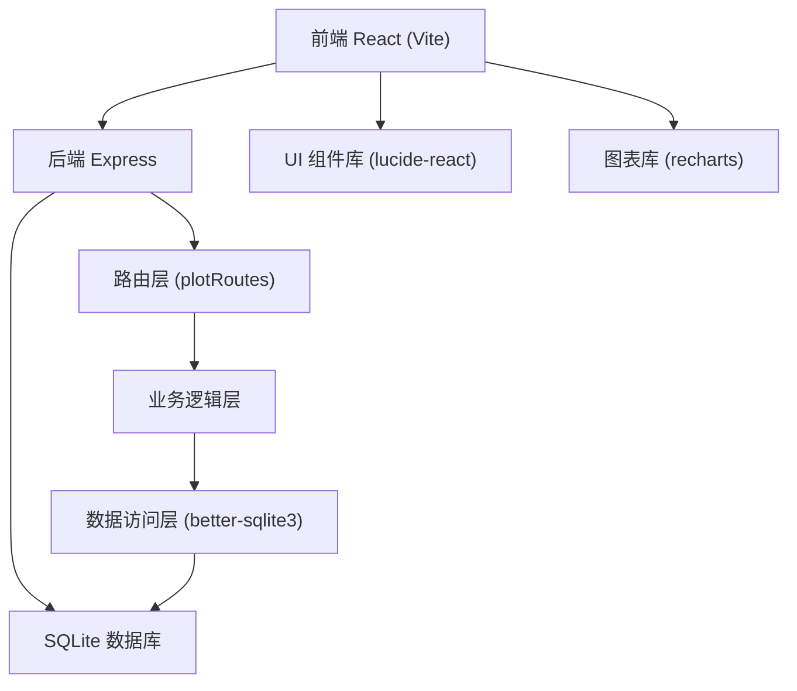
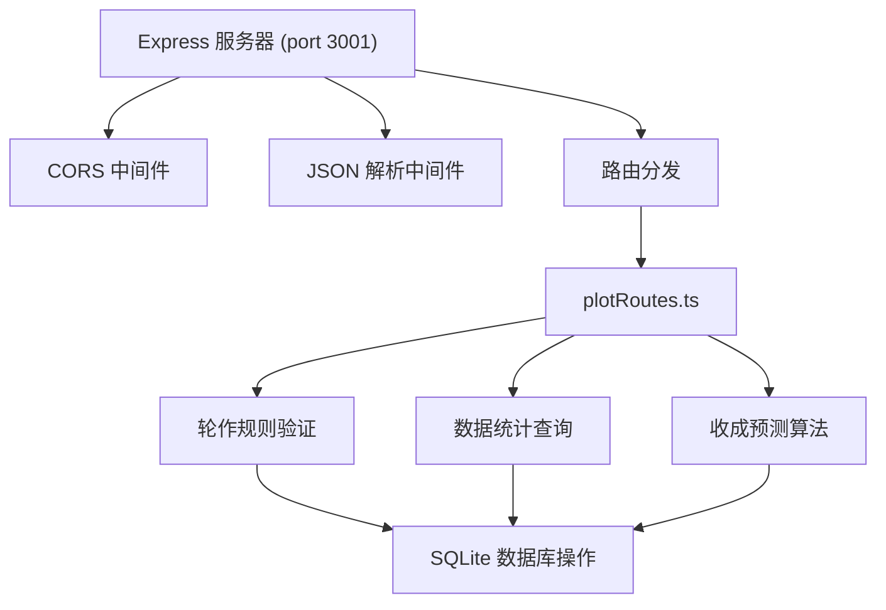
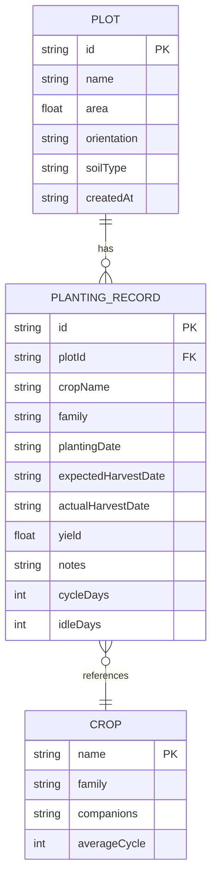

## 1. 架构设计



## 2. 技术描述

- **前端**：React 18 + TypeScript + Vite 5
- **UI组件**：lucide-react（线性图标）
- **图表组件**：recharts
- **后端**：Express 4 + TypeScript
- **数据库**：SQLite（better-sqlite3驱动）
- **HTTP代理**：Vite 代理 /api 到 localhost:3001
- **并发启动**：concurrently 同时启动前后端
- **唯一ID**：uuid

## 3. 路由定义

| 路由 | 页面/组件 | 功能 |
|------|-----------|------|
| / | PlotList | 首页地块卡片网格列表 |
| /plot/:id | PlotDetail | 地块详情页（种植记录+收成预测） |
| /rotation | RotationOverview | 全局轮作概览甘特图 |

## 4. API 定义

### 4.1 TypeScript 类型定义

```typescript
interface Plot {
  id: string;
  name: string;
  area: number;
  orientation: string;
  soilType: 'sandy' | 'loam' | 'clay';
  createdAt: string;
}

interface PlantingRecord {
  id: string;
  plotId: string;
  cropName: string;
  family: 'solanaceae' | 'brassicaceae' | 'fabaceae' | 'cucurbitaceae';
  plantingDate: string;
  expectedHarvestDate: string;
  actualHarvestDate?: string;
  yield?: number;
  notes?: string;
  cycleDays: number;
  idleDays: number;
}

interface Crop {
  name: string;
  family: 'solanaceae' | 'brassicaceae' | 'fabaceae' | 'cucurbitaceae';
  companion: string[];
  averageCycle: number;
}

interface RotationValidation {
  valid: boolean;
  message: string;
  recommendations: string[];
}

interface YieldPrediction {
  expectedMin: number;
  expectedMax: number;
  bestHarvestWindow: { start: string; end: string };
  dailyTrend: { date: string; yield: number }[];
  historicalData: { month: string; avgYield: number }[];
}
```

### 4.2 REST API 端点

| 方法 | 路径 | 描述 |
|------|------|------|
| GET | /api/plots | 获取所有地块列表 |
| POST | /api/plots | 创建新地块 |
| GET | /api/plots/:id | 获取地块详情（含种植记录） |
| PUT | /api/plots/:id | 更新地块信息 |
| DELETE | /api/plots/:id | 删除地块 |
| GET | /api/plots/:id/records | 获取地块种植记录 |
| POST | /api/plots/:id/records | 添加种植记录 |
| PUT | /api/plots/:id/records/:recordId | 更新种植记录 |
| DELETE | /api/plots/:id/records/:recordId | 删除种植记录 |
| GET | /api/crops | 获取预置作物列表 |
| POST | /api/rotation/validate | 验证轮作规则 |
| GET | /api/plots/:id/prediction | 获取收成预测 |
| GET | /api/rotation/gantt | 获取甘特图数据 |

## 5. 服务器架构



## 6. 数据模型

### 6.1 ER 图



### 6.2 DDL 语句

```sql
CREATE TABLE IF NOT EXISTS plots (
    id TEXT PRIMARY KEY,
    name TEXT NOT NULL,
    area REAL NOT NULL,
    orientation TEXT NOT NULL,
    soilType TEXT NOT NULL CHECK(soilType IN ('sandy', 'loam', 'clay')),
    createdAt TEXT NOT NULL DEFAULT CURRENT_TIMESTAMP
);

CREATE TABLE IF NOT EXISTS planting_records (
    id TEXT PRIMARY KEY,
    plotId TEXT NOT NULL,
    cropName TEXT NOT NULL,
    family TEXT NOT NULL CHECK(family IN ('solanaceae', 'brassicaceae', 'fabaceae', 'cucurbitaceae')),
    plantingDate TEXT NOT NULL,
    expectedHarvestDate TEXT NOT NULL,
    actualHarvestDate TEXT,
    yield REAL,
    notes TEXT,
    cycleDays INTEGER,
    idleDays INTEGER,
    FOREIGN KEY (plotId) REFERENCES plots(id) ON DELETE CASCADE
);

CREATE TABLE IF NOT EXISTS crops (
    name TEXT PRIMARY KEY,
    family TEXT NOT NULL,
    companions TEXT,
    averageCycle INTEGER NOT NULL
);

CREATE INDEX IF NOT EXISTS idx_records_plotId ON planting_records(plotId);
CREATE INDEX IF NOT EXISTS idx_records_date ON planting_records(plantingDate);
```

### 6.3 预置作物数据（20种常见蔬菜水果）

| 作物名称 | 科属 | 伴生作物 | 平均周期(天) |
|---------|------|----------|-------------|
| 番茄 | 茄科 | 胡萝卜、洋葱、生菜 | 90 |
| 茄子 | 茄科 | 豆类、辣椒、菠菜 | 100 |
| 辣椒 | 茄科 | 番茄、茄子、罗勒 | 85 |
| 土豆 | 茄科 | 白菜、胡萝卜、洋葱 | 120 |
| 白菜 | 十字花科 | 土豆、芹菜、洋葱 | 70 |
| 西兰花 | 十字花科 | 土豆、胡萝卜、洋葱 | 90 |
| 花椰菜 | 十字花科 | 豆类、甜菜、芹菜 | 85 |
| 萝卜 | 十字花科 | 番茄、辣椒、菠菜 | 45 |
| 大豆 | 豆科 | 玉米、土豆、白菜 | 110 |
| 豌豆 | 豆科 | 胡萝卜、白萝卜、生菜 | 75 |
| 四季豆 | 豆科 | 土豆、黄瓜、白菜 | 65 |
| 蚕豆 | 豆科 | 小麦、土豆、白菜 | 95 |
| 黄瓜 | 葫芦科 | 豆类、玉米、白菜 | 60 |
| 南瓜 | 葫芦科 | 玉米、豆类、萝卜 | 110 |
| 西瓜 | 葫芦科 | 玉米、豆类、花生 | 100 |
| 甜瓜 | 葫芦科 | 玉米、向日葵、豆类 | 90 |
| 胡萝卜 | 伞形科 | 番茄、豌豆、洋葱 | 80 |
| 芹菜 | 伞形科 | 白菜、番茄、豆类 | 95 |
| 菠菜 | 藜科 | 茄子、萝卜、草莓 | 45 |
| 生菜 | 菊科 | 番茄、胡萝卜、豌豆 | 50 |

## 7. 目录结构

```
auto91/
├── .trae/documents/
│   ├── PRD_作物轮作管理系统.md
│   └── TECH_技术架构文档.md
├── server/
│   ├── index.ts
│   └── routes/
│       └── plotRoutes.ts
├── src/
│   ├── modules/
│   │   ├── gardenManager/
│   │   │   ├── main.tsx
│   │   │   └── components/
│   │   │       └── PlotCard.tsx
│   │   └── rotationPlanner/
│   │       ├── main.tsx
│   │       └── components/
│   │           └── PlantingTimeline.tsx
│   ├── App.tsx
│   └── main.tsx
├── package.json
├── vite.config.js
├── tsconfig.json
└── index.html
```
