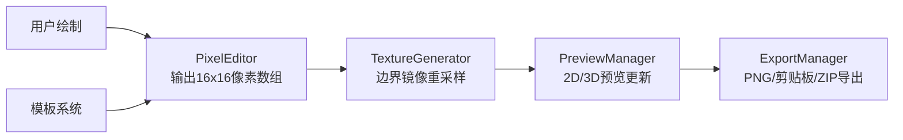

## 1. 产品概述
像素无接缝纹理生成器是一款为独立游戏制作人和小型团队设计的工具性网页应用，解决在2D像素游戏开发中手动拼接大尺寸纹理时出现的接缝断裂、相邻瓦片色差和重复模式明显等问题。用户可以在浏览器中绘制16x16基础瓷砖图案，通过边界镜像重采样算法一键生成128x128四方连续无接缝纹理，并支持实时2D/3D预览和多格式导出。

### 1.1 目标用户
- 独立游戏制作人
- 小型游戏开发团队
- 像素艺术爱好者
- 需要快速生成游戏素材的开发者

### 1.2 核心价值
- 消除手动拼接纹理的接缝问题
- 提供直观的像素编辑体验
- 实时预览纹理在3D场景中的铺陈效果
- 支持多种导出格式，无缝接入游戏开发流程

---

## 2. 核心功能

### 2.1 用户角色
| 角色 | 注册方式 | 核心权限 |
|------|----------|----------|
| 普通用户 | 无需注册，直接使用 | 使用所有编辑、生成、预览、导出功能 |

### 2.2 功能模块
1. **像素编辑器**：支持铅笔、油漆桶、取色器、橡皮擦工具，1x-8x缩放，边缘镜像辅助绘制
2. **调色板系统**：32色固定调色盘，按色系分组，悬停显示HEX色值
3. **无接缝纹理生成**：边界像素镜像重采样算法，16x16→128x128无缝纹理
4. **2D预览区**：128x128纹理预览，带4x4黄色参考网格线
5. **3D平铺预览**：Phaser 3正交俯视相机，16x16块平铺，支持鼠标拖拽旋转
6. **模板系统**：内置3套快速模板（草地、石砖、木板）
7. **导出系统**：PNG导出、剪贴板复制、ZIP打包下载

### 2.3 页面详情
| 页面名称 | 模块名称 | 功能描述 |
|---------|---------|----------|
| 主页面 | 左侧工具栏 | 铅笔、油漆桶、取色器、橡皮擦工具选择，32色调色板，模板选择 |
| 主页面 | 中央编辑器 | 16x16像素网格绘制，1x-8x缩放，边缘镜像辅助，棋盘格背景 |
| 主页面 | 右侧预览区 | 128x128 2D预览（带参考线），320x320 3D平铺预览，导出按钮区 |
| 主页面 | 顶部控制栏 | 无接缝生成按钮，缩放控制 |

---

## 3. 核心流程

### 3.1 用户主流程
用户打开应用 → 选择模板或从零开始 → 使用工具栏工具绘制16x16基础图案 → 点击"无接缝生成"按钮 → 查看2D/3D预览效果 → 导出纹理（PNG/剪贴板/ZIP）

### 3.2 数据流转图


---

## 4. 用户界面设计

### 4.1 设计风格
- **主题**：复古像素游戏风格暗色主题
- **主背景色**：#1a1a2e
- **面板色**：#16213e
- **悬浮高亮色**：#0f3460
- **描边色**：#cccccc（1像素浅灰色描边）
- **按钮风格**：8x8/16x16自绘像素图标，1像素描边，复古操作系统风格
- **字体**：等宽像素字体，营造80年代家用电脑感觉

### 4.2 布局结构
```
┌─────────────┬───────────────────────────┬──────────────────┐
│ 左侧工具栏   │     中央像素编辑器        │   右侧预览区      │
│ ┌─────────┐ │  ┌─────────────────────┐ │ ┌──────────────┐ │
│ │ 工具区   │ │  │  16x16像素网格      │ │ │ 128x128预览  │ │
│ │ 铅笔/油桶 │ │  │  (可缩放1x-8x)     │ │ │ (黄色参考线) │ │
│ │ 取色/橡皮 │ │  │                     │ │ └──────────────┘ │
│ └─────────┘ │  │                     │ │ ┌──────────────┐ │
│ ┌─────────┐ │  │                     │ │ │ 3D平铺预览   │ │
│ │ 调色板   │ │  │                     │ │ │ 320x320      │ │
│ │ 32色分组 │ │  └─────────────────────┘ │ │ (拖拽旋转)   │ │
│ └─────────┘ │                           │ └──────────────┘ │
│ ┌─────────┐ │                           │ ┌──────────────┐ │
│ │ 模板区   │ │                           │ │ 导出按钮区   │ │
│ │ 3套模板  │ │                           │ │ PNG/复制/ZIP│ │
│ └─────────┘ │                           │ └──────────────┘ │
└─────────────┴───────────────────────────┴──────────────────┘
```

### 4.3 交互细节
- **像素网格悬停**：白色十字准星指针
- **像素点击/拖拽**：300ms渐隐高亮闪烁动画
- **边缘绘制**：对应边自动镜像填充，实时提示无缝效果
- **3D预览**：鼠标拖拽旋转（左右0-360°，上下0-60°），保持30FPS以上

### 4.4 页面设计概述
| 页面名称 | 模块名称 | UI元素 |
|---------|---------|--------|
| 主页面 | 工具栏 | 像素风格图标按钮，1像素描边，悬停高亮效果 |
| 主页面 | 调色板 | 32个色块，按色系分组，微浮雕边缘效果，悬停显示HEX提示 |
| 主页面 | 编辑器 | 深灰色棋盘格背景，可缩放像素网格，白色十字准星，像素高亮动画 |
| 主页面 | 2D预览 | 128x128纹理，4x4黄色参考网格线 |
| 主页面 | 3D预览 | 正交俯视相机，四方形平面16x16平铺 |
| 主页面 | 导出区 | 三个按钮：导出PNG、复制到剪贴板、打包ZIP |

### 4.5 响应式设计
- 桌面端优先设计，三栏布局
- 最低支持分辨率：1280x800
- 触摸设备优化：增大点击区域，支持触摸绘制

### 4.6 3D场景设计
- **相机**：正交俯视相机，初始角度45°俯角
- **光照**：环境光+方向光，均匀照亮纹理平面
- **平面**：四方形平面，使用16x16块平铺渲染
- **交互**：鼠标拖拽旋转（左右0-360°，上下0-60°）
- **性能**：满16x16块平铺时保持30FPS以上

---

## 5. 性能要求
- 3D平铺预览窗口：满16x16块平铺时，鼠标拖拽旋转保持30FPS以上
- 纹理生成：16x16→128x128转换时间<100ms
- 像素绘制响应：<16ms（60FPS）
