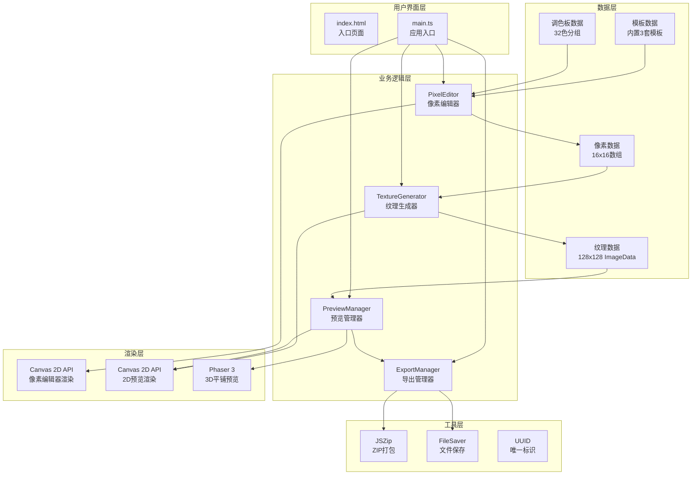
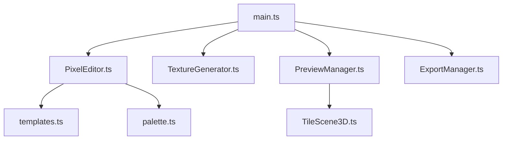

## 1. 架构设计

### 1.1 系统架构图


### 1.2 模块依赖关系


---

## 2. 技术栈描述

### 2.1 核心技术栈
| 层级 | 技术 | 版本 | 用途 |
|------|------|------|------|
| 前端框架 | TypeScript | ^5.0.0 | 类型安全的JavaScript |
| 构建工具 | Vite | ^5.0.0 | 快速开发构建 |
| 3D引擎 | Phaser 3 | ^3.70.0 | 3D平铺预览渲染 |
| 工具库 | jszip | ^3.10.0 | ZIP文件打包 |
| 工具库 | file-saver | ^2.0.5 | 文件保存 |
| 工具库 | uuid | ^9.0.0 | 唯一标识符生成 |

### 2.2 项目初始化
- **初始化命令**：使用Vite创建vanilla-ts项目
- **包管理器**：npm
- **开发服务器**：`npm run dev`

---

## 3. 目录结构

```
project-root/
├── index.html                    # 入口HTML页面
├── package.json                  # 项目依赖配置
├── vite.config.js                # Vite构建配置
├── tsconfig.json                 # TypeScript配置
└── src/
    ├── main.ts                   # 应用入口
    ├── assets/                   # 静态资源
    │   └── icons/                # 像素风格图标
    ├── data/                     # 数据配置
    │   ├── palette.ts            # 32色调色板数据
    │   └── templates.ts          # 内置模板数据
    ├── modules/                  # 业务模块
    │   ├── editor/
    │   │   └── PixelEditor.ts    # 像素编辑器核心
    │   ├── tilegen/
    │   │   └── TextureGenerator.ts # 纹理生成算法
    │   ├── preview/
    │   │   ├── PreviewManager.ts # 预览管理器
    │   │   └── TileScene3D.ts    # Phaser 3D场景
    │   └── export/
    │       └── ExportManager.ts  # 导出管理器
    ├── types/                    # 类型定义
    │   └── index.ts              # 通用类型
    └── utils/                    # 工具函数
        └── canvas.ts             # Canvas工具函数
```

---

## 4. 核心数据结构

### 4.1 类型定义
```typescript
// src/types/index.ts

// 像素颜色（RGBA格式）
export interface PixelColor {
  r: number;
  g: number;
  b: number;
  a: number;
}

// 16x16像素数据数组
export type PixelGrid = (PixelColor | null)[][];

// 调色板颜色项
export interface PaletteColor {
  hex: string;
  rgb: PixelColor;
  group: 'warm' | 'cool' | 'earth' | 'metal';
}

// 工具类型
export type ToolType = 'pencil' | 'bucket' | 'eyedropper' | 'eraser';

// 模板类型
export interface Template {
  id: string;
  name: string;
  grid: PixelGrid;
  recommendedPalette: string[]; // hex数组
}

// 纹理生成结果
export interface GeneratedTexture {
  sourceCanvas: HTMLCanvasElement;  // 16x16原图
  textureCanvas: HTMLCanvasElement; // 128x128生成图
  previewCanvas: HTMLCanvasElement; // 平铺预览图
}
```

---

## 5. 核心API设计

### 5.1 PixelEditor API
```typescript
class PixelEditor {
  constructor(container: HTMLElement, options: EditorOptions);
  getPixelData(): PixelGrid;
  setPixelData(grid: PixelGrid): void;
  setTool(tool: ToolType): void;
  setColor(color: PixelColor): void;
  setScale(scale: number): void;
  clear(): void;
  onPixelChange(callback: (grid: PixelGrid) => void): void;
}
```

### 5.2 TextureGenerator API
```typescript
class TextureGenerator {
  static generateSeamlessTexture(
    sourceGrid: PixelGrid,
    targetSize: number = 128
  ): HTMLCanvasElement;
  
  static createTiledPreview(
    textureCanvas: HTMLCanvasElement,
    tilesX: number = 4,
    tilesY: number = 4
  ): HTMLCanvasElement;
  
  private static mirrorEdgeSample(
    sourceData: ImageData,
    targetSize: number
  ): ImageData;
}
```

### 5.3 PreviewManager API
```typescript
class PreviewManager {
  constructor(previewContainer: HTMLElement, phaserContainer: HTMLElement);
  update2DPreview(textureCanvas: HTMLCanvasElement): void;
  update3DPreview(textureCanvas: HTMLCanvasElement): void;
  destroy(): void;
}
```

### 5.4 ExportManager API
```typescript
class ExportManager {
  static exportAsPNG(canvas: HTMLCanvasElement, filename: string): void;
  static copyToClipboard(canvas: HTMLCanvasElement): Promise<boolean>;
  static exportAsZIP(
    sourceCanvas: HTMLCanvasElement,
    textureCanvas: HTMLCanvasElement,
    previewCanvas: HTMLCanvasElement
  ): Promise<void>;
}
```

---

## 6. 关键算法说明

### 6.1 边界像素镜像重采样算法
```
输入：16x16像素网格 sourceGrid
输出：128x128无缝纹理 textureData

算法步骤：
1. 将sourceGrid绘制到16x16 Canvas上
2. 获取ImageData: sourceData (16x16x4字节)
3. 创建targetData (128x128x4字节)
4. 对于targetData中的每个像素(x, y)：
   a. 计算在sourceData中的采样点：
      sx = (x / 128) * 16
      sy = (y / 128) * 16
   b. 应用镜像边界处理：
      if sx > 8: sx = 16 - sx  // 水平镜像
      if sy > 8: sy = 16 - sy  // 垂直镜像
      if sx < 0: sx = -sx
      if sy < 0: sy = -sy
   c. 取整得到采样位置: sxi = floor(sx), syi = floor(sy)
   d. 双线性插值采样周围4个像素
   e. 将结果写入targetData的(x, y)位置
5. 将targetData绘制到128x128 Canvas上返回
```

### 6.2 油漆桶填充算法（Flood Fill）
```
输入：起始位置(x, y)，目标颜色targetColor，替换颜色fillColor
输出：填充后的像素网格

算法步骤：
1. 检查(x, y)处颜色是否等于targetColor，且不等于fillColor
2. 如果是，创建一个栈/队列，将(x, y)加入
3. 当栈不为空时：
   a. 弹出当前位置(cx, cy)
   b. 如果(cx, cy)越界或颜色不等于targetColor，跳过
   c. 设置(cx, cy)为fillColor
   d. 将(cx+1, cy), (cx-1, cy), (cx, cy+1), (cx, cy-1)加入栈
4. 返回更新后的网格
```

---

## 7. Phaser 3 3D场景配置

### 7.1 游戏配置
```typescript
const phaserConfig: Phaser.Types.Core.GameConfig = {
  type: Phaser.AUTO,
  width: 320,
  height: 320,
  parent: 'phaser-container',
  scene: [TileScene3D],
  render: {
    antialias: false,
    pixelArt: true,
  },
  scale: {
    mode: Phaser.Scale.NONE,
    width: 320,
    height: 320,
  },
};
```

### 7.2 正交相机设置
```typescript
// 在TileScene3D的create方法中
this.cameras.main.setOrthographic(true);
this.cameras.main.setZoom(0.8);
this.cameras.main.setRotation(0);
```

---

## 8. Vite配置说明

### 8.1 Phaser 3专用配置
```javascript
// vite.config.js
export default {
  optimizeDeps: {
    include: ['phaser'],
  },
  build: {
    commonjsOptions: {
      include: [/phaser/, /node_modules/],
    },
    rollupOptions: {
      output: {
        manualChunks: {
          phaser: ['phaser'],
        },
      },
    },
  },
  server: {
    port: 5173,
    open: true,
  },
};
```

---

## 9. 性能优化策略

### 9.1 像素编辑器优化
- 使用离屏Canvas进行绘制缓存
- 只重绘变化的像素区域
- 使用requestAnimationFrame进行批量更新

### 9.2 3D预览优化
- 合并16x16平铺为单个网格减少Draw Call
- 使用纹理图集（Texture Atlas）
- 限制渲染分辨率为320x320
- 启用Phaser的像素渲染模式

### 9.3 纹理生成优化
- 使用Uint32Array进行像素操作，提高速度
- 预计算采样位置表
- 使用Web Worker进行大尺寸纹理生成（可选）

---

## 10. 构建与部署

### 10.1 开发命令
```bash
npm install    # 安装依赖
npm run dev    # 启动开发服务器
npm run build  # 生产构建
npm run preview # 预览构建结果
```

### 10.2 生产构建输出
- 所有资源打包到`dist/`目录
- Phaser单独打包为vendor chunk
- 开启gzip压缩
- 保留source map便于调试
