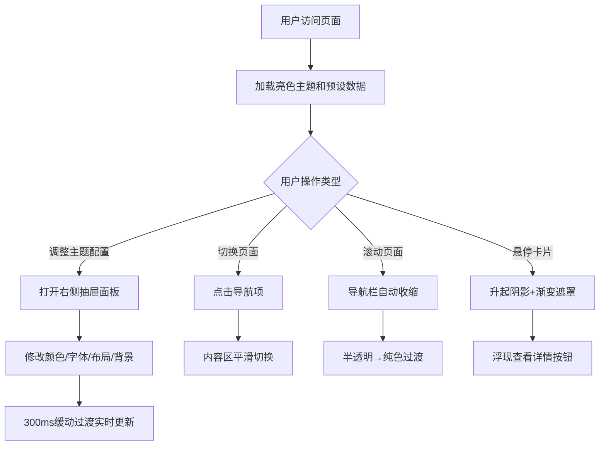

## 1. 产品概述

个人作品展示页面构建工具，面向博客作者和内容创作者，提供可视化主题定制、响应式卡片布局和流畅交互体验的一站式解决方案。

- 解决现有博客引擎主题定制繁琐、交互反馈不足、移动端适配体验不佳的问题
- 帮助创作者无需编码即可快速搭建具有专业视觉品质的个人作品展示站点

## 2. 核心功能

### 2.1 功能模块

1. **主题定制面板**：右侧抽屉式可视化面板，支持主题色、字体、卡片布局、背景图案实时调整
2. **作品卡片网格**：自适应多列布局，桌面3列/平板2列/手机1列，带悬停动画效果
3. **导航栏组件**：滚动收缩、主题色绑定、移动端汉堡菜单动画
4. **双主题切换**：深色/亮色主题一键切换，默认加载亮色主题

### 2.2 页面详情

| 页面名称 | 模块名称 | 功能描述 |
|-----------|-------------|---------------------|
| 主页 | 导航栏 | 顶部固定导航，滚动时自动收缩高度，半透明渐变过渡为不透明纯色 |
| 主页 | 主题定制面板 | 右侧抽屉式面板，配置颜色/字体/布局/背景，300ms缓动过渡 |
| 主页 | 作品卡片网格 | 展示封面图、标题、摘要，悬停升起阴影+渐变遮罩+查看详情按钮 |
| 主页 | 面包屑导航 | 底部导航，移动端收合成汉堡菜单，弹性缓动展开动画 |
| 主页 | 多页内容区 | 关于我、作品、联系三个页面内容切换 |

## 3. 核心流程

用户访问页面 → 默认加载亮色主题和预设作品数据 → 通过右侧面板调整主题配置 → 实时预览300ms过渡动画 → 切换不同页面（关于我/作品/联系） → 滚动时导航栏自动收缩 → 悬停卡片查看交互效果

## 4. 用户界面设计

### 4.1 设计风格

- **主色调**：默认蓝紫色系（#6366f1），支持用户自定义主题色
- **字体**：默认使用 'Playfair Display' 作为标题字体，'DM Sans' 作为正文字体，支持字体切换
- **按钮风格**：圆角胶囊形，悬停微放大+阴影加深
- **布局风格**：卡片式网格布局，大留白，现代杂志风
- **视觉细节**：几何SVG背景图案（6种预置），渐变遮罩，多层阴影
- **动效**：所有过渡使用300ms cubic-bezier缓动，汉堡菜单使用弹性缓动

### 4.2 页面设计概述

| 页面名称 | 模块名称 | UI元素 |
|-----------|-------------|-------------|
| 主页 | 导航栏 | 毛玻璃半透明背景，滚动后变为纯色，品牌Logo左对齐，导航项居中，主题切换按钮+面板开关右对齐 |
| 主页 | 主题定制面板 | 深色背景右侧抽屉，分组控件：颜色选择器、字体下拉、布局滑块、背景图案网格 |
| 主页 | 作品卡片网格 | 等宽卡片，圆角16px，封面图4:3比例，悬停translateY(-4px)+box-shadow，渐变遮罩从主题色60%→90% |
| 主页 | 面包屑导航 | 底部固定，移动端汉堡菜单图标，点击后菜单项弹性动画依次展开 |

### 4.3 响应式

- 桌面端（≥1024px）：3列卡片网格，完整导航栏
- 平板端（768px-1023px）：2列卡片网格，精简导航
- 手机端（<768px）：1列卡片网格，汉堡菜单
- 所有断点过渡平滑，触控区域≥44px×44px

### 4.4 性能指标

- 滚动帧率稳定在55FPS以上
- 首屏加载时间不超过2秒
- 所有动画使用GPU加速属性（transform、opacity）
