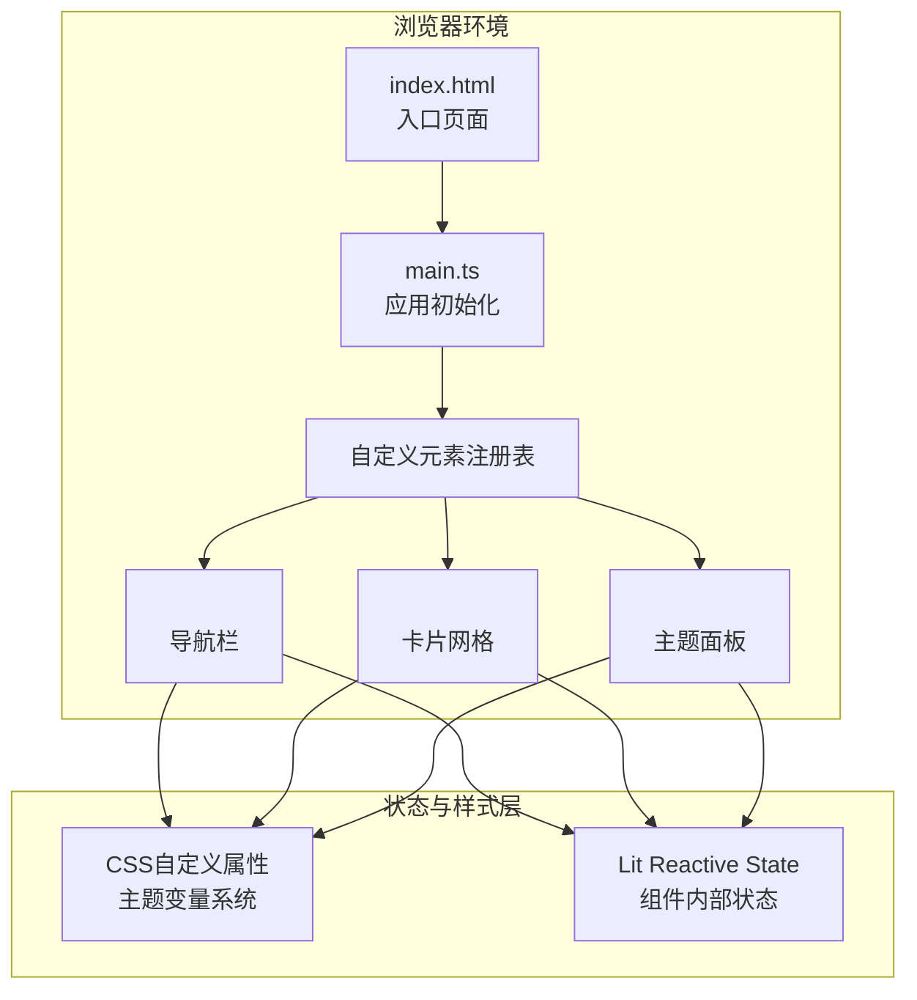

## 1. 架构设计



## 2. 技术描述

- **前端框架**：Lit 3.x（轻量级Web Components库）+ 原生Web Components API
- **构建工具**：Vite 5.x，支持Web Components polyfill
- **语言**：TypeScript 5.x，严格模式，目标ES2020
- **状态管理**：CSS自定义属性（全局主题）+ Lit reactive properties（组件状态）
- **辅助库**：uuid（生成唯一标识）
- **零运行时框架依赖**：不使用React/Vue等框架，基于Web Components标准

## 3. 文件结构

| 路径 | 用途 |
|-------|------|
| `package.json` | 项目依赖（lit、uuid）与脚本配置 |
| `index.html` | 入口页面，包含#app挂载点和主题切换按钮 |
| `vite.config.js` | Vite构建配置，支持Web Components polyfill |
| `tsconfig.json` | TypeScript严格模式配置，目标ES2020 |
| `src/main.ts` | 应用初始化入口，注册所有自定义元素 |
| `src/components/theme-panel.ts` | 主题定制面板组件 |
| `src/components/card-grid.ts` | 作品卡片网格组件 |
| `src/components/nav-bar.ts` | 导航栏组件 |

## 4. 组件接口定义

### 4.1 NavBar Component
```typescript
interface NavBarProps {
  activeSection: 'about' | 'works' | 'contact';
  themeMode: 'light' | 'dark';
}
// 自定义事件: 'navigate'(section切换), 'toggle-theme'(主题切换), 'open-panel'(打开主题面板)
```

### 4.2 CardGrid Component
```typescript
interface WorkItem {
  id: string;
  title: string;
  summary: string;
  coverImage: string;
}
interface CardGridProps {
  works: WorkItem[];
  columns?: { desktop: number; tablet: number; mobile: number };
}
```

### 4.3 ThemePanel Component
```typescript
interface ThemeConfig {
  primaryColor: string;
  fontFamily: string;
  cardGap: number;
  backgroundPattern: number; // 0-5
}
// 自定义事件: 'theme-change'(配置变更), 'close'(关闭面板)
```

## 5. 性能优化策略

### 5.1 渲染性能
- 使用CSS `transform` 和 `opacity` 实现动画，触发GPU合成层
- 卡片悬停效果使用 `will-change: transform` 提示浏览器优化
- 避免布局抖动：所有尺寸计算使用ResizeObserver批量处理

### 5.2 加载性能
- 组件懒注册：非首屏组件延迟定义
- SVG背景图案内联，避免额外网络请求
- 使用Vite的代码分割和Tree Shaking优化产物体积
- 图片使用loading="lazy"原生懒加载

### 5.3 动画策略
- 所有过渡统一300ms `cubic-bezier(0.4, 0, 0.2, 1)` 缓动
- 汉堡菜单展开使用 `cubic-bezier(0.34, 1.56, 0.64, 1)` 弹性缓动
- 滚动监听使用 `requestAnimationFrame` 节流，避免频繁重绘
