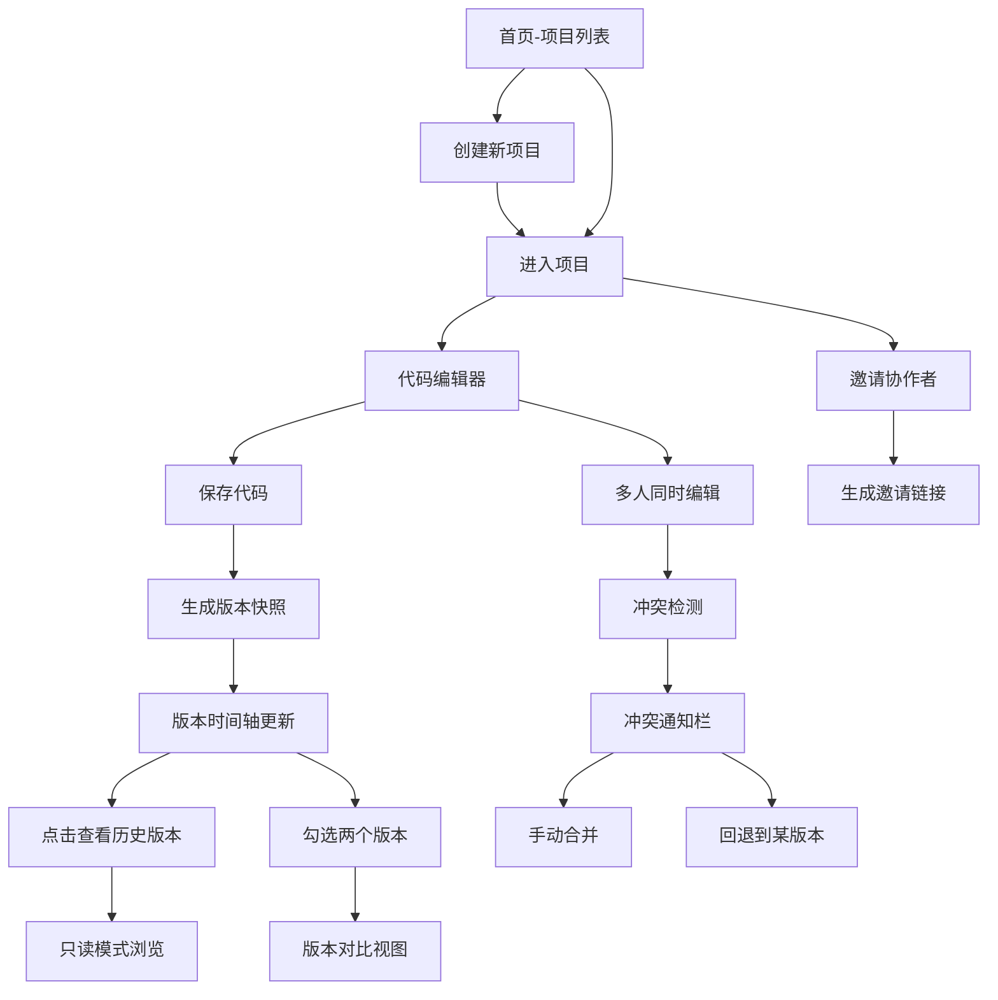

## 1. 产品概述

CSSnippet 是一款面向前端团队的 CSS 代码片段在线协作编辑与版本管理工具。解决团队成员分别编写样式时缺乏统一版本控制、样式冲突时难以回溯和对比历史记录的核心痛点。

- **目标用户**：前端开发团队、UI 设计师、需要协作编写样式的开发人员
- **核心价值**：提供专业的代码编辑体验、完整的版本快照管理、可视化差异对比、模拟多人协作冲突检测

## 2. 核心功能

### 2.1 用户角色
| 角色 | 注册方式 | 核心权限 |
|------|----------|----------|
| 普通用户 | 无需注册，本地使用 | 创建/管理项目、编辑代码、查看版本、对比差异、模拟协作 |

### 2.2 功能模块

1. **项目管理首页**：项目卡片网格展示、创建新项目、项目状态指示、在线协作者显示
2. **代码编辑器**：Monaco 编辑器集成、CSS 语法高亮、行号显示、自动补全、深色主题
3. **版本历史时间轴**：垂直时间轴展示、版本颜色编码、点击切换版本、只读浏览模式
4. **版本对比视图**：分栏并排展示、差异行高亮、同步滚动、只读模式
5. **协作与冲突**：邀请链接生成、在线用户头像气泡、冲突检测与通知、冲突行标记
6. **冲突通知栏**：红色渐变通知、冲突行号提示、合并/回退操作建议

### 2.3 页面详情
| 页面名称 | 模块名称 | 功能描述 |
|----------|----------|----------|
| 项目首页 | 项目卡片网格 | 展示所有项目卡片，支持悬停状态进度条动画、在线头像气泡 |
| 项目首页 | 新建项目按钮 | 弹出创建表单，输入项目名称和描述 |
| 编辑页面 | 代码编辑器 | Monaco 编辑器，深色主题，CSS 语法高亮，行号，自动补全 |
| 编辑页面 | 版本时间轴 | 左侧垂直时间轴，版本颜色编码，点击切换，版本摘要 |
| 编辑页面 | 版本对比视图 | 左右分栏，差异高亮，同步滚动开关 |
| 编辑页面 | 冲突通知栏 | 底部红色通知，显示冲突行号和操作建议 |
| 编辑页面 | 协作者头像 | 右上角头像气泡，最多3个叠加显示 |

## 3. 核心流程

### 3.1 主要用户流程

用户打开应用 → 查看项目列表 → 创建/进入项目 → 编辑 CSS 代码 → 保存生成版本快照 → 查看版本历史 → 对比不同版本 → 邀请协作者 → 检测冲突 → 处理冲突

### 3.2 流程图

## 4. 用户界面设计

### 4.1 设计风格
- **主色调**：霓虹蓝 #00D4FF（按钮），悬停变 #00A3CC
- **背景**：深灰 #2D2D2D 到浅灰 #3C3C3C 的微弱渐变
- **编辑器背景**：深色 #1E1E1E
- **代码高亮**：绿色 #98C379
- **状态色**：绿色（最新）、橙色（未保存）、红色（冲突）
- **字体**：代码使用 monospace 等宽字体
- **按钮风格**：圆角，点击缩放 0.95，transition 200ms ease
- **卡片风格**：暗蓝紫到深蓝灰渐变，左侧彩色进度条，柔和边框阴影

### 4.2 页面设计概述

| 页面名称 | 模块名称 | UI 元素 |
|----------|----------|---------|
| 项目首页 | 页面标题 | 大标题 + 副标题，霓虹蓝渐变文字 |
| 项目首页 | 项目卡片 | 渐变背景，左侧状态进度条动画（300ms），标题、描述、在线头像 |
| 项目首页 | 新建卡片 | 加号图标，悬停发光效果 |
| 编辑页面 | 顶部导航 | 项目名称、返回按钮、保存按钮、协作者头像 |
| 编辑页面 | 版本警告条 | 黄色背景，"当前查看版本 v3" 文字 |
| 编辑页面 | 版本时间轴 | 左侧 260px 固定宽度，垂直列表，颜色编码 |
| 编辑页面 | 代码编辑器 | Monaco 编辑器，深色主题，行号，语法高亮 |
| 编辑页面 | 对比视图 | 左右分栏，差异高亮，同步滚动开关 |
| 编辑页面 | 冲突通知栏 | 底部红色渐变，白色感叹号图标，关闭按钮 |

### 4.3 响应式设计
- **桌面端**：3列卡片网格，时间轴左侧固定 260px
- **平板端**：2列卡片网格，时间轴折叠为顶部水平可展开面板
- **手机端**：1列卡片网格，时间轴全屏覆盖
- **触摸优化**：按钮最小点击区域 44px，滑动手势支持

### 4.4 动画与交互
- 卡片悬停：左侧进度条滑入动画（300ms）
- 按钮：悬停颜色过渡（200ms），点击缩放（0.95）
- 版本切换：淡入淡出过渡
- 通知栏：从底部滑入动画
- 输入框聚焦：边框发光效果

## 5. 性能要求

- 编辑器输入卡顿不超过 50ms
- 版本对比加载在 200ms 内完成（500 个版本以内）
- 页面首屏加载 < 2s
- 滚动帧率保持 60fps
