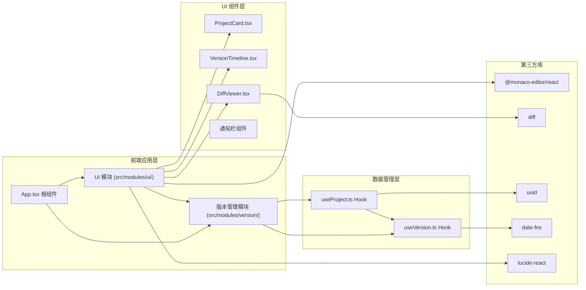
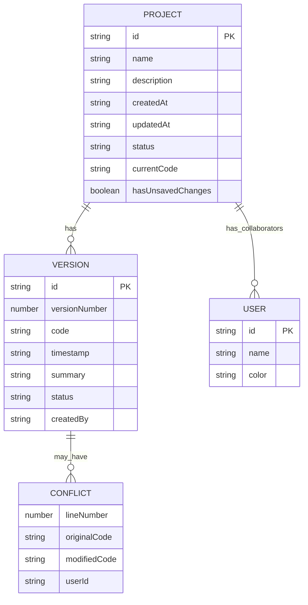

## 1. 架构设计



## 2. 技术描述

- **前端框架**：React 18 + TypeScript
- **构建工具**：Vite
- **状态管理**：React Hooks (useState, useReducer, useCallback)
- **代码编辑器**：@monaco-editor/react
- **版本对比**：diff 库
- **工具库**：uuid（ID生成）、date-fns（日期处理）、lucide-react（图标）
- **样式方案**：内联样式 + CSS Modules / styled-components（使用纯 CSS）
- **数据存储**：localStorage 模拟持久化
- **后端**：无，纯前端模拟协作功能

## 3. 项目结构

```
e:\solo\SoloAutoDemo\tasks\auto97\
├── package.json
├── vite.config.js
├── tsconfig.json
├── index.html
├── src/
│   ├── App.tsx
│   ├── main.tsx
│   ├── index.css
│   ├── modules/
│   │   ├── ui/
│   │   │   ├── components/
│   │   │   │   ├── ProjectCard.tsx
│   │   │   │   ├── VersionTimeline.tsx
│   │   │   │   ├── DiffViewer.tsx
│   │   │   │   ├── CodeEditor.tsx
│   │   │   │   ├── NotificationBar.tsx
│   │   │   │   └── UserAvatar.tsx
│   │   │   └── styles/
│   │   │       ├── ProjectCard.css
│   │   │       ├── VersionTimeline.css
│   │   │       └── DiffViewer.css
│   │   ├── version/
│   │   │   ├── hooks/
│   │   │   │   ├── useProject.ts
│   │   │   │   └── useVersion.ts
│   │   │   ├── types/
│   │   │   │   └── index.ts
│   │   │   └── utils/
│   │   │       ├── diff.ts
│   │   │       └── conflict.ts
│   │   └── shared/
│   │       └── utils/
│   │           └── storage.ts
```

## 4. 数据模型

### 4.1 类型定义

```typescript
interface Project {
  id: string;
  name: string;
  description: string;
  createdAt: string;
  updatedAt: string;
  status: 'latest' | 'modified' | 'conflict';
  collaborators: User[];
  currentCode: string;
  hasUnsavedChanges: boolean;
}

interface Version {
  id: string;
  versionNumber: number;
  code: string;
  timestamp: string;
  summary: string;
  status: 'latest' | 'normal' | 'conflict';
  createdBy: string;
}

interface User {
  id: string;
  name: string;
  color: string;
}

interface Conflict {
  lineNumber: number;
  originalCode: string;
  modifiedCode: string;
  userId: string;
}

interface DiffLine {
  type: 'added' | 'removed' | 'modified' | 'unchanged';
  content: string;
  lineNumber: number;
}
```

### 4.2 ER 图



## 5. 核心模块说明

### 5.1 useProject Hook
- 项目列表管理（增删改查）
- 当前项目状态管理
- 代码编辑与保存
- 版本快照自动生成
- 冲突检测逻辑
- 协作者管理

### 5.2 useVersion Hook
- 版本历史存储与检索
- 版本对比计算（使用 diff 库）
- 版本回退
- 版本摘要生成

### 5.3 ProjectCard 组件
- 项目卡片展示
- 状态进度条动画
- 在线用户头像气泡
- 悬停效果

### 5.4 VersionTimeline 组件
- 垂直时间轴展示
- 版本颜色编码
- 版本选择与切换
- 多选对比模式
- 响应式布局

### 5.5 DiffViewer 组件
- 左右分栏对比视图
- 差异行高亮
- 同步滚动
- 只读模式

## 6. 性能优化策略

- 编辑器使用 Monaco 的虚拟滚动
- 版本对比使用 Web Worker（可选，先在主线程优化）
- 列表虚拟化（长列表时）
- React.memo 优化组件重渲染
- useMemo/useCallback 缓存计算结果和函数
- debounce 处理编辑器输入事件
- 懒加载 Monaco 编辑器

## 7. 响应式断点

| 断点 | 宽度 | 布局变化 |
|------|------|----------|
| 桌面端 | ≥ 1200px | 3列卡片，时间轴 260px |
| 平板端 | 768px - 1199px | 2列卡片，时间轴可折叠 |
| 手机端 | < 768px | 1列卡片，时间轴全屏覆盖 |
