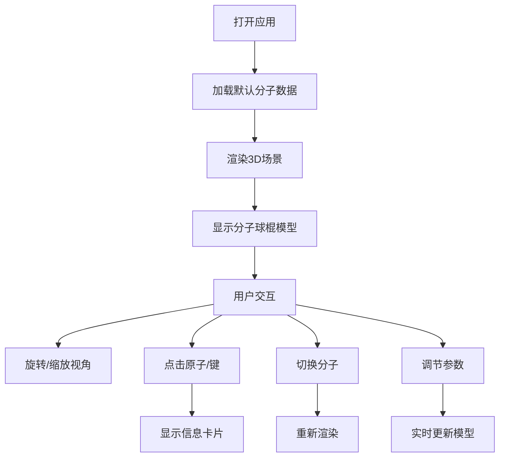

## 1. 产品概述

交互式3D分子结构教学辅助应用，帮助化学专业学生和教师通过可视化方式理解分子空间构型、键角及分子间相互作用力。

- **核心问题**：化学教学中学生难以从平面分子式理解空间构型、键角、以及分子间相互作用力
- **目标用户**：化学教师、化学专业学生、化学爱好者
- **产品价值**：将抽象的分子结构转化为直观可交互的3D模型，提升学习效率和教学效果

## 2. 核心功能

### 2.1 用户角色

| 角色 | 注册方式 | 核心权限 |
|------|-----------|-----------|
| 普通用户 | 无需注册 | 浏览分子模型、调节参数、查看原子/键信息 |

### 2.2 功能模块

1. **分子3D可视化模块**：球棍模型渲染、键角标注、原子/键信息显示
2. **分子库模块**：预定义分子（水、甲烷、氨气、苯环）加载与切换
3. **参数调节模块**：键长缩放、原子半径缩放、光照强度调节
4. **交互控制模块**：视角旋转、缩放、原子/键点击交互
5. **信息展示模块**：原子信息卡片、键长高亮显示

### 2.3 页面详情

| 页面名称 | 模块名称 | 功能描述 |
|-----------|-----------|-----------|
| 主页面 | 3D场景区域 | 渲染分子球棍模型，支持旋转、缩放、点击交互 |
| 主页面 | 控制面板 | 分子选择、参数滑块调节 |
| 主页面 | 信息卡片 | 显示原子/键的详细信息 |

## 3. 核心流程

用户打开应用 → 加载默认分子（水）→ 3D场景渲染分子模型 → 用户可：
  - 拖拽旋转视角、滚轮缩放
  - 点击原子查看信息卡片
  - 点击化学键查看键长
  - 通过控制面板切换分子
  - 调节参数实时更新模型
  - 查看键角标注

## 4. 用户界面设计

### 4.1 设计风格
- **主色调**：深色渐变背景（#0f0c29 → #302b63 → #24243e）
- **原子配色**：碳#808080、氧#ff3333、氮#4d4dff、氢#ffffff
- **控件配色**：控制面板背景#1a202c，文字#e2e8f0
- **滑块样式**：宽240px，轨道色#4a5568，滑块头圆形20px，拖拽时#63b3ed
- **过渡动画**：所有交互元素0.2秒过渡（transition: all 0.2s ease）

### 4.2 页面设计概述

| 页面名称 | 模块名称 | UI元素 |
|-----------|-----------|---------|
| 主页面 | 3D场景区域 | 70%页面宽度，深色渐变背景，球棍模型，键角弧线+标签 |
| 主页面 | 控制面板 | 300px宽，分子选择下拉，参数滑块组，数值输入框 |
| 主页面 | 信息卡片 | 半透明黑色背景，白色12px字体，圆角矩形 |

### 4.3 响应式设计
- **桌面端（≥768px）**：左侧70% 3D场景，右侧300px控制面板
- **移动端（<768px）**：控制面板移至场景下方，场景高度占视口60%
- **触摸优化**：支持触摸拖拽旋转、双指缩放

### 4.4 3D场景设计
- **环境**：深色渐变背景，营造科技感和沉浸感
- **光照**：环境光+方向光组合，突出3D效果
- **相机**：透视相机，支持轨道控制器
- **交互**：OrbitControls支持拖拽旋转、滚轮缩放、右键平移
- **动画**：模型自动微调旋转，增强3D感
- **性能**：60FPS流畅运行，原子≤50个，化学键≤100条
