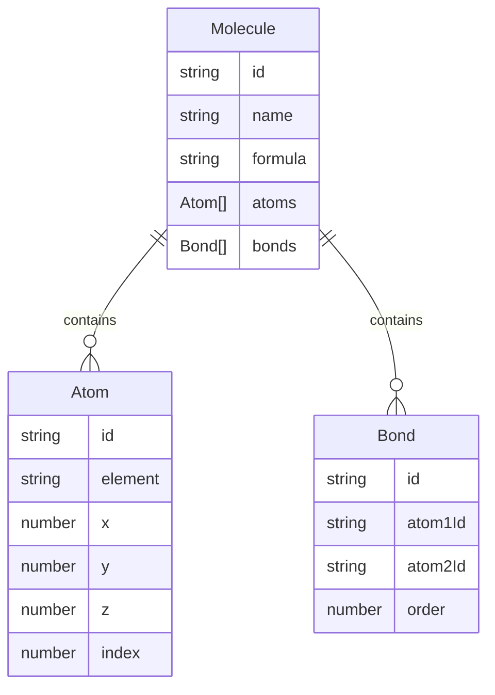

## 1. 架构设计

```mermaid
graph TD
    subgraph "前端"
        A["App.tsx (主页面)"]
        B["MoleculeViewer.tsx (3D渲染组件]
        C["ControlPanel.tsx (控制面板)"]
        D["RenderEngine.ts (渲染引擎模块)"]
        E["MoleculeParser.ts (数据解析模块)"]
        F["Zustand Store (状态管理)"]
    end
    
    subgraph "后端"
        G["Express Server"]
        H["API: GET /api/molecules"]
        I["分子数据 JSON"]
    end
    
    subgraph "3D渲染层"
        J["Three.js 场景"]
        K["@react-three/fiber"]
        L["@react-three/drei (OrbitControls等)"]
    end
    
    A --> B
    A --> C
    B --> D
    B --> E
    B --> K
    K --> J
    K --> L
    C --> F
    D --> J
    E --> H
    H --> G
    G --> I
```

## 2. 技术描述

- **前端框架**：React 18 + TypeScript
- **构建工具**：Vite 5
- **3D渲染**：Three.js + @react-three/fiber + @react-three/drei
- **状态管理**：Zustand
- **样式方案**：TailwindCSS 3
- **后端**：Express 4
- **数据格式**：JSON
- **跨域处理**：CORS

## 3. 项目结构

```
project-root/
├── src/
│   ├── components/
│   │   ├── MoleculeViewer.tsx
│   │   └── ControlPanel.tsx
│   ├── modules/
│   │   ├── RenderEngine.ts
│   │   └── MoleculeParser.ts
│   ├── store/
│   │   └── useMoleculeStore.ts
│   ├── types/
│   │   └── index.ts
│   ├── App.tsx
│   ├── main.tsx
│   └── index.css
├── server/
│   ├── index.ts
│   └── data/
│   │   └── molecules.json
│   └── types.ts
├── package.json
├── vite.config.js
├── tsconfig.json
└── index.html
```

## 4. 数据模型定义



## 5. 状态管理

```typescript
interface MoleculeState {
  currentMolecule: MoleculeData | null;
  molecules: MoleculeData[];
  params: {
    bondScale: number;
    atomScale: number;
    lightIntensity: number;
  };
  selectedAtom: AtomData | null;
  selectedBond: BondData | null;
}
```

## 6. API 定义

### GET /api/molecules

**请求**：无参数

**响应**：
```typescript
interface MoleculeData {
  id: string;
  name: string;
  formula: string;
  atoms: Array<{
    id: string;
    element: 'C' | 'H' | 'O' | 'N';
    x: number;
    y: number;
    z: number;
    index: number;
  }>;
  bonds: Array<{
    id: string;
    atom1Id: string;
    atom2Id: string;
    order: number;
  }>;
}
```

## 7. 核心模块接口

### RenderEngine
```typescript
interface RenderEngine {
  init(container: HTMLElement): void;
  addMolecule(data: MoleculeRenderData): void;
  updateParams(params: RenderParams): void;
  dispose(): void;
}

interface MoleculeRenderData {
  atoms: AtomRenderData[];
  bonds: BondRenderData[];
  bondAngles: BondAngleData[];
}

interface RenderParams {
  bondScale: number;
  atomScale: number;
  lightIntensity: number;
}
```

### MoleculeParser
```typescript
interface MoleculeParser {
  parseFromAPI(data: MoleculeData): MoleculeRenderData;
  calculateBondAngles(atoms: AtomData[], bonds: BondData[]): BondAngleData[];
}
```
