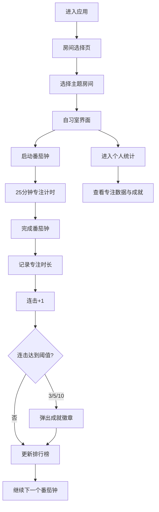

## 1. 产品概述

虚拟自习室专注力统计与动力激励应用，为用户提供沉浸式的在线专注学习环境。通过番茄钟计时、虚拟房间、实时排行榜和成就系统，帮助用户保持专注并获得持续的学习动力。

- **目标用户**：学生、远程工作者、自由职业者等需要保持专注的人群
- **核心价值**：沉浸式专注环境 + 社交激励机制 + 数据化统计反馈

## 2. 核心功能

### 2.1 用户角色

| 角色 | 注册方式 | 核心权限 |
|------|----------|----------|
| 普通用户 | 自动生成临时身份（昵称+首字母头像） | 进入房间、使用番茄钟、查看排行榜、查看个人统计 |

### 2.2 功能模块

1. **房间选择页**：展示6个不同主题的虚拟自习房间卡片
2. **自习室界面**：番茄钟计时器、实时专注排行榜、连击显示
3. **个人统计面板**：今日专注时长、本周趋势、连续专注天数、成就徽章

### 2.3 页面详情

| 页面名称 | 模块名称 | 功能描述 |
|----------|----------|----------|
| 房间选择页 | 房间卡片列表 | 展示6个主题房间（深海专注、森林阅读、星空冥想、咖啡馆、图书馆、深夜书桌），显示在线人数，hover上浮效果，点击进入房间 |
| 自习室界面 | 番茄钟计时器 | 圆形倒计时（25分钟专注/5分钟休息），外圈旋转动画，已用时长显示，开始/暂停/重置控制 |
| 自习室界面 | 番茄获得动画 | 完成一个番茄钟时弹出+1番茄图标飞出动画 |
| 自习室界面 | 实时排行榜 | 显示房间内用户专注时长排名，当前用户高亮，每10秒WebSocket刷新 |
| 自习室界面 | 连击与成就 | 显示当前连击数，达成3/5/10连击时弹出对应徽章动画 |
| 个人统计面板 | 今日专注总时长 | 大字金色展示今日累计专注分钟数 |
| 个人统计面板 | 本周专注趋势 | 柱状图展示周一至周日每日专注时长 |
| 个人统计面板 | 连续专注天数 | 火焰图标+数字，>3天时火焰橙色跳动动画 |
| 个人统计面板 | 成就徽章展示 | 展示已获得的铜/银/金徽章 |

## 3. 核心流程

用户进入应用 → 选择虚拟自习房间 → 启动番茄钟开始专注 → 计时完成记录专注时长 → 获得连击与成就激励 → 查看排行榜和个人统计

## 4. 用户界面设计

### 4.1 设计风格

- **主色调**：深色主题，背景深灰 `#1a202c`，卡片背景 `#2d3748`
- **强调色**：番茄红 `#e53e3e`-`#fc8181` 渐变、金色 `#d69e2e`、绿色 `#68d391`
- **按钮样式**：圆角12px，hover时 `scale(1.05)` 缩放反馈
- **字体**：现代无衬线字体，标题粗体，正文常规
- **布局风格**：卡片式布局，圆角统一12px，细微内阴影
- **图标风格**：emoji表情符号 + Lucide React 图标库

### 4.2 页面设计概览

| 页面名称 | 模块名称 | UI元素 |
|----------|----------|--------|
| 房间选择页 | 房间卡片 | 渐变背景、主题色、白色半透明底部、hover上浮6px、阴影变化 |
| 自习室界面 | 番茄钟 | 圆形红色渐变、外圈旋转描边动画、倒计时数字、控制按钮 |
| 自习室界面 | 排行榜 | 半透明深灰背景、用户首字母头像（哈希色）、白色昵称、绿色时长 |
| 个人统计面板 | 趋势图 | 柱状图渐变 `#667eea`-`#764ba2`、横轴周一至周日 |
| 个人统计面板 | 连击天数 | 火焰图标、>3天橙色跳动动画（scale 1.1每0.5秒） |
| 成就弹窗 | 徽章 | 圆形60px、径向渐变（铜/银/金）、顶部滑入滑出动画 |

### 4.3 响应式设计

- **桌面端（≥768px）**：左右分栏，左侧番茄钟，右侧排行榜
- **移动端（<768px）**：排行榜变为底部可横向滑动列表
- **触控优化**：按钮最小44px触控区域，滑动手势支持

### 4.4 性能要求

- 番茄钟倒计时更新间隔：1秒
- CSS动画帧率：≥30fps
- WebSocket心跳：每30秒一次
- 排行榜刷新延迟：≤2秒
