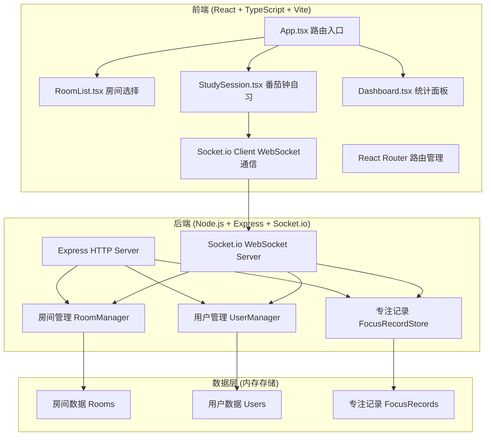
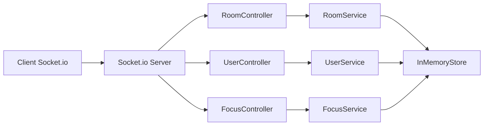
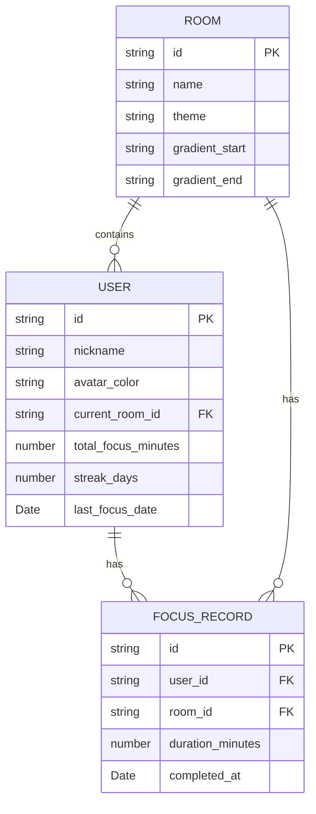

## 1. 架构设计



## 2. 技术说明

- **前端**：React 18 + TypeScript + Vite
- **路由**：react-router-dom v6
- **实时通信**：socket.io-client
- **状态管理**：React Hooks (useState, useEffect, useRef) + 组件本地状态
- **样式**：原生CSS + CSS变量 + 响应式媒体查询
- **后端**：Express 4 + TypeScript
- **WebSocket**：socket.io
- **ID生成**：uuid
- **跨域**：cors
- **数据存储**：内存存储（开发演示用）

## 3. 路由定义

| 路由 | 用途 |
|------|------|
| `/` | 房间选择首页，展示6个主题自习房间 |
| `/room/:roomId` | 自习室界面，番茄钟计时 + 实时排行榜 |
| `/dashboard` | 个人专注统计面板 |

## 4. API定义

### 4.1 HTTP REST API

```typescript
// 获取房间列表
GET /api/rooms
Response: {
  rooms: Array<{
    id: string;
    name: string;
    theme: string;
    gradient: string[];
    onlineCount: number;
  }>;
}

// 获取用户专注记录
GET /api/users/:userId/focus-records
Response: {
  records: Array<{
    id: string;
    userId: string;
    roomId: string;
    duration: number; // 分钟
    completedAt: string; // ISO时间戳
  }>;
  totalMinutes: number;
  streakDays: number;
}

// 提交专注记录
POST /api/focus-records
Body: {
  userId: string;
  roomId: string;
  duration: number;
}
Response: {
  success: boolean;
  record: FocusRecord;
  newStreak: number;
  achievement?: 'bronze' | 'silver' | 'gold';
}
```

### 4.2 WebSocket事件

```typescript
// 客户端 → 服务端
'join_room': { roomId: string; user: User }
'leave_room': { roomId: string; userId: string }
'start_focus': { roomId: string; userId: string }
'complete_focus': { roomId: string; userId: string; duration: number }
'heartbeat': { userId: string }

// 服务端 → 客户端
'room_joined': { room: Room; users: User[] }
'user_joined': { user: User }
'user_left': { userId: string }
'leaderboard_update': { rankings: Ranking[] }
'focus_completed': { userId: string; duration: number }
```

## 5. 服务端架构



## 6. 数据模型

### 6.1 数据模型定义



### 6.2 类型定义

```typescript
interface Room {
  id: string;
  name: string;
  theme: string;
  gradient: [string, string];
  onlineCount: number;
}

interface User {
  id: string;
  nickname: string;
  avatarColor: string;
  roomId: string | null;
  totalFocusMinutes: number;
  streakDays: number;
  lastFocusDate: string;
}

interface FocusRecord {
  id: string;
  userId: string;
  roomId: string;
  duration: number;
  completedAt: string;
}

interface Ranking {
  userId: string;
  nickname: string;
  avatarColor: string;
  focusMinutes: number;
  isCurrentUser: boolean;
}
```

### 6.3 初始房间数据

| 房间ID | 房间名称 | 渐变起始色 | 渐变结束色 |
|--------|----------|------------|------------|
| deep-sea | 深海专注 | #1a365d | #2b6cb0 |
| forest | 森林阅读 | #276749 | #48bb78 |
| starry | 星空冥想 | #1a202c | #553c9a |
| cafe | 咖啡馆 | #744210 | #d69e2e |
| library | 图书馆 | #44337a | #805ad5 |
| midnight | 深夜书桌 | #171923 | #4a5568 |
