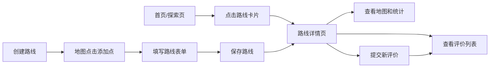

## 1. 产品概述

户外运动路线规划与社交分享应用，为徒步、骑行、跑步爱好者提供路线记录、探索和社交分享平台。用户可在地图上手动创建路线轨迹，查看其他用户分享的路线和评价，获取路线难度、耗时和海拔变化等统计信息。

### 核心价值
- 帮助户外爱好者发现和规划优质路线
- 通过社区评价体系建立路线可信度
- 提供海拔、距离等专业数据支持

## 2. 核心功能

### 2.1 用户角色
| 角色 | 注册方式 | 核心权限 |
|------|----------|----------|
| 普通用户 | 无需注册（演示版） | 浏览路线、查看详情、发布路线、提交评价 |

### 2.2 功能模块
1. **首页**: 精选路线轮播、最新/热门路线Tab切换
2. **探索页**: 路线卡片瀑布流展示、路线搜索筛选
3. **路线详情页**: 完整轨迹地图、海拔渐变、统计数据、评价列表
4. **路线发布**: 地图点击创建轨迹、路线信息表单、保存预览

### 2.3 页面详情
| 页面名称 | 模块名称 | 功能描述 |
|---------|---------|----------|
| 首页 | 精选轮播 | 自动播放（4秒切换）、左右箭头手动切换、平滑滑动过渡 |
| 首页 | Tab切换 | 最新路线/热门路线切换、交叉淡入淡出动画（400ms） |
| 探索页 | 卡片网格 | 瀑布流布局、缩略地图、路线名称/距离/评分展示 |
| 路线详情页 | 地图展示 | 全宽地图（400px高）、海拔渐变色多段线、起终点标记 |
| 路线详情页 | 统计卡片 | 三列布局：总距离、预计耗时、累计爬升 |
| 路线详情页 | 评价列表 | 用户头像、用户名、星级评分、评论文本 |
| 路线详情页 | 评价表单 | 1-5星评分、200字限制文本输入、实时字数统计 |
| 路线发布 | 地图创建 | 点击添加坐标点、半透明淡蓝色预览线、自动计算距离 |

## 3. 核心流程

用户浏览探索页 → 点击路线卡片 → 查看详情和评价 → 提交评价
↓
用户点击创建路线 → 在地图上点击添加点 → 填写路线信息 → 发布路线

## 4. 用户界面设计

### 4.1 设计风格
- **主色调**: 深森林绿 `#276749`、浅草绿 `#48bb78`
- **辅助色**: 暖黄 `#f6e05e`、天蓝 `#63b3ed`、亮橙 `#ed8936`
- **背景色**: 淡灰 `#f0f4f8`
- **卡片背景**: 白色 `#ffffff`，圆角 `16px`
- **按钮**: 渐变蓝 `#3182ce` 到 `#2b6cb0`，圆角 `8px`，悬停上浮 `3px`
- **字体**: 清晰现代无衬线字体，层级分明
- **图标风格**: 简洁线性图标，搭配户外主题元素

### 4.2 页面设计概述
| 页面名称 | 模块名称 | UI元素 |
|---------|---------|--------|
| 首页 | 导航栏 | 固定顶部64px、深森林绿背景、白色文字、2px下边框、中央搜索框 |
| 首页 | 轮播横幅 | 全宽、自动播放、左右箭头、平滑滑动 |
| 首页 | Tab卡片列表 | 双Tab切换、交叉淡入淡出、卡片网格 |
| 探索页 | 卡片网格 | 24px间距、响应式、悬停效果 |
| 路线详情页 | 地图区域 | 400px高、海拔渐变线、起终点标记 |
| 路线详情页 | 统计卡片 | 三列、#f7fafc背景、12px圆角 |
| 路线详情页 | 评价区域 | 圆形头像、星级评分、淡入动画 |

### 4.3 响应式设计
- 桌面优先设计，最大宽度 `1200px` 居中
- 屏幕宽度小于 `768px` 时卡片变为单列
- 导航栏在移动端自适应简化
- 触摸交互优化

### 4.4 动效设计
- 轮播切换：平滑滑动过渡
- Tab切换：交叉淡入淡出（400ms）
- 评价添加：淡入动画（300ms ease）
- 按钮悬停：向上浮动3px + 阴影加深
- 星星评分：悬停高亮当前及之前的星
