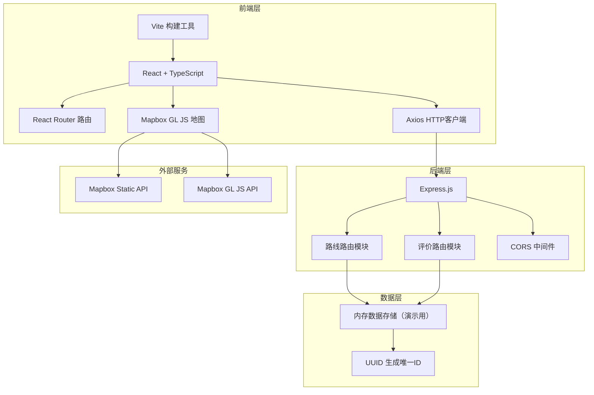
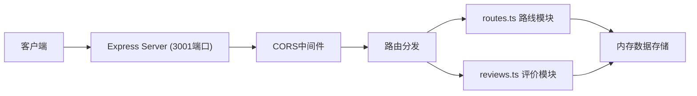
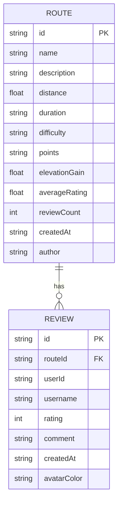

## 1. 架构设计



## 2. 技术描述

- **前端框架**: React 18 + TypeScript
- **构建工具**: Vite 5
- **路由管理**: React Router DOM 6
- **状态管理**: React Hooks (useState, useEffect)
- **地图服务**: Mapbox GL JS
- **HTTP客户端**: Axios
- **后端框架**: Express.js 4
- **后端语言**: TypeScript
- **数据存储**: 内存存储（演示版本）
- **ID生成**: UUID
- **跨域处理**: CORS 中间件

## 3. 路由定义

| 前端路由 | 页面 | 功能 |
|---------|------|------|
| `/` | 首页 | 精选轮播、最新/热门路线 |
| `/explore` | 探索页 | 所有公开路线卡片列表 |
| `/route/:id` | 路线详情页 | 完整地图、统计、评价 |
| `/create` | 创建路线 | 地图点击创建、表单提交 |

| 后端API路由 | 方法 | 功能 |
|------------|------|------|
| `/api/routes` | GET | 获取所有路线列表 |
| `/api/routes/:id` | GET | 获取单条路线详情 |
| `/api/routes` | POST | 创建新路线 |
| `/api/routes/:id/reviews` | GET | 获取路线评价列表 |
| `/api/routes/:id/reviews` | POST | 添加新评价 |

## 4. API定义

### 4.1 数据类型定义

```typescript
interface RoutePoint {
  lng: number;
  lat: number;
  elevation?: number;
}

interface Route {
  id: string;
  name: string;
  description: string;
  distance: number;
  duration: string;
  difficulty: 'easy' | 'medium' | 'hard';
  points: RoutePoint[];
  elevationGain: number;
  averageRating: number;
  reviewCount: number;
  createdAt: string;
  author: string;
}

interface Review {
  id: string;
  routeId: string;
  userId: string;
  username: string;
  rating: number;
  comment: string;
  createdAt: string;
  avatarColor: string;
}
```

### 4.2 请求响应格式

**GET /api/routes**
- 响应: `{ routes: Route[] }`

**GET /api/routes/:id**
- 响应: `{ route: Route }`

**POST /api/routes**
- 请求体: `{ name, description, distance, duration, difficulty, points, elevationGain }`
- 响应: `{ route: Route }`

**GET /api/routes/:id/reviews**
- 响应: `{ reviews: Review[] }`

**POST /api/routes/:id/reviews**
- 请求体: `{ username, rating, comment }`
- 响应: `{ review: Review }`

## 5. 服务器架构图



## 6. 数据模型

### 6.1 数据模型定义



### 6.2 初始数据

应用启动时自动生成演示数据：
- 50条示例路线，包含随机坐标点和海拔数据
- 每条路线附带3-8条随机评价
- 路线类型覆盖徒步、骑行、跑步
- 难度等级分布：简单30%、中等50%、困难20%
