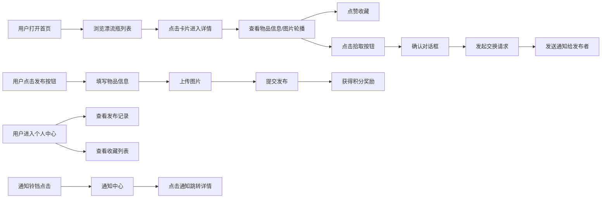

## 1. 产品概述

校园闲置物品漂流瓶是一款面向高校学生的闲置物品流转平台，通过"漂流瓶"的趣味形式解决毕业季闲置物品处理难题。用户可以匿名发布闲置物品，系统随机推送给其他用户，感兴趣的用户可以留言询价或发起交换请求，通过积分激励机制提高物品流转效率。

- 目标用户：高校学生，尤其是临近毕业需要处理闲置物品的学长学姐，以及想要淘好物的低年级学生
- 核心价值：让闲置物品快速流转，减少浪费，通过游戏化的漂流瓶形式提升用户参与度

## 2. 核心 Features

### 2.1 用户角色

| 角色 | 注册方式 | 核心权限 |
|------|---------|---------|
| 普通用户 | 匿名使用（本地存储用户ID） | 浏览漂流瓶、发布物品、点赞收藏、发起交换、查看通知 |

### 2.2 功能模块

1. **首页**：漂流瓶卡片列表，展示随机推送的闲置物品
2. **详情页**：物品大图轮播、详细信息、拾取/交换功能
3. **个人中心**：发布记录、收藏列表、积分展示、发布入口
4. **发布页**：物品信息填写表单、图片上传
5. **通知中心**：留言、点赞、交换请求通知

### 2.3 页面详情

| 页面名称 | 模块名称 | 功能描述 |
|---------|---------|----------|
| 首页 | 漂流瓶列表 | 卡片式展示，150x150px，浅米色背景，暖橙色阴影，悬停浮动效果 |
| 首页 | 卡片标签 | 水滴状标签，绿色可交换、蓝色可赠送、紫色可出售 |
| 首页 | 点赞按钮 | 底部心形按钮，点击变红缩放弹跳 |
| 详情页 | 图片轮播 | 最多4张图，左右箭头切换，淡入动画300ms |
| 详情页 | 星级评分 | 5颗星显示新旧程度，可点击打分 |
| 详情页 | 拾取按钮 | 橙色主按钮，点击振动反馈，弹出确认对话框 |
| 个人中心 | 用户信息 | 圆形头像、昵称、积分展示（褐色渐变+闪烁星星） |
| 个人中心 | 发布记录 | 时间倒序排列，显示状态和浏览数 |
| 个人中心 | 收藏列表 | 点赞过的物品，点击跳转详情 |
| 个人中心 | 发布按钮 | 右下角悬浮，橙红渐变，脉冲动画 |
| 发布页 | 表单输入 | 名称、描述、新旧程度、交换方式选择 |
| 发布页 | 图片上传 | 拖拽上传，拖入时边框变色背景变浅橙 |
| 发布页 | 提交按钮 | 渐变圆角按钮，提交时loading旋转动画 |
| 通知中心 | 通知列表 | 时间倒序，新通知橙点标记，已读灰点 |
| 导航栏 | 通知入口 | 铃铛图标，红色徽章显示未读数量 |

## 3. 核心流程

### 用户主要流程描述
1. **浏览与拾取**：用户打开首页看到随机推送的漂流瓶卡片，点击卡片查看详情，浏览图片和描述，可点赞收藏或点击拾取发起交换请求
2. **发布物品**：用户点击右下角悬浮按钮进入发布页，填写物品信息、上传图片、选择交换方式后提交，获得积分奖励
3. **消息互动**：用户通过导航栏通知铃铛查看其他用户的留言、点赞和交换请求，点击通知跳转到对应物品详情页
4. **个人管理**：用户在个人中心查看自己发布的物品状态和浏览数，管理收藏列表

## 4. 用户界面设计

### 4.1 设计风格
- **设计调性**：温暖、趣味、年轻化，符合校园氛围
- **主色调**：橙色 #f97316（活力、温暖）
- **辅助色**：米白 #fffbeb、暖灰 #ede9fe、浅米 #fef3c7
- **功能色**：绿色 #22c55e（可交换）、蓝色 #3b82f6（可赠送）、紫色 #a855f7（可出售）、红色 #ef4444（点赞）
- **字体**：使用Noto Sans SC，清晰易读，符合中文阅读习惯
- **布局风格**：卡片式布局，大量圆角和柔和阴影，营造温暖友好的视觉感受
- **动画风格**：流畅的过渡动画，微交互反馈（浮动、弹跳、脉冲）

### 4.2 页面设计概述

| 页面名称 | 模块名称 | UI元素 |
|---------|---------|--------|
| 首页 | 卡片列表 | 网格布局（桌面4列/平板2列/手机1列），150x150px卡片，浅米色#fef3c7，圆角12px，暖橙色#fb923c阴影8px，悬停上移8px阴影12px，200ms ease-out |
| 首页 | 卡片标签 | 左上角水滴状，绿色#22c55e/蓝色#3b82f6/紫色#a855f7 |
| 首页 | 点赞按钮 | 底部心形，实心灰→红色#ef4444，缩放弹跳动画 |
| 详情页 | 图片轮播 | 大图展示，左右圆形半透明箭头，淡入300ms ease-in-out |
| 详情页 | 详情区 | 字体灰#374151，字号14px，行高1.6，星级评分，拾取按钮橙色#f97316圆角8px |
| 详情页 | 确认对话框 | 半透明遮罩rgba(0,0,0,0.4)，圆角16px白色背景，顶部物品小图和名称 |
| 个人中心 | 顶部区域 | 圆形头像128px灰色边框#e5e7eb，昵称，积分褐色渐变#a16207到#713f12加粗18px，闪烁金色星星 |
| 个人中心 | 发布按钮 | 右下角固定，圆形56px，橙红渐变#f97316到#ea580c，脉冲动画2秒缩放 |
| 发布页 | 表单元素 | 输入框圆角8px，聚焦橙色#f97316边框阴影4px，上传区50%圆角虚线边框，拖入橙色实线背景浅橙#fff7ed |
| 发布页 | 单选按钮 | 圆形，选中填充对应绿/蓝/紫色 |
| 发布页 | 提交按钮 | 宽160px高44px，圆角22px，橙红渐变，loading旋转圆环 |
| 通知中心 | 通知列表 | 时间倒序，左状态图标，新通知橙点#f97316，已读灰点#d1d5db |
| 导航栏 | 顶部导航 | 高56px白色背景，底部2px橙色横线，右侧铃铛图标+红色圆形徽章，数字10px超过9显示9+ |

### 4.3 响应式设计
- **桌面端（≥1024px）**：卡片4列网格布局
- **平板端（768px-1023px）**：卡片2列网格布局
- **移动端（<768px）**：卡片1列布局，触摸时有震动反馈
- **设计原则**：桌面优先，逐步降级适配移动端，确保各断点下布局美观流畅

### 4.4 性能要求
- 首页加载时间 ≤ 1.5秒
- 图片懒加载，提升首屏速度
- 点赞操作响应 ≤ 100ms
- 动画流畅度60fps
