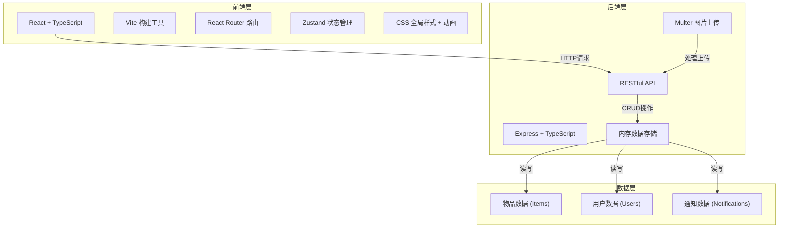
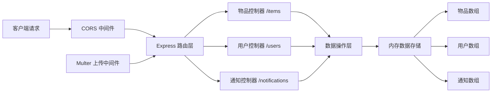
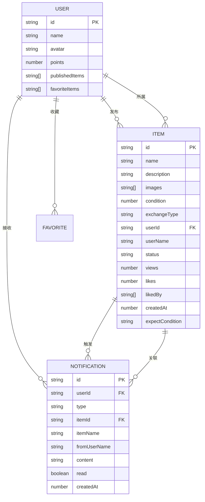

## 1. 架构设计



## 2. 技术栈描述

- **前端框架**：React 18 + TypeScript
- **构建工具**：Vite 5
- **路由管理**：React Router DOM 6
- **状态管理**：Zustand（轻量级全局状态）
- **样式方案**：全局CSS + CSS变量 + 响应式媒体查询
- **后端框架**：Express 4 + TypeScript
- **文件上传**：Multer
- **图片处理**：Sharp
- **数据存储**：内存数组模拟（开发环境）
- **唯一标识**：UUID
- **跨域处理**：CORS

## 3. 路由定义

| 路由路径 | 页面组件 | 用途说明 |
|---------|---------|---------|
| `/` | HomePage | 首页，漂流瓶卡片列表 |
| `/item/:id` | DetailPage | 物品详情页，大图轮播+详情 |
| `/profile` | ProfilePage | 个人中心，发布记录+收藏列表 |
| `/publish` | PublishPage | 发布漂流瓶表单页 |
| `/notifications` | NotificationPage | 通知中心页面 |

## 4. API 接口定义

### 类型定义
```typescript
// 物品类型
interface Item {
  id: string;
  name: string;
  description: string;
  images: string[];
  condition: number; // 1-5 星级
  exchangeType: 'exchange' | 'gift' | 'sell';
  userId: string;
  userName: string;
  status: 'waiting' | 'sent' | 'expired';
  views: number;
  likes: number;
  likedBy: string[];
  createdAt: number;
  expectCondition?: string;
}

// 用户类型
interface User {
  id: string;
  name: string;
  avatar: string;
  points: number;
  publishedItems: string[];
  favoriteItems: string[];
}

// 通知类型
interface Notification {
  id: string;
  userId: string;
  type: 'like' | 'comment' | 'exchange';
  itemId: string;
  itemName: string;
  fromUserName: string;
  content: string;
  read: boolean;
  createdAt: number;
}
```

### RESTful API

| 方法 | 路径 | 描述 | 请求参数 | 响应格式 |
|------|------|------|---------|----------|
| GET | `/api/items` | 获取物品列表 | `?page=1&limit=20` | `{ items: Item[], total: number }` |
| GET | `/api/items/:id` | 获取单个物品详情 | - | `Item` |
| POST | `/api/items` | 发布新物品 | `FormData: name, description, images[], condition, exchangeType, expectCondition, userId, userName` | `{ success: true, item: Item }` |
| POST | `/api/items/:id/like` | 点赞/取消点赞 | `{ userId: string }` | `{ success: true, liked: boolean, likes: number }` |
| POST | `/api/items/:id/exchange` | 发起交换请求 | `{ userId: string, userName: string, message: string }` | `{ success: true }` |
| GET | `/api/users/:id` | 获取用户信息 | - | `User` |
| GET | `/api/users/:id/items` | 获取用户发布的物品 | - | `Item[]` |
| GET | `/api/users/:id/favorites` | 获取用户收藏列表 | - | `Item[]` |
| GET | `/api/notifications/:userId` | 获取用户通知列表 | - | `Notification[]` |
| PUT | `/api/notifications/:id/read` | 标记通知已读 | - | `{ success: true }` |
| GET | `/api/notifications/:userId/unread-count` | 获取未读通知数 | - | `{ count: number }` |

## 5. 服务器架构图



### 模块职责
- **路由层**：定义API端点，处理HTTP请求分发
- **控制器层**：处理业务逻辑，参数校验，响应格式化
- **数据操作层**：封装对内存数组的CRUD操作
- **中间件**：CORS跨域、Multer文件上传、JSON解析

## 6. 数据模型

### 6.1 实体关系图



### 6.2 初始化数据

应用启动时会自动注入模拟数据，包含：
- 3个示例用户
- 10-15个示例物品（涵盖书籍、小电器、生活用品等类别）
- 若干通知记录

确保首次打开应用即可看到丰富的内容展示。
