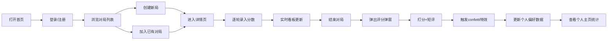

## 1. 产品概述
桌游约局与评分统计平台 - 解决线下桌游群凑人难、无战绩记录的问题
- 核心价值：帮助桌游玩家快速约局、记录对战数据、分析个人偏好与胜率
- 目标用户：桌游爱好者群体、桌游吧常客、线下桌游聚会组织者

## 2. 核心功能

### 2.1 用户角色
| 角色 | 注册方式 | 核心权限 |
|------|---------|---------|
| 普通玩家 | 用户名+密码注册 | 浏览/创建/加入对局、记录分数、评分评价、查看个人资料 |

### 2.2 功能模块
1. **首页（对局列表）**：动态游戏局卡片列表、创建新局按钮、用户登录/注册入口
2. **游戏详情页**：玩家列表管理、轮次分数记录、实时可视化看板、结束对局评分
3. **个人主页**：总场次/平均分/胜率统计、偏好雷达图、历史战绩
4. **认证系统**：用户注册/登录、头像选择、会话保持

### 2.3 页面详情
| 页面名称 | 模块名称 | 功能描述 |
|---------|---------|---------|
| 首页 | 游戏卡片列表 | 每张卡片展示游戏名、人数、状态、渐变色条分类标识 |
| 首页 | 创建对局弹窗 | 选择游戏名称、设置最大人数、选择游戏分类 |
| 首页 | 登录/注册表单 | 用户名/密码验证、emoji头像选择、表单校验 |
| 游戏详情页 | 玩家列表面板 | 显示已加入玩家、拖拽调整座位顺序、加入/离开按钮 |
| 游戏详情页 | 轮次记录面板 | 逐轮录入分数、表格交替色显示、饼图统计占比 |
| 游戏详情页 | 实时看板 | Canvas圆环进度图、玩家柱状对比图 |
| 游戏详情页 | 评分弹窗 | 1-5星弹性动画打分、短评输入、confetti庆祝特效 |
| 个人主页 | 统计概览 | 总场次、平均分、胜率、最擅长游戏卡片 |
| 个人主页 | 偏好雷达图 | 五维度Canvas雷达图（策略/互动/运气/时长/难度）、tooltip交互 |

## 3. 核心流程
玩家打开首页 → 注册/登录账号 → 浏览对局列表或创建新局 → 加入对局 → 进入详情页 → 轮次录入分数 → 实时看板更新 → 结束对局弹出评分 → 打分评价 → 更新个人偏好雷达图 → 查看个人主页统计

## 4. 用户界面设计

### 4.1 设计风格
- **主色调**：深紫色系 (#7c3aed, #6d28d9, #6366f1) + 深蓝背景 (#0f172a, #1e293b, #334155)
- **强调色**：金色星星 (#fbbf24)、橙色人数标识 (#f59e0b)、绿色进度 (#22c55e, #84cc16)
- **按钮风格**：圆角按钮，悬停变深色，0.2s平滑过渡
- **字体**：现代无衬线字体，标题加粗18px，正文14px，小字12px
- **布局风格**：深色主题卡片式布局，三栏详情页，响应式设计
- **图标风格**：使用emoji作为头像（🎲🃏🎴🎯🏆♟️），lucide-react功能图标

### 4.2 页面设计概览
| 页面名称 | 模块名称 | UI元素 |
|---------|---------|--------|
| 首页 | 游戏卡片 | 280x200px卡片、圆角16px、渐变色条、悬停上浮12px、阴影放大效果 |
| 首页 | 导航栏 | 品牌Logo、创建对局按钮、用户头像下拉菜单 |
| 游戏详情页 | 三栏布局 | 左侧玩家列表（圆角8px）、中间轮次表格、右侧Canvas看板 |
| 游戏详情页 | 轮次表格 | 交替行背景色、可编辑input、回车提交 |
| 评分弹窗 | 星星评分 | 金黄色实心星、弹性scale(1.2)动画、未选灰色 |
| 个人主页 | 雷达图 | 五边形轴线、半透明紫色填充、鼠标悬停tooltip跟随 |

### 4.3 响应式
- 桌面优先设计（1200px+）：三栏并排布局
- 平板（768-1199px）：两栏布局，看板移至底部
- 移动端（<768px）：单栏堆叠，横向滚动表格
- 所有交互元素支持触摸操作，点击区域≥44px
