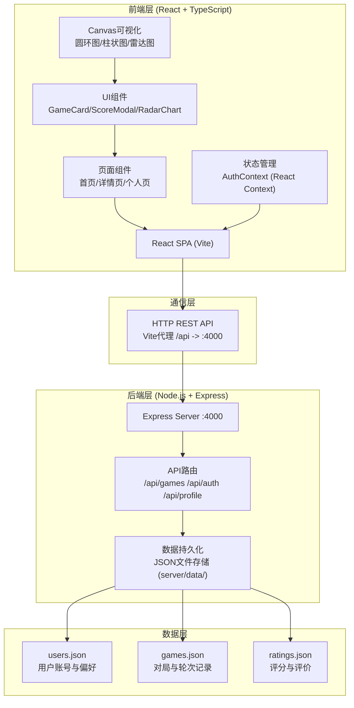
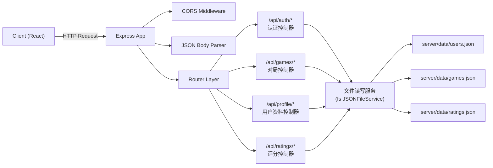
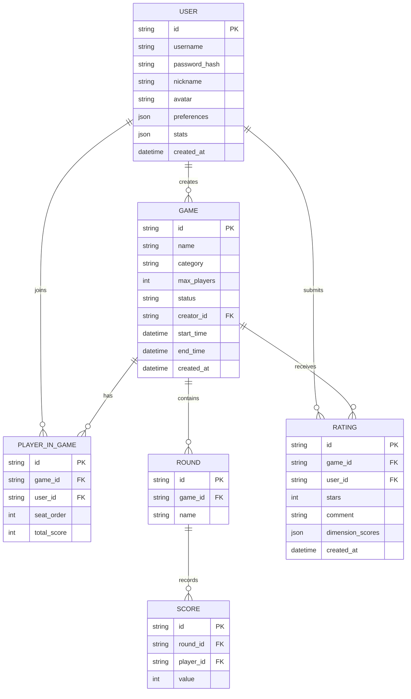

## 1. 架构设计



## 2. 技术说明
- **前端框架**：React 18 + TypeScript 5 + Vite 5
- **构建工具**：Vite（热更新、快速构建、API代理配置）
- **路由**：React Router DOM v6（BrowserRouter + Routes）
- **状态管理**：React Context API（AuthContext用户认证状态）
- **可视化**：原生HTML5 Canvas API（圆环进度图、柱状对比图、五维雷达图）
- **动效**：CSS Transitions + canvas-confetti粒子特效
- **后端**：Node.js + Express 4 + CORS中间件
- **数据库**：本地JSON文件模拟（server/data/*.json）+ UUID生成唯一ID
- **依赖包**：react, react-dom, typescript, vite, @types/react, @types/react-dom, react-router-dom, express, cors, uuid, canvas-confetti

## 3. 路由定义
| 前端路由 | 页面/组件 | 功能说明 |
|---------|---------|---------|
| `/` | 首页（HomePage） | 游戏对局卡片列表、登录/注册入口 |
| `/game/:id` | 游戏详情页（GameDetailPage） | 玩家列表、轮次记录、实时看板、评分 |
| `/profile` | 个人主页（ProfilePage） | 统计数据、偏好雷达图、历史战绩 |
| `/login` | 登录页（LoginPage） | 用户登录表单 |
| `/register` | 注册页（RegisterPage） | 用户注册表单+头像选择 |

| 后端API路由 | 方法 | 功能说明 |
|-----------|-----|---------|
| `/api/games` | GET | 获取所有对局列表 |
| `/api/games` | POST | 创建新对局 |
| `/api/games/:id` | GET | 获取单个对局详情 |
| `/api/games/:id` | PUT | 更新对局信息（加入/离开、轮次、状态） |
| `/api/auth/register` | POST | 用户注册 |
| `/api/auth/login` | POST | 用户登录验证 |
| `/api/profile/:userId` | GET | 获取用户资料与统计数据 |
| `/api/ratings` | POST | 提交游戏评分与短评 |

## 4. API定义

### 4.1 类型定义
```typescript
interface User {
  id: string;
  username: string;
  nickname: string;
  avatar: string; // emoji
  preferences: {
    strategy: number;    // 0-5 策略性
    interaction: number; // 0-5 互动性
    luck: number;        // 0-5 运气成分
    duration: number;    // 0-5 时长偏好
    difficulty: number;  // 0-5 难度偏好
  };
  stats: {
    totalGames: number;
    wins: number;
    averageRating: number;
  };
  createdAt: string;
}

interface Game {
  id: string;
  name: string;
  category: 'strategy' | 'party' | 'family' | 'card' | 'euro';
  categoryColor: { from: string; to: string };
  maxPlayers: number;
  players: PlayerInGame[];
  rounds: Round[];
  status: 'waiting' | 'playing' | 'finished';
  startTime?: string;
  endTime?: string;
  creatorId: string;
  createdAt: string;
}

interface PlayerInGame {
  userId: string;
  username: string;
  nickname: string;
  avatar: string;
  seatOrder: number;
  totalScore: number;
}

interface Round {
  id: string;
  name: string; // 如 "第一回合"
  scores: Record<string, number>; // userId -> score
}

interface Rating {
  id: string;
  gameId: string;
  userId: string;
  stars: number; // 1-5
  comment: string;
  dimensionScores: {
    strategy: number;
    interaction: number;
    luck: number;
    duration: number;
    difficulty: number;
  };
  createdAt: string;
}
```

## 5. 服务器架构图



## 6. 数据模型

### 6.1 ER图


### 6.2 JSON文件结构初始数据

**server/data/users.json** (初始含演示用户)
```json
{
  "users": [
    {
      "id": "uuid-demo-1",
      "username": "player1",
      "password": "Test1234",
      "nickname": "策略大师",
      "avatar": "🎲",
      "preferences": { "strategy": 4.5, "interaction": 3, "luck": 2, "duration": 3.5, "difficulty": 4 },
      "stats": { "totalGames": 12, "wins": 7, "averageRating": 4.3 },
      "createdAt": "2025-01-15T10:30:00Z"
    }
  ]
}
```

**server/data/games.json** (初始含演示对局)
```json
{
  "games": [
    {
      "id": "uuid-game-1",
      "name": "卡坦岛",
      "category": "euro",
      "categoryColor": { "from": "#6366f1", "to": "#8b5cf6" },
      "maxPlayers": 4,
      "status": "waiting",
      "creatorId": "uuid-demo-1",
      "players": [],
      "rounds": [],
      "createdAt": "2025-06-20T14:00:00Z"
    },
    {
      "id": "uuid-game-2",
      "name": "七大奇迹",
      "category": "strategy",
      "categoryColor": { "from": "#f59e0b", "to": "#ef4444" },
      "maxPlayers": 7,
      "status": "playing",
      "creatorId": "uuid-demo-1",
      "players": [],
      "rounds": [],
      "startTime": "2025-06-22T09:00:00Z",
      "createdAt": "2025-06-22T08:00:00Z"
    },
    {
      "id": "uuid-game-3",
      "name": "璀璨宝石",
      "category": "card",
      "categoryColor": { "from": "#06b6d4", "to": "#0ea5e9" },
      "maxPlayers": 4,
      "status": "waiting",
      "creatorId": "uuid-demo-1",
      "players": [],
      "rounds": [],
      "createdAt": "2025-06-21T18:00:00Z"
    }
  ]
}
```

**server/data/ratings.json**
```json
{
  "ratings": []
}
```
