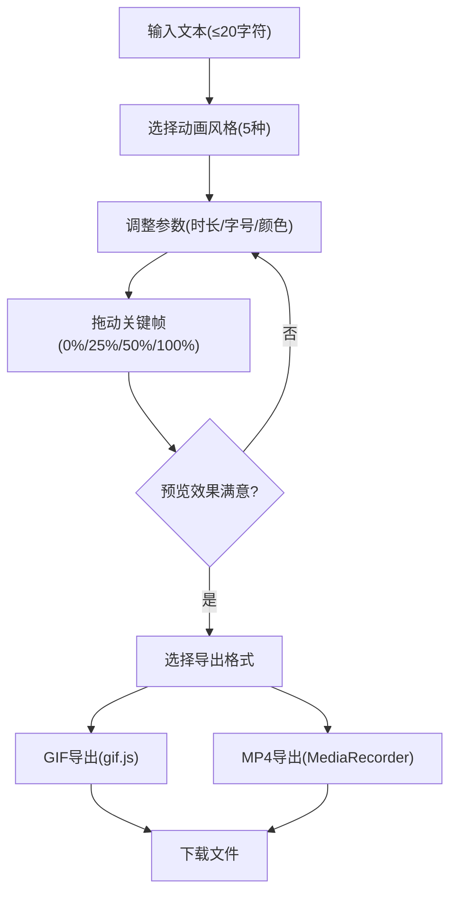

## 1. 产品概述

SVG文字Logo动画编辑器是一款浏览器端的创意工具，帮助个人博主、设计师和创作者快速生成动态品牌Logo，无需编写动画代码即可预览、调整并导出专业的文字动画效果。

- 核心价值：降低动态Logo制作门槛，提供5种预设动画风格，支持可视化参数调整和多种格式导出
- 目标用户：个人博客作者、作品集网站开发者、独立设计师、内容创作者

## 2. 核心功能

### 2.1 用户角色
| 角色 | 注册方式 | 核心权限 |
|------|----------|----------|
| 普通用户 | 无需注册，浏览器直接使用 | 输入文本、选择动画、调整参数、预览效果、导出文件 |

### 2.2 功能模块
1. **主编辑器页面**：动画预览区、控制面板、时间轴、导出功能

### 2.3 页面详情
| 页面名称 | 模块名称 | 功能描述 |
|-----------|-------------|---------------------|
| 主编辑器 | 文本输入模块 | 支持最多20字符输入，实时同步到预览区 |
| 主编辑器 | 动画风格选择模块 | 5种预设动画（逐字打印、旋转凝聚、波浪起伏、粒子消散、霓虹闪烁），按钮带脉冲反馈 |
| 主编辑器 | 参数调节模块 | 动画时长滑块(1-5s)、字体大小滑块(24-72px)、颜色选择器(12预设色+自定义)、播放/暂停按钮 |
| 主编辑器 | SVG预览画布 | 400x200px白色半透明画布，虚线边框，居中显示动画文本，30FPS+流畅度 |
| 主编辑器 | 关键帧时间轴 | 4个可拖动标记点(0%/25%/50%/100%)，实时调整动画节奏 |
| 主编辑器 | 导出模块 | GIF导出(5fps，gif.js Web Worker)、MP4导出(30fps，MediaRecorder API)，文件名自动格式化 |

## 3. 核心流程

用户输入品牌名称 → 选择动画风格 → 调整时长/字体/颜色参数 → 拖动关键帧标记优化节奏 → 实时预览效果 → 导出GIF或MP4文件

## 4. 用户界面设计

### 4.1 设计风格
- **主色调**：深色主题，背景#1a1a2e，卡片背景#16213e，文字#e0e0e0
- **强调色**：渐变#00d2ff → #3a7bd5（按钮/交互元素），边框聚焦#00d2ff
- **按钮风格**：渐变背景+圆角8px，hover放大+加深阴影，active缩小变暗
- **字体**：无衬线体，动画文本居中显示
- **布局风格**：卡片式分组(圆角10px+阴影)，左侧预览右侧控制面板，响应式切换上下布局
- **动效细节**：所有交互0.2s过渡，动画切换按钮1.2倍脉冲反馈，颜色选中放大动画

### 4.2 页面设计概述
| 页面名称 | 模块名称 | UI元素 |
|-----------|-------------|-------------|
| 主编辑器 | 顶部标题区 | 渐变背景标题，品牌标识 |
| 主编辑器 | 预览区(左) | 400x200 SVG画布(白半透明+虚线边)，下方时间轴(4蓝色拖拽点+百分比显示) |
| 主编辑器 | 控制面板(右320px) | 三个卡片组(动画风格/参数/导出)，输入框聚焦变蓝，滑块统一材质风格 |
| 主编辑器 | 动画风格卡片 | 5个风格按钮(图标+文字)，选中态渐变边框+脉冲反馈 |
| 主编辑器 | 参数调节卡片 | 双滑块(时长+字号)+数值显示，12色圆点+自定义按钮，播放/暂停切换 |
| 主编辑器 | 导出卡片 | GIF/MP4双按钮，加载动画+禁用态，防重复点击 |

### 4.3 响应式
- 桌面端(≥768px)：左右双栏布局，预览区居中，控制面板固定宽320px可滚动
- 移动端(<768px)：上下堆叠布局，控制面板宽度自适应100%，触摸优化拖拽热区
- 所有交互元素保持0.2s过渡动画一致性

### 4.4 性能保障
- 动画渲染：requestAnimationFrame调度，保持30FPS+
- GIF导出：Web Worker后台编码，不阻塞UI
- MP4导出：MediaRecorder实时录制30fps，2秒片段
- 文件大小限制：导出文件≤5MB
