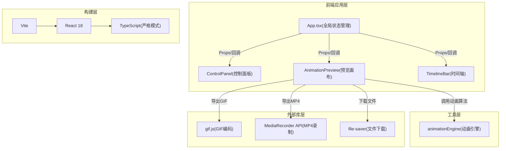

## 1. 架构设计



**数据流向说明：**
1. 用户交互 → ControlPanel → 回调更新App.state → Props下发AnimationPreview/TimelineBar
2. TimelineBar拖拽 → 回调更新keyframes数据 → App.state → AnimationPreview使用
3. AnimationPreview渲染 → 调用animationEngine算法 → 生成SVG/CSS动画属性
4. 导出触发 → AnimationPreview调用gif.js/MediaRecorder → file-saver下载

**文件调用关系：**
- src/App.tsx → import {ControlPanel} from ./components/ControlPanel
- src/App.tsx → import {AnimationPreview} from ./components/AnimationPreview
- src/App.tsx → import {TimelineBar} from ./components/TimelineBar
- src/components/AnimationPreview.tsx → import * as engine from ../utils/animationEngine
- src/components/AnimationPreview.tsx → import GIF from 'gif.js', import {saveAs} from 'file-saver'

## 2. 技术描述

- **前端框架**：React 18 + TypeScript 5 (严格模式 strict: true)
- **构建工具**：Vite 5 + @vitejs/plugin-react
- **动画渲染**：SVG + CSS keyframes + requestAnimationFrame
- **GIF导出**：gif.js (Web Worker模式，5fps采样)
- **MP4导出**：MediaRecorder API (canvas.captureStream + video/webm, 30fps)
- **文件下载**：file-saver
- **样式方案**：CSS Modules + CSS Variables，内联动态样式
- **开发脚本**：npm run dev (vite开发服务器)

## 3. 路由定义

| 路由 | 用途 |
|-------|---------|
| / | 主编辑器页面(单页应用，无需路由) |

## 4. 类型定义(TypeScript)

```typescript
// 动画风格枚举
type AnimationStyle = 'typewriter' | 'rotate' | 'wave' | 'particle' | 'neon';

// 关键帧位置(百分比0-100)
interface KeyframePositions {
  k0: number;   // 0%标记位置，默认0
  k25: number;  // 25%标记位置，默认25
  k50: number;  // 50%标记位置，默认50
  k100: number; // 100%标记位置，默认100
}

// 全局应用状态
interface AppState {
  text: string;               // ≤20字符
  animationStyle: AnimationStyle;
  duration: number;           // 1-5秒，步长0.5
  fontSize: number;           // 24-72px，步长2
  color: string;              // 十六进制颜色值
  keyframes: KeyframePositions;
  isPlaying: boolean;         // 播放/暂停
  waveAmplitude: number;      // 波浪振幅8-20px
}

// 单字符动画状态
interface CharState {
  char: string;
  x: number;
  y: number;
  opacity: number;
  rotation: number;
  scale: number;
  offsetX: number;
  offsetY: number;
}

// 粒子状态(粒子消散动画)
interface Particle {
  x: number;
  y: number;
  targetX: number;
  targetY: number;
  vx: number;
  vy: number;
  color: string;
  radius: number;
  opacity: number;
}
```

## 5. 文件结构

```
auto12/
├── package.json
├── vite.config.js
├── tsconfig.json
├── index.html
└── src/
    ├── main.tsx              # React入口
    ├── App.tsx               # 主组件(状态中心)
    ├── index.css             # 全局样式+CSS变量
    ├── components/
    │   ├── AnimationPreview.tsx   # SVG预览画布+导出
    │   ├── ControlPanel.tsx       # 控制面板(输入/滑块/色盘)
    │   └── TimelineBar.tsx        # 关键帧时间轴拖拽
    └── utils/
        └── animationEngine.ts     # 5种动画算法+缓动函数
```

## 6. 动画引擎核心算法

### 6.1 缓动函数集
```
easeOutCubic(t) = 1 - Math.pow(1-t, 3)
easeInOutQuad(t) = t<0.5 ? 2t² : 1 - pow(-2t+2,2)/2
easeOutElastic(t) = 弹性缓动(霓虹闪烁抖动用)
```

### 6.2 关键帧映射算法
根据KeyframePositions将标准化时间t∈[0,1]映射到节奏化时间t'：
- 将0%→k0, 25%→k25, 50%→k50, 100%→k100构建分段线性插值
- 用于修改动画节奏(如将50%拖到70%则前半段变慢后半段变快)

### 6.3 五种动画实现策略
1. **逐字打印**：按字符索引设置delay，每个字符先opacity:0→1后加 translateY上弹(easeOutBack)
2. **旋转凝聚**：每字符随机初始角度[-180,180]+透明度0 → 插值到0°+不透明
3. **波浪起伏**：y = amplitude * sin(2πt + 字符索引×相位差)
4. **粒子消散**：字符数×30个粒子 → 前0.5秒扩散至画布外 → 0.5-1秒聚拢回归
5. **霓虹闪烁**：SVG filter的flood-color在主色↔白色间以0.8s周期交替，translate微抖动±1px
