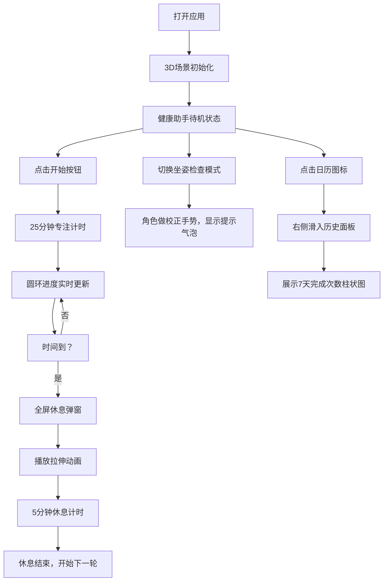

## 1. 产品概述

3D虚拟工位健康助手是一款针对办公室白领的健康管理应用，通过沉浸式3D交互体验帮助用户改善久坐习惯。应用结合番茄工作法、坐姿监测和拉伸运动指导，在浏览器中实时渲染3D工位场景，用户可与卡通健康助手互动，定时接收休息提醒和运动指导。

- **核心价值**：解决职场久坐健康问题，通过有趣的3D交互提升用户依从性
- **目标用户**：办公室白领、长期伏案工作人群
- **市场定位**：轻量化Web应用，无需安装即可使用的健康管理工具

## 2. 核心功能

### 2.1 用户角色
| 角色 | 注册方式 | 核心权限 |
|------|----------|----------|
| 普通用户 | 无需注册，直接使用 | 使用全部功能，本地存储历史数据 |

### 2.2 功能模块
1. **番茄计时模块**：25分钟专注+5分钟休息的工作循环，可视化进度展示
2. **3D工位场景**：实时渲染办公环境（桌子、椅子、显示器），可360度旋转查看
3. **健康助手角色**：卡通风格3D角色，提供动作示范和语音提示
4. **坐姿检查模式**：提醒用户保持正确坐姿，显示姿态校正提示
5. **拉伸动画指导**：3组预置拉伸动作（转头、抬手、侧弯腰）的3D动画演示
6. **历史记录面板**：最近7天的运动完成次数统计

### 2.3 页面详情
| 页面名称 | 模块名称 | 功能描述 |
|----------|----------|----------|
| 主界面 | 3D场景渲染 | 全屏Canvas展示虚拟工位，OrbitControls控制视角 |
| 主界面 | 左侧工具栏 | 开始/暂停按钮、坐姿检查开关、历史记录按钮 |
| 主界面 | 计时器组件 | 桌面右下角圆环进度，顶部进度条动画 |
| 主界面 | 休息弹窗 | 25分钟结束后全屏弹窗，显示拉伸引导和动画 |
| 主界面 | 坐姿提示气泡 | 角色头顶显示实时坐姿建议 |
| 主界面 | 历史面板 | 右侧滑入，展示7天完成次数柱状图 |
| 主界面 | 动作名称标签 | 播放拉伸时显示动作名称，淡入动画 |

## 3. 核心流程

用户打开应用 → 看到3D工位场景和健康助手 → 点击开始按钮启动25分钟倒计时 → 圆环进度实时更新 → 倒计时结束弹出休息提醒 → 播放拉伸动画引导 → 用户跟随完成 → 进入5分钟休息计时 → 循环开始下一轮 → 可随时切换坐姿检查模式 → 点击日历查看7天历史统计

## 4. 用户界面设计

### 4.1 设计风格
- **主色调**：深色主题，主背景#111827，次要背景#1f2937，文字#e5e7eb
- **强调色**：蓝色#3b82f6、紫色#8b5cf6（渐变），绿色#10b981（进度/激活），橙色#f59e0b（暂停/警告）
- **按钮样式**：圆角设计，悬停缩放1.1倍+微光阴影，点击脉冲缩放0.95
- **字体**：现代无衬线字体，层级分明（标题20px加粗，正文14px）
- **布局风格**：左侧垂直工具栏（60px宽）+ 全屏3D场景，卡片式弹窗
- **图标风格**：Lucide图标库，24x24px标准尺寸

### 4.2 页面设计概述
| 页面名称 | 模块名称 | UI元素 |
|----------|----------|--------|
| 主界面 | 3D场景 | 浅木色桌面#c4a882，深灰椅子#4b5563，黑色显示器，卡通角色（球体头部+圆柱身体+胶囊手臂），背景#f0f4f8，地面网格 |
| 主界面 | 左侧工具栏 | 开始/暂停圆形按钮（40px直径），坐姿检查滑块（44x24px），日历图标（24x24px），垂直排列，右圆角12px |
| 主界面 | 计时器 | 桌面右下角圆环（64px直径，填充#10b981），顶部进度条（500x8px，圆角4px，蓝紫渐变） |
| 主界面 | 休息弹窗 | 半透明黑色蒙版，中央白色圆角卡片（600x400px），淡入+上移动画（300ms） |
| 主界面 | 坐姿提示 | 角色头顶白色气泡（圆角16px，8px阴影），文字随计时阶段变化 |
| 主界面 | 历史面板 | 右侧滑入（宽度320px，背景#1f2937，左圆角16px），纯CSS柱状图，蓝紫渐变 |
| 主界面 | 动作标签 | 半透明黑底圆角标签，白色20px加粗文字，淡入动画300ms |

### 4.3 响应式
- **桌面端**：左侧垂直工具栏（60px宽），3D场景占满剩余区域
- **移动端**（<768px）：工具栏变为底部横条（60px高，100%宽），按钮水平排列，3D场景高度为视口70%

### 4.4 3D场景指导
- **环境**：柔和室内光照，环境光+方向光组合，阴影开启
- **摄像机**：PerspectiveCamera，初始位置(0, 1.5, 3)，fov 50
- **交互**：OrbitControls启用阻尼，可旋转缩放，目标点锁定桌面中心
- **动画**：角色骨骼动画（转头、抬手、侧弯腰），使用useFrame帧循环
- **性能**：帧率30fps+，动作切换延迟<100ms
- **资产**：全部使用Three.js基础几何体（BoxGeometry、SphereGeometry、CylinderGeometry、CapsuleGeometry）程序化构建，无外部模型依赖
