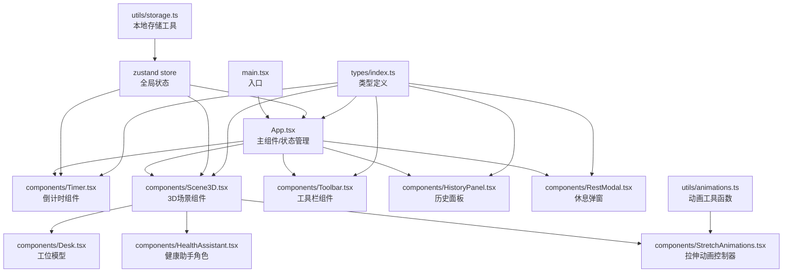

## 1. 架构设计

纯前端React单页应用，采用组件化分层架构，状态集中管理，3D渲染通过@react-three/fiber桥接Three.js。



## 2. 技术描述

### 2.1 核心技术栈
- **框架**：React 18 + TypeScript
- **构建工具**：Vite 5
- **3D渲染**：Three.js 0.160 + @react-three/fiber 8.15 + @react-three/drei 9.92
- **状态管理**：Zustand 4.4
- **样式方案**：CSS Modules + CSS Variables（深色主题）
- **图标库**：Lucide React 0.294
- **包管理器**：npm

### 2.2 项目结构
```
.
├── index.html              # 入口HTML，全屏Canvas容器
├── package.json            # 依赖配置
├── tsconfig.json           # TypeScript配置（严格模式，ES2020）
├── vite.config.js          # Vite配置（代理、模块解析）
└── src/
    ├── main.tsx            # React DOM渲染入口
    ├── App.tsx             # 主组件，状态管理
    ├── types/
    │   └── index.ts        # 全局类型定义
    ├── store/
    │   └── useAppStore.ts  # Zustand全局状态
    ├── components/
    │   ├── Timer.tsx       # 倒计时+进度条组件
    │   ├── Scene3D.tsx     # Three.js场景容器
    │   ├── Desk.tsx        # 工位模型（桌子、椅子、显示器）
    │   ├── HealthAssistant.tsx  # 健康助手3D角色
    │   ├── StretchAnimations.tsx # 拉伸动作动画
    │   ├── Toolbar.tsx     # 左侧工具栏
    │   ├── HistoryPanel.tsx # 历史记录面板
    │   ├── RestModal.tsx   # 休息提醒弹窗
    │   └── ActionLabel.tsx # 动作名称标签
    ├── hooks/
    │   ├── useTimer.ts     # 计时器自定义Hook
    │   └── useAnimation.ts # 动画控制Hook
    └── utils/
        ├── animations.ts   # 动画配置与插值函数
        └── storage.ts      # localStorage操作工具
```

## 3. 模块依赖与数据流向

### 3.1 模块调用关系
| 模块 | 依赖模块 | 输出 |
|------|----------|------|
| main.tsx | App.tsx | 挂载根组件到#root |
| App.tsx | useAppStore, Timer, Scene3D, Toolbar, HistoryPanel, RestModal | 布局容器、事件回调分发 |
| Timer.tsx | useTimer hook, types | 进度条UI、倒计时显示，onComplete回调 |
| Scene3D.tsx | Desk, HealthAssistant, StretchAnimations, @react-three/fiber, @react-three/drei | 3D场景渲染，OrbitControls交互 |
| HealthAssistant.tsx | StretchAnimations, types | 3D角色渲染，动作切换 |
| Toolbar.tsx | useAppStore, lucide-react | 按钮交互，触发状态变更 |
| HistoryPanel.tsx | useAppStore, storage | 历史数据柱状图渲染 |
| useAppStore.ts | types, storage | 全局状态：timerState, postureMode, currentAction, historyData |

### 3.2 核心数据流
1. **计时器流程**：Toolbar点击 → useAppStore更新timerState → Timer组件监听变化启动倒计时 → 每100ms更新进度 → 完成触发onComplete → App切换到休息阶段，打开RestModal并播放动画
2. **坐姿检查流程**：Toolbar切换开关 → useAppStore更新postureMode → HealthAssistant监听变化 → 角色转头+做手势+显示气泡
3. **历史记录流程**：每完成一个25分钟周期 → useAppStore调用storage.save()持久化数据 → 点击日历按钮 → HistoryPanel从store读取7天数据 → 渲染纯CSS柱状图

## 4. 类型定义

```typescript
// src/types/index.ts
export type TimerPhase = 'idle' | 'focus' | 'rest';
export type TimerState = {
  phase: TimerPhase;
  isRunning: boolean;
  timeRemaining: number; // 秒
  duration: number; // 总时长秒
};

export type StretchAction = 'idle' | 'headTurn' | 'armRaise' | 'sideBend';

export type PostureTip = '挺直背部' | '放松肩膀' | '调整坐姿' | '活动颈部';

export type HistoryRecord = {
  date: string; // YYYY-MM-DD
  completedSessions: number;
};

export type AppState = {
  timer: TimerState;
  postureMode: boolean;
  currentAction: StretchAction;
  showRestModal: boolean;
  showHistoryPanel: boolean;
  history: HistoryRecord[];
  currentTip: PostureTip;
};

// 动作配置
export type AnimationConfig = {
  name: StretchAction;
  duration: number; // 秒
  label: string;
  description: string;
};
```

## 5. 关键实现约束

### 5.1 性能优化
- **计时器更新**：使用requestAnimationFrame或setInterval 100ms间隔，保证进度条平滑
- **3D渲染**：@react-three/fiber自动帧循环，设置像素比限制（dpr={[1, 2]}），启用frustumCulling
- **动画性能**：使用useFrame的delta参数做时间插值，避免阻塞主线程
- **历史柱状图**：纯CSS实现，无第三方图表库，重绘时间<50ms

### 5.2 动画实现
- **转头**：头部mesh.rotation.y在-0.52rad(-30°)到0.52rad(30°)间正弦波动，周期2秒
- **抬手**：右臂rotation.x从0到-1.57rad(-90°)，easeOutQuad插值，1.5秒
- **侧弯腰**：躯干rotation.z在-0.26rad(-15°)到0.26rad(15°)间波动，周期2秒
- 使用THREE.MathUtils.lerp和THREE.MathUtils.damp做平滑过渡

### 5.3 响应式断点
- CSS媒体查询 `@media (max-width: 768px)` 切换工具栏布局
- 3D画布高度：桌面端100vh，移动端calc(100vh - 60px)或70vh

## 6. 配置文件规范

### 6.1 package.json
- 依赖：react, react-dom, three, @react-three/fiber, @react-three/drei, typescript, vite, @types/react, @types/react-dom, zustand, lucide-react
- 脚本：`"dev": "vite"`, `"build": "tsc && vite build"`, `"preview": "vite preview"`

### 6.2 tsconfig.json
- compilerOptions: strict: true, target: "ES2020", moduleResolution: "bundler", jsx: "react-jsx"

### 6.3 vite.config.js
- resolve.alias: "@" => "./src"
- server.port: 5173
