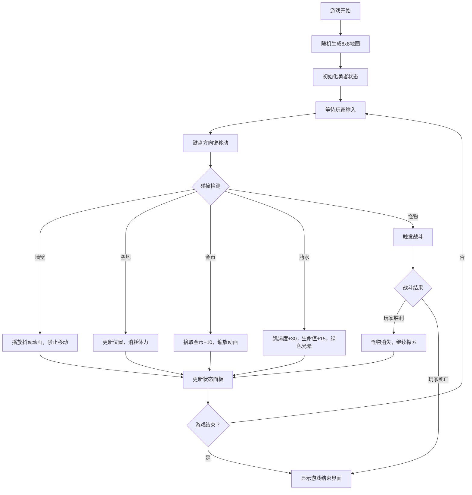

## 1. 产品概述

像素风地下城探险与资源管理游戏，玩家控制勇者在随机生成的地牢中探索、收集资源、击败怪物，同时管理生命值、饥渴度和体力值。目标用户为休闲游戏爱好者，提供快节奏的 Roguelike 体验。

## 2. 核心功能

### 2.1 用户角色
| 角色 | 注册方式 | 核心权限 |
|------|----------|----------|
| 玩家 | 无需注册，直接游戏 | 控制角色移动、收集物品、战斗 |

### 2.2 功能模块
1. **游戏主界面**：640x640 Canvas 游戏区域、顶部状态栏
2. **地图系统**：8x8 随机地牢生成，包含墙壁、空地、怪物、金币、药水
3. **角色控制系统**：WASD/方向键移动，碰撞检测，移动冷却
4. **资源管理系统**：生命值、饥渴度、体力值的动态变化与显示
5. **物品系统**：金币拾取、药水饮用及动画效果
6. **战斗系统**：自动回合制战斗，伤害计算，游戏结束判定

### 2.3 页面详情
| 页面名称 | 模块名称 | 功能描述 |
|---------|----------|----------|
| 游戏主界面 | Canvas 渲染层 | 绘制地图、角色、物品、怪物，像素风格渲染 |
| 游戏主界面 | 状态栏 | 显示生命值条、饥渴度条、体力值条、金币数量 |
| 游戏主界面 | 动画效果 | 撞墙抖动、金币缩放、药水光晕、战斗红屏、游戏结束滤镜 |

## 3. 核心流程

## 4. 用户界面设计

### 4.1 设计风格
- **主色调**：深背景 #111827，文字白色 #f9fafb
- **状态条颜色**：生命红 #ef4444，饥渴橙 #f97316，体力蓝 #3b82f6
- **物品颜色**：金币金 #fbbf24，药水绿 #34d399，墙壁灰 #374151，地面棕 #451a03
- **像素风格**：Canvas 图像渲染属性 pixelated，8x8 格子地图，每格 80px
- **圆角设计**：UI 元素圆角 8px，状态条圆角 4px
- **字体**：monospace 等宽字体，16px 数值显示

### 4.2 页面设计概述
| 页面名称 | 模块名称 | UI 元素 |
|---------|----------|----------|
| 游戏主界面 | 状态栏 | 深灰背景 #1f2937，高度 60px，三个状态条（宽 120px，高 16px），金币闪烁动画 |
| 游戏主界面 | 游戏区域 | 640x640 Canvas，8x8 网格，像素角色，碰撞动画，战斗特效 |
| 游戏主界面 | 游戏结束 | 灰暗滤镜，居中"你被击败了"文字 |

### 4.3 响应式
- 桌面优先设计，固定尺寸 640x700（游戏区域+状态栏）
- 无移动端适配需求，专注桌面端体验

### 4.4 动画效果
- 撞墙抖动：水平位移 5px，持续 100ms
- 金币拾取：缩放动画 0.2s ease-out
- 药水饮用：绿色光晕扩散 0.3s
- 战斗红屏：屏幕边缘红色半透明遮罩 #ef4444 30%，持续 200ms
- 金币闪烁：opacity 0.8-1 循环，1s 周期
- 状态过渡：200ms ease 动画
