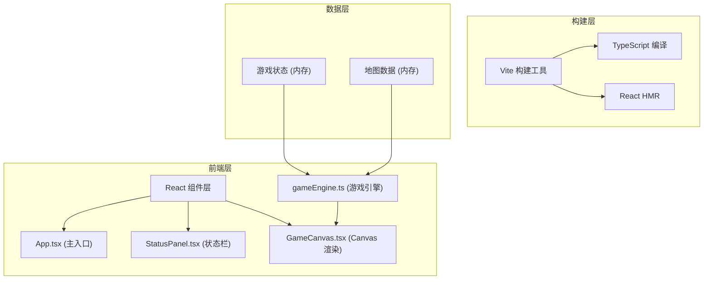

## 1. 架构设计



## 2. 技术描述
- **前端**：React@18 + TypeScript + Vite
- **样式**：原生 CSS，CSS 变量管理主题
- **渲染**：HTML5 Canvas 2D API
- **状态管理**：React useState/useRef + 游戏引擎内部状态
- **构建工具**：Vite@5

## 3. 文件结构

```
auto124/
├── package.json
├── vite.config.js
├── tsconfig.json
├── index.html
├── src/
│   ├── main.tsx
│   ├── App.tsx
│   ├── styles.css
│   ├── gameEngine.ts
│   └── components/
│       ├── GameCanvas.tsx
│       └── StatusPanel.tsx
└── .trae/
    └── documents/
        ├── PRD.md
        └── TECH_ARCH.md
```

## 4. 核心模块定义

### 4.1 GameEngine 类型定义

```typescript
// 地图格子类型
export type TileType = 'wall' | 'floor' | 'coin' | 'potion' | 'monster';

// 位置坐标
export interface Position {
  x: number;
  y: number;
}

// 玩家状态
export interface PlayerState {
  hp: number;
  maxHp: number;
  hunger: number;
  maxHunger: number;
  stamina: number;
  maxStamina: number;
  coins: number;
  position: Position;
  isDead: boolean;
}

// 怪物状态
export interface Monster {
  hp: number;
  maxHp: number;
  position: Position;
}

// 动画状态
export interface AnimationState {
  shake: { active: boolean; startTime: number };
  coinScale: { active: boolean; startTime: number; position: Position };
  potionGlow: { active: boolean; startTime: number; position: Position };
  redScreen: { active: boolean; startTime: number };
}

// 游戏引擎类
export class GameEngine {
  map: TileType[][];
  player: PlayerState;
  monsters: Monster[];
  animation: AnimationState;
  moveCooldown: number;
  lastMoveTime: number;
  lastHungerDecay: number;
  lastStaminaRegen: number;
  lastHpDecay: number;
  lastBattleTime: number;
  currentBattle: Monster | null;
  
  constructor();
  generateMap(): void;
  movePlayer(dx: number, dy: number): boolean;
  update(timestamp: number): void;
  checkCollision(position: Position): TileType | null;
  pickUpCoin(position: Position): void;
  drinkPotion(position: Position): void;
  startBattle(monster: Monster): void;
  updateBattle(timestamp: number): void;
  getMoveSpeed(): number;
}
```

### 4.2 游戏常量定义

| 常量 | 值 | 说明 |
|------|-----|------|
| MAP_SIZE | 8 | 地图大小 8x8 |
| TILE_SIZE | 80 | 每格像素大小 |
| PLAYER_MAX_HP | 100 | 最大生命值 |
| PLAYER_MAX_HUNGER | 100 | 最大饥渴度 |
| PLAYER_MAX_STAMINA | 100 | 最大体力值 |
| MOVE_COOLDOWN | 100 | 移动冷却时间 (ms) |
| HUNGER_DECAY_INTERVAL | 2000 | 饥渴度衰减间隔 (ms) |
| HUNGER_DECAY_AMOUNT | 1 | 每次饥渴度衰减量 |
| STAMINA_MOVE_COST | 0.5 | 移动体力消耗 |
| STAMINA_REGEN_INTERVAL | 1000 | 体力恢复间隔 (ms) |
| STAMINA_REGEN_AMOUNT | 2 | 每次体力恢复量 |
| LOW_HUNGER_THRESHOLD | 20 | 低饥渴度阈值 |
| LOW_HP_DECAY_INTERVAL | 5000 | 低饥渴度时生命衰减间隔 (ms) |
| LOW_HP_DECAY_AMOUNT | 5 | 每次生命衰减量 |
| LOW_STAMINA_THRESHOLD | 10 | 低体力阈值 |
| COIN_VALUE | 10 | 金币价值 |
| POTION_HUNGER_BONUS | 30 | 药水饥渴度恢复 |
| POTION_HP_BONUS | 15 | 药水生命值恢复 |
| BATTLE_INTERVAL | 1500 | 战斗攻击间隔 (ms) |
| PLAYER_ATTACK_DAMAGE | 10 | 玩家攻击力 |
| MONSTER_ATTACK_DAMAGE | 5 | 怪物攻击力 |
| MONSTER_MAX_HP | 30 | 怪物最大生命值 |

### 4.3 颜色常量定义

| 变量 | 值 | 用途 |
|------|-----|------|
| COLOR_BG | #111827 | 主背景 |
| COLOR_PANEL_BG | #1f2937 | 状态栏背景 |
| COLOR_WALL | #374151 | 墙壁 |
| COLOR_FLOOR | #451a03 | 地面 |
| COLOR_PLAYER | #3b82f6 | 玩家 |
| COLOR_COIN | #fbbf24 | 金币 |
| COLOR_POTION | #34d399 | 药水 |
| COLOR_HP | #ef4444 | 生命值条 |
| COLOR_HUNGER | #f97316 | 饥渴度条 |
| COLOR_STAMINA | #3b82f6 | 体力值条 |
| COLOR_TEXT | #f9fafb | 文字 |

## 5. 性能要求

- 目标帧率：45fps 以上
- 键盘响应延迟：< 100ms
- 使用 requestAnimationFrame 进行渲染循环
- 使用 useRef 存储高频更新的游戏状态，避免 React 重渲染性能损耗
- 碰撞检测使用 O(1) 数组索引访问
