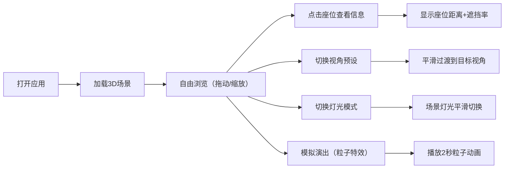

## 1. 产品概述

LitStage 是一个虚拟现场音乐会3D可视化应用，让用户在浏览器中沉浸式浏览演出现场，直观感受舞台布局、灯光效果和不同座位区域的视野差异，提升购票决策的准确性和沉浸感。

- 解决的问题：传统演出信息仅通过文字和照片呈现，用户无法在购票前了解场地实际视野和氛围
- 目标用户：音乐节、Livehouse观众，演出购票决策者
- 市场价值：通过3D可视化提升购票转化率，增强用户对演出场地的认知和期待

## 2. 核心功能

### 2.1 用户角色
| 角色 | 注册方式 | 核心权限 |
|------|----------|----------|
| 普通用户 | 无需注册 | 浏览3D场景、切换视角、选择座位查看信息、控制灯光和模拟演出 |

### 2.2 功能模块
1. **主舞台模块**：半包围拱形舞台渲染，渐变背景幕布，可调节彩色聚光灯，动态光斑效果，粒子演出特效
2. **观众席模块**：三种座位区域网格布局（VIP区、普通区、二楼看台），座位点击交互，座位信息展示
3. **控制中心模块**：侧边控制面板，视角预设切换，灯光模式切换，模拟演出功能
4. **导航栏模块**：应用名称展示，当前选中座位信息弹窗

### 2.3 页面详情
| 页面名称 | 模块名称 | 功能描述 |
|----------|----------|----------|
| 主页面 | 3D场景渲染 | Three.js渲染舞台和观众席，支持鼠标拖动旋转视角、滚轮缩放 |
| 主页面 | 舞台交互 | 聚光灯颜色切换，灯光模式切换，粒子演出特效 |
| 主页面 | 座位交互 | 点击座位查看距离和视野遮挡信息，座位选中高亮放大 |
| 主页面 | 控制面板 | 视角预设按钮（舞台正面、左侧45度、俯视全景、座位视野），灯光模式开关，模拟演出按钮 |
| 主页面 | 导航栏 | 应用名称"LitStage"，选中座位信息弹窗，毛玻璃效果 |

## 3. 核心流程

用户打开应用 → 自动加载3D场景（舞台+观众席）→ 可自由拖动/缩放浏览 → 点击座位查看详情 → 使用控制面板切换视角/灯光 → 点击模拟演出观看粒子特效 → 继续探索其他座位或视角

## 4. 用户界面设计

### 4.1 设计风格
- 设计基调：暗色主题，赛博朋克演唱会氛围，奢华科技感
- 主色调：深灰蓝 #0f172a（背景），深蓝 #1e293b（面板）
- 强调色：紫色 #7c3aed（VIP区），蓝色 #2563eb（普通区），红色 #dc2626（看台），金色 #fbbf24（VIP边框），亮白 #ffffff（高亮）
- 渐变：紫红色 #8b2252 → 深紫色 #4b0082（舞台背景）
- 按钮风格：圆角设计，hover时轻微放大，点击时scale(0.98)骨骼震动反馈
- 字体：使用现代无衬线字体，标题加粗醒目，正文清晰易读
- 布局：左侧3D场景占满剩余空间，右侧280px固定控制面板，顶部半透明导航栏
- 图标风格：简洁线性图标，与演唱会主题呼应

### 4.2 页面设计概述
| 页面名称 | 模块名称 | UI元素 |
|----------|----------|----------|
| 主页面 | 3D场景 | Three.js渲染，舞台拱形设计，渐变背景，聚光灯光锥，动态光斑，座位网格 |
| 主页面 | 导航栏 | 毛玻璃效果 backdrop-filter:blur(8px)，背景rgba(15,23,42,0.7)，"LitStage"标题，座位信息弹窗（圆角8px，边框#38bdf8） |
| 主页面 | 控制面板 | 宽280px，背景#1e293b，圆角12px，内边距16px，按钮分组，动画过渡效果 |
| 主页面 | 座位Tooltip | 悬停显示座位信息，白字#ffffff，背景#1e293b，圆角4px |

### 4.3 响应式
- 桌面端优先设计，左侧3D场景自适应，右侧固定控制面板
- 支持窗口大小变化时3D场景自动适配
- 鼠标交互：左键拖动旋转，滚轮缩放，右键平移
- 触控优化：支持触摸手势操作

### 4.4 3D场景指导
- **环境与氛围**：暗色演唱会场景，舞台作为视觉焦点，聚光灯营造现场氛围，整体偏暗但主体明亮
- **灯光设置**：
  - 环境光：低强度基础照明，确保场景可见
  - 聚光灯：两排共多盏彩色聚光灯，从舞台上方投射，形成圆形光锥和地面光斑
  - 灯光模式：暖色常亮（温暖橙黄色调）、冷色频闪（蓝白色快速闪烁）、派对彩虹渐变（多彩循环渐变）
- **相机设置**：
  - 初始视角：舞台正面中距离，可完整看到舞台和观众席
  - 视角预设：舞台正面、左侧45度、俯视全景、座位视野模拟
  - 相机控制：使用OrbitControls支持拖动、缩放、平移
  - 动画过渡：缓动cubic-bezier(0.25, 0.1, 0.25, 1)，持续1200ms平滑切换
- **构图与焦点**：
  - 舞台位于场景中心靠后位置，呈半包围拱形
  - 观众席位于舞台前方，分三个区域
  - 聚光灯作为视觉引导，聚焦舞台中央
- **交互与动画**：
  - 座位点击：放大1.2倍，颜色变白高亮
  - 灯光切换：0.3秒平滑过渡
  - 粒子特效：400个彩色粒子从舞台向上飘散，速度30px/s，透明度0.6→0.2，生命周期2秒
- **后处理效果**：
  - 轻微泛光效果增强灯光氛围感
  - 抗锯齿处理确保边缘平滑
- **性能要求**：
  - 60fps稳定渲染
  - 视角切换响应时间≤150ms
  - 粒子动画流畅不卡顿
