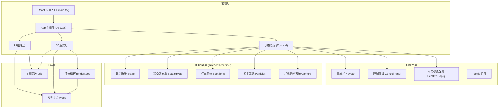
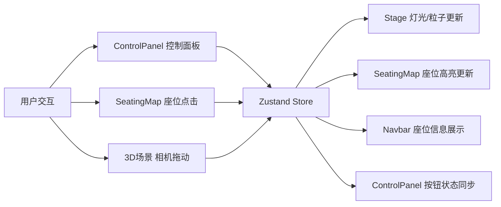

## 1. 架构设计



## 2. 技术描述

- **前端框架**：React 18 + TypeScript
- **构建工具**：Vite 5（自动打开浏览器）
- **3D渲染**：Three.js + @react-three/fiber + @react-three/drei
- **状态管理**：Zustand（轻量状态管理，共享灯光模式、演出状态、选中座位信息）
- **样式方案**：CSS Modules / 内联样式 + Tailwind CSS 3
- **动画库**：@react-three/drei（3D动画）+ CSS transitions（UI动画）
- **开发规范**：TypeScript 严格模式，ESLint 代码检查

### 核心技术选型理由
- **@react-three/fiber**：React渲染器，让Three.js使用React声明式API，简化3D场景开发
- **@react-three/drei**：常用Three.js组件库（OrbitControls、SpotLight等），避免重复造轮子
- **Zustand**：轻量状态管理，API简洁，适合跨组件共享3D场景状态
- **Vite**：极速开发体验，热更新快，TypeScript支持好

## 3. 目录结构

```
.
├── index.html                 # 入口HTML文件
├── package.json               # 项目依赖和脚本
├── vite.config.js             # Vite构建配置
├── tsconfig.json              # TypeScript配置
└── src/
    ├── main.tsx              # React应用入口
    ├── App.tsx               # 主应用组件
    ├── types.ts              # 全局类型定义
    ├── store/
    │   └── useSceneStore.ts  # Zustand状态管理
    ├── stage/
    │   └── Stage.tsx         # 舞台场景组件（背景、灯光、粒子）
    ├── audience/
    │   └── SeatingMap.tsx    # 座位布局组件
    ├── controls/
    │   └── ControlPanel.tsx  # 控制面板组件
    ├── components/
    │   ├── Navbar.tsx        # 顶部导航栏
    │   ├── SeatInfoPopup.tsx # 座位信息弹窗
    │   └── Tooltip.tsx       # 悬停提示组件
    └── utils/
        └── renderLoop.ts     # 渲染循环工具
```

## 4. 路由定义

| 路由 | 用途 |
|------|------|
| / | 主页面，包含3D场景和控制面板 |

本项目为单页应用（SPA），无需复杂路由配置。

## 5. 状态管理设计

### 5.1 Zustand Store 接口

```typescript
// types.ts 中定义的状态类型
interface SceneState {
  // 灯光相关
  lightMode: LightMode;
  spotlightColor: string;
  
  // 演出状态
  isPerforming: boolean;
  
  // 座位相关
  selectedSeat: Seat | null;
  hoveredSeat: Seat | null;
  
  // 视角相关
  currentView: ViewPreset;
  
  // Actions
  setLightMode: (mode: LightMode) => void;
  setSpotlightColor: (color: string) => void;
  setPerforming: (performing: boolean) => void;
  selectSeat: (seat: Seat | null) => void;
  hoverSeat: (seat: Seat | null) => void;
  setCurrentView: (view: ViewPreset) => void;
}
```

### 5.2 核心类型定义

```typescript
// src/types.ts
export enum LightMode {
  WARM_STEADY = 'warm_steady',
  COLD_STROBE = 'cold_strobe',
  PARTY_RAINBOW = 'party_rainbow',
}

export enum SeatZone {
  VIP = 'vip',
  GENERAL = 'general',
  BALCONY = 'balcony',
}

export enum ViewPreset {
  FRONT = 'front',
  LEFT_45 = 'left_45',
  TOP_DOWN = 'top_down',
  SEAT_VIEW = 'seat_view',
}

export interface Seat {
  id: string;
  zone: SeatZone;
  row: number;
  col: number;
  position: { x: number; y: number; z: number };
  distanceToStage: number;
  obstructionPercent: number;
}

export interface PerformanceState {
  isActive: boolean;
  startTime: number;
}
```

## 6. 核心模块设计

### 6.1 舞台模块 (src/stage/Stage.tsx)
- **职责**：渲染舞台背景、地面、聚光灯、粒子特效
- **输入Props**：
  - `lightMode: LightMode` - 灯光模式
  - `spotlightColor: string` - 聚光灯颜色
  - `isPerforming: boolean` - 是否正在模拟演出
- **输出回调**：
  - `onCameraChange?: (position: Vector3) => void` - 相机位置变更回调
- **核心组件**：
  - `<StageBackdrop />` - 渐变拱形背景幕布
  - `<StageFloor />` - 深灰色质感舞台地面
  - `<Spotlights />` - 两排可调节彩色聚光灯
  - `<LightSpots />` - 地面动态光斑
  - `<ParticleSystem />` - 演出粒子特效（400粒子，向上飘散）

### 6.2 观众席模块 (src/audience/SeatingMap.tsx)
- **职责**：生成三种座位区域网格，处理座位交互
- **输入Props**：
  - `selectedSeatId: string | null` - 选中的座位ID
- **输出回调**：
  - `onSeatClick: (seat: Seat) => void` - 座位点击回调
  - `onSeatHover: (seat: Seat | null) => void` - 座位悬停回调
- **核心逻辑**：
  - 生成VIP区（紫色#7c3aed，金色边框#fbbf24）
  - 生成普通区（蓝色#2563eb）
  - 生成二楼看台（红色#dc2626）
  - 座位尺寸：200x80px（3D空间中对应缩放比例）
  - 选中状态：放大1.2倍，白色#ffffff高亮

### 6.3 控制面板模块 (src/controls/ControlPanel.tsx)
- **职责**：提供UI控制界面，向3D场景发送指令
- **输入Props**：无（通过Zustand获取/更新状态）
- **样式**：宽280px，背景#1e293b，圆角12px，内边距16px
- **核心控件**：
  - **视角预设按钮组**：舞台正面、左侧45度、俯视全景、座位视野
  - **灯光模式切换**：暖色常亮、冷色频闪、派对彩虹渐变（单选按钮组）
  - **聚光灯颜色选择器**：预设颜色快速切换
  - **模拟演出按钮**：点击触发2秒粒子特效
- **动画**：
  - 按钮点击：transform: scale(0.98) 瞬间恢复（骨骼震动）
  - 灯光切换：0.3秒平滑过渡
  - 视角切换：cubic-bezier(0.25, 0.1, 0.25, 1)，1200ms缓动

### 6.4 渲染循环工具 (src/utils/renderLoop.ts)
- **职责**：统一管理Three.js渲染循环，确保所有动画在同一requestAnimationFrame帧中更新
- **API**：
  ```typescript
  interface RenderLoop {
    start: () => void;
    stop: () => void;
    addCallback: (callback: (deltaTime: number) => void) => string;
    removeCallback: (id: string) => void;
  }
  ```
- **设计目的**：避免多个组件各自创建requestAnimationFrame，提升性能，确保60fps稳定渲染

## 7. 性能优化策略

### 7.1 3D性能优化
- **对象复用**：座位使用InstancedMesh批量渲染，减少draw call
- **视锥体剔除**：Three.js内置视锥体剔除，不可见对象不渲染
- **LOD（层次细节）**：远处座位使用简化几何体
- **粒子系统**：使用Points + BufferGeometry实现高效粒子渲染
- **帧率控制**：渲染循环节流，确保稳定60fps

### 7.2 动画性能优化
- **CSS硬件加速**：使用transform和opacity属性实现UI动画
- **避免布局抖动**：批量DOM读写操作
- **requestAnimationFrame**：所有动画使用RAF统一调度
- **对象池**：粒子对象复用，避免频繁GC

### 7.3 响应时间保证
- 视角切换响应时间 ≤ 150ms：使用tweening预计算+GPU加速
- 灯光切换0.3秒平滑过渡：颜色插值计算
- 点击响应 < 100ms：事件委托+状态批处理

## 8. 组件通信数据流



**数据流原则**：单向数据流，所有状态变更通过Zustand Store分发，避免组件间直接耦合。

## 9. 构建与部署

### 开发命令
- `npm run dev`：启动开发服务器（自动打开浏览器）
- `npm run build`：生产构建
- `npm run preview`：预览生产构建
- `npm run typecheck`：TypeScript类型检查

### 环境要求
- Node.js ≥ 16.x
- npm ≥ 7.x
- 现代浏览器支持 WebGL 2.0
