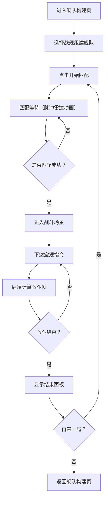

## 1. 产品概述

多人在线太空舰队指挥与实时对战应用，让玩家组建自定义舰队（侦察舰、护卫舰、旗舰），在2D星图上实时指挥舰队进行半自动对战，通过Socket.io实现低延迟状态同步和匹配系统。

- 目标用户：喜欢策略对战的休闲/中核玩家
- 核心价值：快节奏5分钟对战+宏观指令简化操作，降低RTS门槛

## 2. 核心功能

### 2.1 用户角色

| 角色 | 注册方式 | 核心权限 |
|------|----------|----------|
| 玩家 | 匿名自动分配ID | 组建舰队、匹配对战、查看战绩 |

### 2.2 功能模块

1. **舰队构建页**：战舰卡片选择、编队槽位拖拽、战力评分实时计算
2. **匹配等待页**：匹配队列状态、脉冲雷达动画、等待时长倒计时
3. **战斗场景页**：2D星图画布、舰队血量条、指令面板、倒计时
4. **战斗结果页**：胜负判定、金币奖励、再来一局按钮

### 2.3 页面详情

| 页面名称 | 模块名称 | 功能描述 |
|----------|----------|----------|
| 舰队构建页 | 战舰卡片网格 | 展示侦察舰/护卫舰/旗舰三种卡片（220x280px，圆角16px，背景#1e293b，悬停边框发光#3b82f6），点击添加到编队 |
| 舰队构建页 | 编队槽位区 | 6个槽位，拖拽弹性动画，实时显示总战力评分，最多6艘战舰 |
| 匹配等待页 | 脉冲雷达动画 | 旋转环形动画（颜色#38bdf8，透明度0.3→1.0周期1.5s），显示等待时长 |
| 匹配等待页 | 匹配状态 | 显示队列人数、匹配进度，匹配成功后自动跳转 |
| 战斗场景页 | 2D星图画布 | 深空渐变背景#0a0b1e，400颗闪烁星星带视差，双方舰队左右部署 |
| 战斗场景页 | 血量条 | 左上角己方总血量条（渐变绿#22c55e→红#ef4444），右上角倒计时 |
| 战斗场景页 | 指令面板 | 左下角4个圆形按钮（48x48px，半透明#ffffff1a，悬停放大1.1倍），支持前进/集火/撤退/停止 |
| 战斗场景页 | 战斗特效 | 击毁爆炸粒子（20-30个，红#ff4545/蓝#45aaff，扩散300ms淡出），屏幕边缘闪光 |
| 战斗结果页 | 结果面板 | 获胜方高亮动画，金币奖励弹窗，"再来一局"按钮 |

## 3. 核心流程

1. 玩家进入舰队构建页，从预设战舰模版选择最多6艘组成舰队
2. 点击"开始匹配"，系统根据战力评分（±10%）自动匹配对手
3. 匹配成功后双方舰队部署在2D星图左右两端
4. 战斗半自动进行，玩家下达宏观指令，战舰自动执行
5. 后端每帧（60FPS）计算战舰位置/弹道碰撞/伤害，20Hz广播位置快照
6. 战舰被击毁触发爆炸特效和闪光提示
7. 5分钟倒计时结束或一方全灭，判定胜负
8. 显示结果面板，玩家可选择"再来一局"重新匹配

## 4. 用户界面设计

### 4.1 设计风格

- 主色调：深蓝黑#0f172a搭配亮蓝#3b82f6和橘红#f97316作为阵营对比色
- 战舰阵营色：红方#ff4545，蓝方#45aaff
- 按钮风格：圆形半透明按钮，悬停放大+文字提示
- 字体：Orbitron（标题/数字）+ Source Sans 3（正文）
- 布局风格：全屏沉浸式，Canvas为主画布，UI浮动覆盖
- 图标风格：线条型科幻图标（lucide-react）

### 4.2 页面设计概览

| 页面名称 | 模块名称 | UI元素 |
|----------|----------|--------|
| 舰队构建页 | 战舰卡片 | 卡片220x280px，圆角16px，背景#1e293b，悬停边框发光#3b82f6，内含战舰图标+属性条+添加按钮 |
| 舰队构建页 | 编队槽位 | 水平排列6个槽位，拖入弹性动画，底部战力评分数字（Orbitron字体大号） |
| 匹配等待页 | 雷达动画 | 居中脉冲环形，颜色#38bdf8，透明度周期变化0.3→1.0，1.5s周期 |
| 匹配等待页 | 等待信息 | 环形下方显示"搜索对手中..."和等待时长 |
| 战斗场景页 | 星图画布 | 全屏Canvas，深空渐变#0a0b1e，400颗闪烁星星，视差滚动 |
| 战斗场景页 | HUD覆盖 | 左上血量条，右上倒计时（Orbitron），左下指令面板4按钮 |
| 战斗场景页 | 特效层 | 爆炸粒子20-30个扩散300ms，屏幕边缘红/蓝闪光500ms |
| 战斗结果页 | 结果卡片 | 居中大卡片，获胜方发光动画，金币数字滚动，再来一局按钮 |

### 4.3 响应式设计

- 桌面优先设计，支持1920x1080和1440x900
- flex-wrap和grid自适应布局
- 移动端精简视图：隐藏部分细节图标，Canvas等比缩放
- 指令面板在小屏幕下改为底部水平排列

### 4.4 战舰属性设计

| 战舰类型 | 攻击力 | 防御力 | 速度 | 射程 | 战力系数 |
|----------|--------|--------|------|------|----------|
| 侦察舰 | 15 | 20 | 90 | 200 | 1.0x |
| 护卫舰 | 40 | 50 | 50 | 300 | 2.0x |
| 旗舰 | 80 | 100 | 30 | 400 | 4.0x |

战力评分 = Σ(攻击力 + 防御力) × 战力系数
